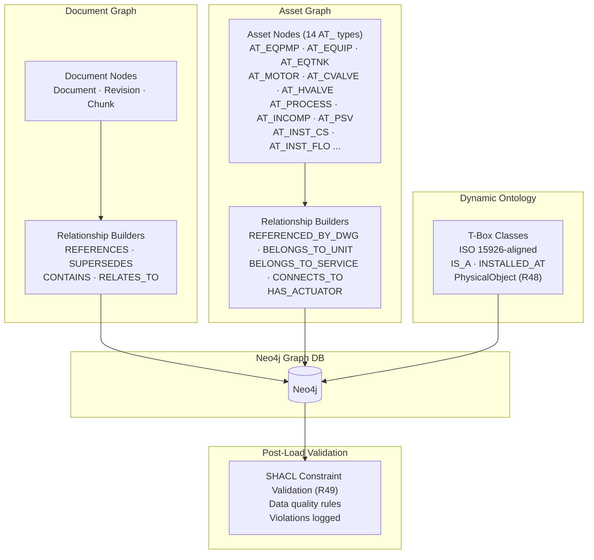

# EKS Phase 3 — Knowledge Graph & Engineering Object Metadata

**Document ID**: WP-EKS-P3-001  
**Current Version**: 1.0  
**Status**: 🔵 DRAFT — PENDING APPROVAL  
**Last Updated**: 2026-06-18  
**Parent Workplan**: [eks_system_workplan.md](eks_system_workplan.md)  
**Phase Dependency**: Phase 2 must be complete and approved  

---

## 1. Title and Description

Build the Neo4j knowledge relationship graph capturing all engineering knowledge connections: document-to-document, document-to-asset, asset-to-asset, and asset-to-metadata. Ingest structured project asset data from the Excel datadrop (7,681 items across 7 categories) into the graph using the universal plant item schema from Phase 1. Implement structured asset loaders (replacing NLP-based extractors) for equipment, instruments, valves, pipelines, and motors. Add CAD format parser stubs (DWG/DGN) and implement superseded document revision chain lookup. Integrate automated document metadata extraction (cover sheet blocks) for the extended metadata schema. Implement specialized document relationships (SUPERSEDES, SUPPLEMENTS, REFERENCES_DOC) based on Appendix B logic.

---

## 2. Revision Control & Version History

| Version | Date       | Author | Summary of Changes                        |
| :------ | :--------- | :----- | :---------------------------------------- |
| 1.0     | 2026-06-18 | Gemini CLI | Added T3.32–T3.34: Document Relationship Ingestion (Revision Chain, Cross-Doc, Asset Tag Linking) per Appendix B logic. Updated to v1.0. |
| 0.10    | 2026-07-08 | opencode | Added T3.35 for CAD parser evaluation (I015); updated risk row; added success criterion for CAD parser coverage. |
| 0.9     | 2026-06-18 | Gemini CLI | Added T3.28–T3.31: Specialized Relationship Ingestion (Flow, Power, Control, Governance, Set Points) per approved gap analysis. |
| 0.8     | 2026-06-18 | System | Added R40 (asset embedding trigger after Neo4j load) and R42 (asset vector upsert on datadrop reload) to scope and tasks. T3.15 sheet orchestrator updated to trigger Phase 2 asset text builder + Qdrant upsert after each node batch. |
| 0.7     | 2026-06-17 | System | Added R43: Automated Document Metadata Extraction. Added T3.21 to task breakdown. |
| 0.6     | 2026-06-17 | System | Added R39 to scope. Updated T3.9 base asset loader to read conditional_fragments from config and evaluate when/in conditions at runtime — zero code changes needed to add new asset types. Schema loader confirmed no update needed (file-agnostic). |
| 0.5     | 2026-06-16 | System | Ontology Option C gap closure: added T3.25 (PhysicalObject nodes + INSTALLED_AT edges from serial numbers); T3.26 (SHACL constraint validation post-load); T3.27 (T-Box reload strategy + version control). Updated T3.24 to include conditional PhysicalObject logic. Added success criteria for all three. |
| 0.4     | 2026-06-16 | System | Added T3.22–T3.24 for dynamic ISO 15926-aligned ontology node & relationship loading in Neo4j. Linked Appendix C. |
| 0.3     | 2026-06-16 | System | Fixed fragment count in Section 6: corrected "10 reusable fragments" to "11 reusable fragments" to align with Phase 1 v0.6 delivery. Added Timestamp column to task breakdown table per AGENTS.md Section 8.8. |
| 0.2     | 2026-06-15 | System | Replaced NLP-based engineering object extractors with structured asset loaders reading Excel datadrop directly (R37). Added asset graph nodes, pipeline-to-component relationships, and P&ID-to-asset linking. Updated risks and success criteria |
| 0.1     | 2026-06-11 | System | Initial phase workplan draft for approval |

---

## 3. Objective

- Integrate Neo4j as the knowledge graph database
- Define the graph schema: document nodes, asset nodes (with typed labels per AT_ category), and all relationship types
- Implement five relationship categories: doc↔doc, doc↔asset, asset↔asset (pipeline→component), asset↔metadata, metadata↔metadata
- Ingest structured project asset data from Excel datadrop using universal schema fragments (R37)
- Implement structured asset loaders that map Excel sheets → Neo4j nodes by tag_type composition rules
- Implement pipeline-to-component relationships from FROM_COMPONENT / TO_COMPONENT fields
- Implement P&ID-to-asset linking via PID NUMBER / DOC_FNAME columns
- Implement superseded document lookup via revision chain graph traversal
- Add DWG/DGN parser stubs (full implementation if CAD library available, else interface stubs)

---

## 4. Scope Summary

| ID  | Category             | Requirement                    | Details                                                                          | Status     |
| :-- | :------------------- | :------------------------ | :------------------------------------------------------------------------------- | :--------: |
| R05 | Knowledge Base       | Knowledge Graph                | Neo4j graph for doc-to-doc, doc-to-asset, asset-to-asset relationships           | 🔷 PLANNED |
| R11 | Metadata             | Engineering Object Metadata    | Plant item, item tag, tag properties; cross-reference metadata                   | 🔷 PLANNED |
| R23 | Revision Management  | Superseded Lookup              | Support querying superseded document revisions via graph traversal               | 🔷 PLANNED |
| R27 | Plug-in Architecture | Structured Asset Loaders       | Loaders for Equipment, Instrument, Valve, Pipeline, Motor from Excel datadrop    | 🔷 PLANNED |
| R31 | Infrastructure       | Graph DB                       | Neo4j for knowledge relationship graph                                           | 🔷 PLANNED |
| R37 | Knowledge Base       | Structured Asset Ingestion     | Load and index project asset data from Excel datadrop into knowledge graph       | 🔷 PLANNED |
| R39 | Schema               | Zero-Code Asset Extensibility  | Base asset loader reads `conditional_fragments` from config at runtime; no code changes needed to add new AT_ types or conditional fragment rules | 🔷 PLANNED |
| R40 | Embedding            | Asset Embedding Trigger        | After loading each asset batch to Neo4j, call asset text builder and upsert vectors into `eks_assets` Qdrant collection | 🔷 PLANNED |
| R42 | Knowledge Base       | Asset Vector Upsert            | On datadrop reload: upsert Neo4j nodes + invalidate and re-embed corresponding `eks_assets` vectors for changed keytags | 🔷 PLANNED |
| R43 | Metadata             | Automated Metadata Extraction | Automated extraction of 11 extended fields (Accountability, Origin, Quality) from doc cover sheets during ingestion | 🔷 PLANNED |
| R44 | Schema               | ISO 15926 Ontology Integration | Separate FunctionalObject (Tag) and PhysicalObject (Equipment) properties in ontology schema; zero-code config-driven classes and relationships | 🔷 PLANNED |
| R45 | Knowledge Base       | Dynamic Ontology Ingestion    | Load T-Box taxonomy dynamically from config; map assets to ontology classes; create IS_A and INSTALLED_AT relationships in Neo4j | 🔷 PLANNED |
| R48 | Knowledge Base | PhysicalObject + INSTALLED_AT | When serial_number is non-null on an asset row, create a separate PhysicalObject node and link it to the FunctionalObject (tag) via INSTALLED_AT; enables physical equipment traceability (ISO 15926 Part 2) | 🔷 PLANNED |
| R49 | Knowledge Base | SHACL Constraint Validation | Post-load SHACL validation against ingested asset nodes; violations logged to issue_log.md | 🔷 PLANNED |

**Status Legend:** ✅ PASS | 🔶 PARTIAL | ❌ FAIL | 🔷 PLANNED
---

## 5. Index of Content

- [1. Title and Description](#1-title-and-description)
- [2. Revision Control & Version History](#2-revision-control--version-history)
- [3. Objective](#3-objective)
- [4. Scope Summary](#4-scope-summary)
- [5. Index of Content](#5-index-of-content)
- [6. Evaluation and Alignment](#6-evaluation-and-alignment-with-existing-architecture)
- [7. Dependencies](#7-dependencies-with-other-tasks)
- [8. Task Breakdown](#8-task-breakdown)
- [9. Files and Modules](#9-files-and-modules-to-createupdate)
- [10. Risks and Mitigation](#10-risks-and-mitigation)
- [11. Potential Future Issues](#11-potential-future-issues)
- [12. Success Criteria](#12-success-criteria)
- [13. Phase 3 Pipeline Architecture (Detailed)](#13-phase-3-pipeline-architecture-detailed)
- [14. Deliverables](#14-deliverables)

---

## 6. Evaluation and Alignment with Existing Architecture

- **Phase 1 dependency**: Requires schema, document registry, logger, asset schema fragments, and ontology config from Phase 1
- **Phase 2 dependency**: Requires chunk registry, vector store, and embedding pipeline from Phase 2
- **Schema-driven**: Graph schema (node labels, relationship types) extends the canonical schema pattern from Phase 1
- **New patterns**: Knowledge graph, structured asset ingestion, dynamic ontology, and SHACL validation are all new to this workspace
- **SSOT**: Neo4j connection settings, asset loader config, and ontology class mappings managed via `eks_config.json`

---

## 7. Dependencies with Other Tasks

1. **Phase 1 (WP-EKS-P1-001)** — Schema, document registry, parsers, logger, asset schema, ontology config
2. **Phase 2 (WP-EKS-P2-001)** — Chunk registry, vector store, embedding providers
3. **External**: Neo4j service (Docker or cloud), Qdrant service for asset vector upsert (R42)
4. **Next Phase**: Phase 4 retrieval pipeline depends on knowledge graph and asset graph from this phase

---

## 8. Task Breakdown

**Timeline**: TBD — starts after Phase 2 approval and completion  
**Estimated Effort**: High (multiple integration points)

| # | Task | Details | Status | Timestamp |
| :- | :--- | :------ | :----: | :-------- |
| T3.1 | Create graph engine scaffolding | Folder structure, `__init__.py`, abstract graph store interface | 🔷 | — |
| T3.2 | Implement Neo4j connection manager | Connect, disconnect, health check; config-driven URI/credentials | 🔷 | — |
| T3.3 | Define graph schema — node labels | Document, Revision, Chunk, FunctionalObject, PhysicalObject, OntologyClass nodes | 🔷 | — |
| T3.4 | Define graph schema — relationship types | IS_A, INSTALLED_AT, CONNECTS_TO, REFERENCES, SUPERSEDES, BELONGS_TO_UNIT, BELONGS_TO_SERVICE, REFERENCED_BY_DWG, HAS_ACTUATOR, FLOWS_TO, CONTROLS, GOVERNED_BY, SET_POINT_IN | 🔷 | — |
| T3.5 | Implement document node builder | Register documents and revisions as Neo4j nodes with metadata properties | 🔷 | — |
| T3.6 | Implement chunk node builder | Register chunks as Neo4j nodes linked to document nodes | 🔷 | — |
| T3.7 | Implement Neo4j graph store | `neo4j_store.py`: CRUD operations, Cypher query execution, batch inserts | 🔷 | — |
| T3.8 | Write unit tests for graph store | Connection, node CRUD, relationship CRUD, type safety | 🔷 | — |
| T3.9 | Implement base asset loader | `base_asset_loader.py`: read sheet data by tag_type; apply conditional_fragments from config; map columns to fragment properties; skip unmapped columns | 🔷 | — |
| T3.10 | Implement equipment loader | `equipment_loader.py`: AT_EQUIP, AT_EQPMP, AT_EQTNK, AT_EQVES, AT_EQEXC | 🔷 | — |
| T3.11 | Implement instrument loader | `instrument_loader.py`: AT_INST_, AT_INST_CS, AT_INST_FLO | 🔷 | — |
| T3.12 | Implement valve loader | `valve_loader.py`: AT_CVALVE, AT_PSV, AT_HVALVE | 🔷 | — |
| T3.13 | Implement pipeline loader | `pipeline_loader.py`: AT_PROCESS with CONNECTS_TO edge builder for FROM_COMPONENT / TO_COMPONENT | 🔷 | — |
| T3.14 | Implement motor + inline loaders | `motor_loader.py`, `inline_component_loader.py` | 🔷 | — |
| T3.15 | Implement sheet orchestrator | Orchestrate sheet-by-sheet loading; batch Neo4j inserts; trigger asset embedding (R40, R42) | 🔷 | — |
| T3.16 | Implement P&ID-to-asset linking | Map PID NUMBER / DOC_FNAME columns to Neo4j REFERENCED_BY_DWG edges | 🔷 | — |
| T3.17 | Implement unit/service grouping | Create Unit and Service nodes; link assets via BELONGS_TO_UNIT and BELONGS_TO_SERVICE | 🔷 | — |
| T3.18 | Implement pipeline-to-component linking | Create CONNECTS_TO edges from FROM_COMPONENT / TO_COMPONENT fields | 🔷 | — |
| T3.19 | Write integration tests for asset loading | End-to-end: Excel → Neo4j nodes + relationships | 🔷 | — |
| T3.20 | Write asset graph query tests | Cypher queries for common retrieval patterns | 🔷 | — |
| T3.21 | Implement automated metadata extraction | Parse cover sheet blocks for 11 extended fields (Accountability, Origin, Quality groups) during ingestion | 🔷 | — |
| T3.22 | Implement ontology node loading | Create OntologyClass nodes from eks_ontology_config.json class definitions | 🔷 | — |
| T3.23 | Implement IS_A relationship builder | Link asset FunctionalObject nodes to OntologyClass nodes via IS_A edges | 🔷 | — |
| T3.24 | Implement dynamic ontology mapping | Map AT_ codes to ontology classes via ontology_class_map; handle alias resolution | 🔷 | — |
| T3.25 | Implement PhysicalObject + INSTALLED_AT | When serial_number is non-null, create PhysicalObject node and INSTALLED_AT edge to FunctionalObject tag node | 🔷 | — |
| T3.26 | Implement SHACL constraint validation | Post-load validation against asset nodes; violations logged to issue_log.md | 🔷 | — |
| T3.27 | Implement T-Box reload strategy | Version-controlled ontology reload; cascade updates to affected IS_A edges | 🔷 | — |
| T3.28 | Implement Directional Flow Builder | Refactor CONNECTS_TO logic to use TO_COMPONENT fields to create FLOWS_TO edges | 🔷 | — |
| T3.29 | Implement Electrical & Control Linker | Map MCC FED FROM and PLC_PANEL fields to create power and control edges | 🔷 | — |
| T3.30 | Implement Governance Resolver | Create EngineeringStandard nodes from unique design_specification strings; link via GOVERNED_BY | 🔷 | — |
| T3.31 | Implement Set Point Linker | Link asset operating parameters (alarms, set points) to source documents via SET_POINT_IN | 🔷 | — |
| T3.32 | Implement Document Revision Graph Builder | Create time-ordered SUPERSEDES chain in Neo4j from document_number and revision strings | 🔷 | — |
| T3.33 | Implement Cross-Doc Reference Extractor | LLM/Regex during ingestion to find document numbers in text; create REFERENCES_DOC edges | 🔷 | — |
| T3.34 | Implement Asset Tag Linker | Map asset_tags registry field (JSON array) to FunctionalObject nodes via REFERENCES_ASSET | 🔷 | — |
| T3.35 | Evaluate and implement CAD parser for DGN/DWG files (I015) | Research CAD libraries (OpenDesign SDK, LibreCAD, or commercial); implement full DGN/DWG parser or confirm stub; update parser registry; test against 48 CAD files from twrp sample; if no viable library found, document as known permanent gap | 🔷 | — |

---

## 9. Files and Modules to Create/Update

| File/Folder                                         | Action | Purpose                                                    |
| :-------------------------------------------------- | :----- | :--------------------------------------------------------- |
| `eks/engine/graph/__init__.py`                      | Create | Graph DB package init                                      |
| `eks/engine/graph/graph_store.py`                   | Create | Abstract graph store interface                             |
| `eks/engine/graph/neo4j_store.py`                   | Create | Neo4j implementation of graph store interface              |
| `eks/engine/graph/graph_schema.py`                  | Create | Node label and relationship type definitions               |
| `eks/engine/graph/relationship_builders.py`         | Create | Doc-to-doc, doc-to-object relationship construction logic  |
| `eks/engine/graph/io_contracts.py`                 | Create | AssetLoaderInput/AssetLoaderOutput and GraphStoreInput/GraphStoreOutput contracts per Appendix F |
| `eks/engine/extractors/__init__.py`                 | Create | Structured asset loader package init                       |
| `eks/engine/extractors/base_asset_loader.py`        | Create | Abstract asset loader interface — load sheet data by tag_type fragment rules |
| `eks/engine/extractors/equipment_loader.py`         | Create | Equipment sheet loader (AT_EQUIP, AT_EQPMP, AT_EQTNK, AT_EQVES, AT_EQEXC) |
| `eks/engine/extractors/instrument_loader.py`        | Create | Instrument sheet loader (AT_INST_, AT_INST_CS, AT_INST_FLO) |
| `eks/engine/extractors/valve_loader.py`             | Create | Valve sheet loader (AT_CVALVE, AT_PSV, AT_HVALVE)         |
| `eks/engine/extractors/pipeline_loader.py`          | Create | Pipeline sheet loader (AT_PROCESS) with CONNECTS_TO edge builder |
| `eks/engine/extractors/motor_loader.py`             | Create | Motor sheet loader (AT_MOTOR)                              |
| `eks/engine/extractors/inline_component_loader.py`  | Create | Inline Component sheet loader (AT_INCOMP)                  |
| `eks/engine/parsers/dwg_parser_stub.py`             | Create | DWG parser stub (deferred implementation)                  |
| `eks/engine/parsers/dgn_parser_stub.py`             | Create | DGN parser stub (deferred implementation)                  |
| `eks/config/eks_base_schema.json`                   | Update | Add graph node/relationship type schema definitions        |
| `eks/config/eks_config.json`                        | Update | Add Neo4j connection settings + asset loader config        |
| `eks/test/test_phase3.py`                           | Create | Integration tests for Phase 3 components                   |
| `eks/engine/extractors/asset_embed_trigger.py`      | Create | Calls asset text builder + Qdrant upsert after Neo4j batch load (R40, R42) |

---

## 10. Risks and Mitigation

| Risk | Likelihood | Impact | Mitigation |
| :--- | :--------: | :----: | :--------- |
| Neo4j service unavailable in dev environment | Low | High | Document Docker Compose setup; use mock graph store for unit tests |
| Datadrop column variability across projects | Medium | Medium | Schema fragment-based approach handles variability; unmapped columns silently dropped |
| Large asset graph (7,681+ nodes) impacts query performance | Medium | Medium | Index key properties (keytag, tag_type, unit); batch inserts; profile Cypher queries |
| DGN/DWG parser stubs remain unimplemented — 48 unparseable CAD files (I015) | High | Medium | T3.35: evaluate CAD libraries; if none viable, document permanent gap; stubs register files as `failed`; manual review workflow compensates |
| Ontology T-Box changes require graph rebuild | Low | High | Version-controlled config; cascading IS_A edge updates |

## 11. Potential Future Issues

- Very large Neo4j datasets (>100k nodes) may require clustering or read replicas
- Ontology class hierarchy may evolve as new engineering domains are added
- SHACL constraint violations may require automated remediation workflows
- CAD parser integration (DWG/DGN) will significantly expand graph coverage when implemented
- Multi-project asset graphs may require namespace isolation

## 12. Success Criteria

- [ ] Neo4j graph store operational with config-driven connection (T3.2)
- [ ] Document, chunk, and revision nodes created in Neo4j (T3.5–T3.6)
- [ ] All 14 AT_ type asset nodes loaded from Excel datadrop with correct fragment properties (T3.9–T3.14)
- [ ] Pipeline-to-component CONNECTS_TO edges created from FROM_COMPONENT / TO_COMPONENT fields (T3.13, T3.18)
- [ ] P&ID-to-asset REFERENCED_BY_DWG edges created from PID NUMBER / DOC_FNAME columns (T3.16)
- [ ] Unit and Service grouping nodes linked via BELONGS_TO_UNIT / BELONGS_TO_SERVICE (T3.17)
- [ ] Ontology class nodes created and linked to assets via IS_A (T3.22–T3.24)
- [ ] PhysicalObject nodes created with INSTALLED_AT edges when serial_number is present (T3.25)
- [ ] SHACL constraint validation runs post-load and logs violations (T3.26)
- [ ] T-Box reload handles version changes without data loss (T3.27)
- [ ] Directional FLOWS_TO edges traversable for upstream/downstream pathfinding (T3.28)
- [ ] Power and control dependency chains traversable (T3.29)
- [ ] Engineering standards and design specs linked via GOVERNED_BY (T3.30)
- [ ] Asset set points linked to source documentation (T3.31)
- [ ] Time-ordered revision chains traversable via SUPERSEDES (T3.32)
- [ ] Automated cross-doc referencing detected from content (T3.33)
- [ ] Assets correctly linked to all referencing documents via REFERENCES_ASSET (T3.34)
- [ ] All unit and integration tests passing for Phase 3 components
- [ ] CAD parser evaluation completed (T3.35): DGN/DWG files either parseable or formally documented as permanent gap with manual review workflow

---

## 13. Phase 3 Pipeline Architecture (Detailed)

---

## 14. Deliverables

- Graph modules: `graph_store.py`, `neo4j_store.py`, `graph_schema.py`, `relationship_builders.py`
- Asset loader modules: `base_asset_loader.py`, `equipment_loader.py`, `instrument_loader.py`, `valve_loader.py`, `pipeline_loader.py`, `motor_loader.py`, `inline_component_loader.py`
- Asset embedding trigger: `asset_embed_trigger.py`
- CAD parser stubs: `dwg_parser_stub.py`, `dgn_parser_stub.py`
- Updated schema: `eks_base_schema.json` (graph definitions), `eks_config.json` (Neo4j + asset loader config)
- Test file: `test_phase3.py`
- Report: `eks/workplan/reports/phase_3_knowledge_graph_report.md`
