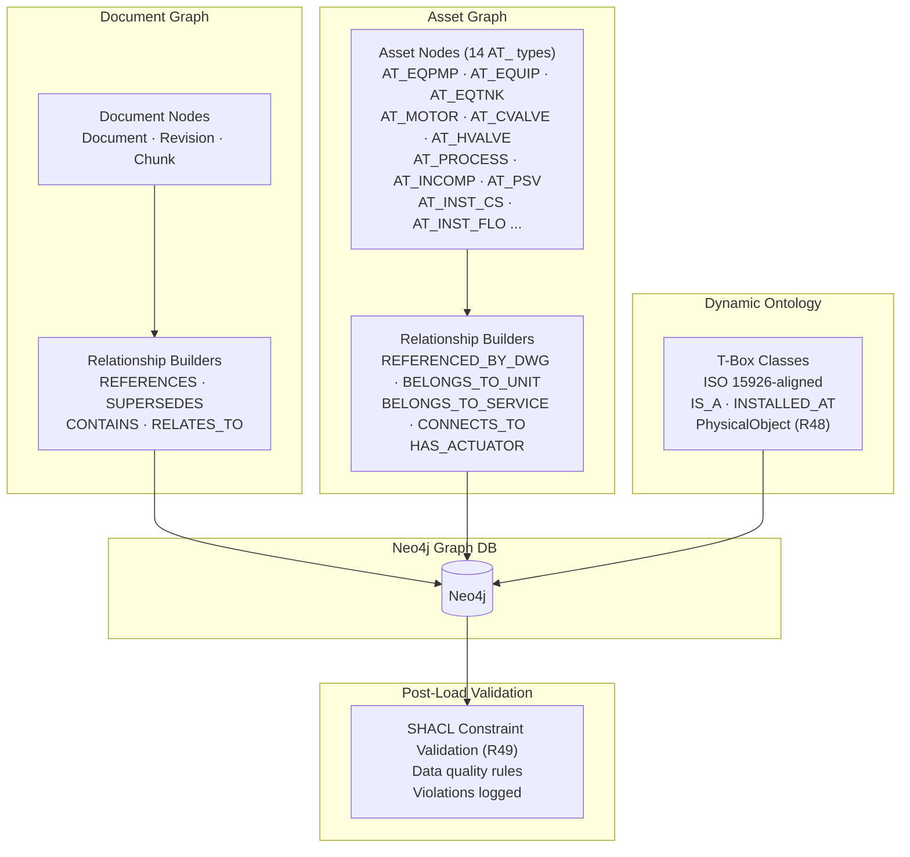

# EKS Phase 3 — Knowledge Graph & Engineering Object Metadata

**Document ID**: WP-EKS-P3-001  
**Current Version**: 1.0  
**Status**: 🔵 DRAFT — PENDING APPROVAL  
**Last Updated**: 2026-06-18  
**Parent Workplan**: [eks_system_workplan.md](eks_system_workplan.md)  
**Phase Dependency**: Phase 2 must be complete and approved  

---

## 1. Title and Description

Build the Neo4j knowledge relationship graph capturing all engineering knowledge connections: document-to-document, document-to-asset, asset-to-asset, and asset-to-metadata. Ingest structured project asset data from the Excel datadrop (7,681 items across 7 categories) into the graph using the universal plant item schema from Phase 1. Implement structured asset loaders (replacing NLP-based extractors) for equipment, instruments, valves, pipelines, and motors. Add CAD format parser stubs (DWG/DGN) and implement superseded document revision chain lookup. Integrate automated document metadata extraction (cover sheet blocks) for the extended metadata schema. Implement specialized document relationships (SUPERSEDES, SUPPLEMENTS, REFERENCES_DOC) based on Appendix B logic.

---

## 2. Revision Control & Version History

| Version | Date       | Author | Summary of Changes                        |
| :------ | :--------- | :----- | :---------------------------------------- |
| 0.1     | 2026-06-11 | System | Initial phase workplan draft for approval |
| 0.2     | 2026-06-15 | System | Replaced NLP-based engineering object extractors with structured asset loaders reading Excel datadrop directly (R37). Added asset graph nodes, pipeline-to-component relationships, and P&ID-to-asset linking. Updated risks and success criteria |
| 0.3     | 2026-06-16 | System | Fixed fragment count in Section 6: corrected "10 reusable fragments" to "11 reusable fragments" to align with Phase 1 v0.6 delivery. Added Timestamp column to task breakdown table per agent_rule Section 8.8. |
| 0.4     | 2026-06-17 | System | Added R39 to scope. Updated T3.9 base asset loader to read conditional_fragments from config and evaluate when/in conditions at runtime — zero code changes needed to add new asset types. Schema loader confirmed no update needed (file-agnostic). |
| 0.5     | 2026-06-18 | System | Added R40 (asset embedding trigger after Neo4j load) and R42 (asset vector upsert on datadrop reload) to scope and tasks. T3.15 sheet orchestrator updated to trigger Phase 2 asset text builder + Qdrant upsert after each node batch. |
| 0.6     | 2026-06-16 | System | Added R43: Automated Document Metadata Extraction. Added T3.21 to task breakdown. |
| 0.7     | 2026-06-16 | System | Added T3.22–T3.24 for dynamic ISO 15926-aligned ontology node & relationship loading in Neo4j. Linked Appendix C. |
| 0.8     | 2026-06-16 | System | Ontology Option C gap closure: added T3.25 (PhysicalObject nodes + INSTALLED_AT edges from serial numbers); T3.26 (SHACL constraint validation post-load); T3.27 (T-Box reload strategy + version control). Updated T3.24 to include conditional PhysicalObject logic. Added success criteria for all three. |
| 0.9     | 2026-06-18 | Gemini CLI | Added T3.28–T3.31: Specialized Relationship Ingestion (Flow, Power, Control, Governance, Set Points) per approved gap analysis. |
| 1.0     | 2026-06-18 | Gemini CLI | Added T3.32–T3.34: Document Relationship Ingestion (Revision Chain, Cross-Doc, Asset Tag Linking) per Appendix B logic. Updated to v1.0. |

---

## 3. Objective

- Integrate Neo4j as the knowledge graph database
- Define the graph schema: document nodes, asset nodes (with typed labels per AT_ category), and all relationship types
- Implement five relationship categories: doc↔doc, doc↔asset, asset↔asset (pipeline→component), asset↔metadata, metadata↔metadata
- Ingest structured project asset data from Excel datadrop using universal schema fragments (R37)
- Implement structured asset loaders that map Excel sheets → Neo4j nodes by tag_type composition rules
- Implement pipeline-to-component relationships from FROM_COMPONENT / TO_COMPONENT fields
- Implement P&ID-to-asset linking via PID NUMBER / DOC_FNAME columns
- Implement superseded document lookup via revision chain graph traversal
- Add DWG/DGN parser stubs (full implementation if CAD library available, else interface stubs)

---

## 4. Scope Summary

| ID  | Category             | Requirement                    | Details                                                                          | Status     |
| :-- | :------------------- | :------------------------ | :------------------------------------------------------------------------------- | :--------: |
| R05 | Knowledge Base       | Knowledge Graph                | Neo4j graph for doc-to-doc, doc-to-asset, asset-to-asset relationships           | 🔷 PLANNED |
| R11 | Metadata             | Engineering Object Metadata    | Plant item, item tag, tag properties; cross-reference metadata                   | 🔷 PLANNED |
| R23 | Revision Management  | Superseded Lookup              | Support querying superseded document revisions via graph traversal               | 🔷 PLANNED |
| R27 | Plug-in Architecture | Structured Asset Loaders       | Loaders for Equipment, Instrument, Valve, Pipeline, Motor from Excel datadrop    | 🔷 PLANNED |
| R31 | Infrastructure       | Graph DB                       | Neo4j for knowledge relationship graph                                           | 🔷 PLANNED |
| R37 | Knowledge Base       | Structured Asset Ingestion     | Load and index project asset data from Excel datadrop into knowledge graph       | 🔷 PLANNED |
| R39 | Schema               | Zero-Code Asset Extensibility  | Base asset loader reads `conditional_fragments` from config at runtime; no code changes needed to add new AT_ types or conditional fragment rules | 🔷 PLANNED |
| R40 | Embedding            | Asset Embedding Trigger        | After loading each asset batch to Neo4j, call asset text builder and upsert vectors into `eks_assets` Qdrant collection | 🔷 PLANNED |
| R42 | Knowledge Base       | Asset Vector Upsert            | On datadrop reload: upsert Neo4j nodes + invalidate and re-embed corresponding `eks_assets` vectors for changed keytags | 🔷 PLANNED |
| R43 | Metadata             | Automated Metadata Extraction | Automated extraction of 11 extended fields (Accountability, Origin, Quality) from doc cover sheets during ingestion | 🔷 PLANNED |
| R44 | Schema               | ISO 15926 Ontology Integration | Separate FunctionalObject (Tag) and PhysicalObject (Equipment) properties in ontology schema; zero-code config-driven classes and relationships | 🔷 PLANNED |
| R45 | Knowledge Base       | Dynamic Ontology Ingestion    | Load T-Box taxonomy dynamically from config; map assets to ontology classes; create IS_A and INSTALLED_AT relationships in Neo4j | 🔷 PLANNED |
| R48 | Knowledge Base | PhysicalObject + INSTALLED_AT | When serial_number is non-null on an asset row, create a separate PhysicalObject node and link it to the FunctionalObject (tag) via INSTALLED_AT; enables physical equipment traceability (ISO 15926 Part 2) | 🔷 PLANNED |
| R49 | Knowledge Base | SHACL Constraint Validation | Post-load SHACL validation against ingested asset nodes; violations logged to issue_log.md | 🔷 PLANNED |

**Status Legend:** ✅ PASS | 🔶 PARTIAL | ❌ FAIL | 🔷 PLANNED

---

...
| T3.28 | Implement Directional Flow Builder | Refactor `CONNECTS_TO` logic to use `TO_COMPONENT` fields to create `FLOWS_TO` edges, enabling upstream/downstream pathfinding | 🔷 | — |
| T3.29 | Implement Electrical & Control Linker | Map `MCC FED FROM` and `PLC_PANEL` fields to create power and control edges in Neo4j | 🔷 | — |
| T3.30 | Implement Governance Resolver | Create `EngineeringStandard` nodes from unique `design_specification` strings and link assets via `GOVERNED_BY` | 🔷 | — |
| T3.31 | Implement Set Point Linker | Link an Asset's operating parameters (alarms, set points) to their source documents via `SET_POINT_IN` edges | 🔷 | — |
| T3.32 | Implement Document Revision Graph Builder | Use `document_number` and `revision` strings to create a time-ordered `SUPERSEDES` chain in Neo4j | 🔷 | — |
| T3.33 | Implement Cross-Doc Reference Extractor | Use LLM/Regex during ingestion to find document numbers mentioned in text and create `REFERENCES_DOC` edges | 🔷 | — |
| T3.34 | Implement Asset Tag Linker | Map the `asset_tags` registry field (JSON array) to existing `FunctionalObject` nodes via `REFERENCES_ASSET` edges | 🔷 | — |

---

## 9. Files and Modules to Create/Update

| File/Folder                                         | Action | Purpose                                                    |
| :-------------------------------------------------- | :----- | :--------------------------------------------------------- |
| `eks/engine/graph/__init__.py`                      | Create | Graph DB package init                                      |
| `eks/engine/graph/graph_store.py`                   | Create | Abstract graph store interface                             |
| `eks/engine/graph/neo4j_store.py`                   | Create | Neo4j implementation of graph store interface              |
| `eks/engine/graph/graph_schema.py`                  | Create | Node label and relationship type definitions               |
| `eks/engine/graph/relationship_builders.py`         | Create | Doc-to-doc, doc-to-object relationship construction logic  |
| `eks/engine/extractors/__init__.py`                 | Create | Structured asset loader package init                       |
| `eks/engine/extractors/base_asset_loader.py`        | Create | Abstract asset loader interface — load sheet data by tag_type fragment rules |
| `eks/engine/extractors/equipment_loader.py`         | Create | Equipment sheet loader (AT_EQUIP, AT_EQPMP, AT_EQTNK, AT_EQVES, AT_EQEXC) |
| `eks/engine/extractors/instrument_loader.py`        | Create | Instrument sheet loader (AT_INST_, AT_INST_CS, AT_INST_FLO) |
| `eks/engine/extractors/valve_loader.py`             | Create | Valve sheet loader (AT_CVALVE, AT_PSV, AT_HVALVE)         |
| `eks/engine/extractors/pipeline_loader.py`          | Create | Pipeline sheet loader (AT_PROCESS) with CONNECTS_TO edge builder |
| `eks/engine/extractors/motor_loader.py`             | Create | Motor sheet loader (AT_MOTOR)                              |
| `eks/engine/extractors/inline_component_loader.py`  | Create | Inline Component sheet loader (AT_INCOMP)                  |
| `eks/engine/parsers/dwg_parser_stub.py`             | Create | DWG parser stub (deferred implementation)                  |
| `eks/engine/parsers/dgn_parser_stub.py`             | Create | DGN parser stub (deferred implementation)                  |
| `eks/config/eks_base_schema.json`                   | Update | Add graph node/relationship type schema definitions        |
| `eks/config/eks_config.json`                        | Update | Add Neo4j connection settings + asset loader config        |
| `eks/test/test_phase3.py`                           | Create | Integration tests for Phase 3 components                   |
| `eks/engine/extractors/asset_embed_trigger.py`      | Create | Calls asset text builder + Qdrant upsert after Neo4j batch load (R40, R42) |

---

## 10. Risks and Mitigation

...
- [ ] Power and control dependency chains traversable (T3.29)
- [ ] Engineering standards and design specs linked via GOVERNED_BY (T3.30)
- [ ] Asset set points linked to source documentation (T3.31)
- [ ] Time-ordered revision chains traversable via SUPERSEDES (T3.32)
- [ ] Automated cross-doc referencing detected from content (T3.33)
- [ ] Assets correctly linked to all referencing documents via REFERENCES_ASSET (T3.34)

---

## 13. Phase 3 Pipeline Architecture (Detailed)

---

## 14. Deliverables

...
