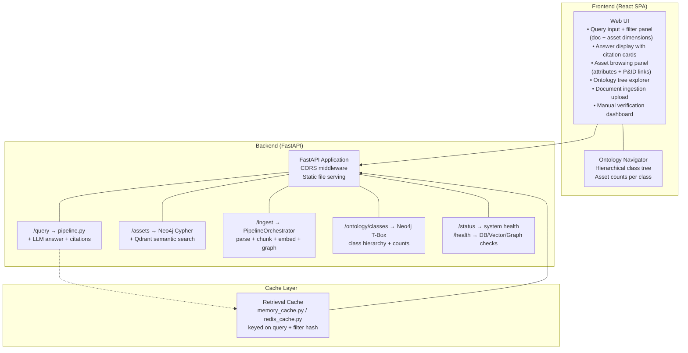

# EKS Phase 5 — UI, Retrieval Cache & System Integration

**Document ID**: WP-EKS-P5-001  
**Current Version**: 0.7  
**Status**: 🔷 PLANNED  
**Last Updated**: 2026-07-08  
**Parent Workplan**: [eks_system_workplan.md](eks_system_workplan.md)  
**Phase Dependency**: Phase 4 must be complete and approved  

---

## 1. Title and Description

Build the standalone interactive user inquiry interface, implement the retrieval cache layer for performance, and conduct full end-to-end system integration testing. This phase closes the loop from document ingestion to user-facing query and answer. Complete system documentation per AGENTS.md Section 14 is produced as a final deliverable.

---

## 2. Revision Control & Version History

| Version | Date       | Author | Summary of Changes                        |
| :------ | :--------- | :----- | :---------------------------------------- |
| 0.1     | 2026-06-11 | System | Initial phase workplan draft for approval |
| 0.2     | 2026-06-15 | System | Added asset browsing/filtering UI (unit, service, tag_type, pipeline tag) and asset-aware query endpoints. Updated integration test scope to include asset graph queries |
| 0.3     | 2026-06-16 | System | Added Timestamp column to task breakdown table per AGENTS.md Section 8.8. Updated dependency note: Phase 5 /assets endpoint depends on T4.18 query_assets handler from Phase 4. |
| 0.4     | 2026-06-16 | System | Added T5.18: Manual Metadata Verification UI workflow. |
| 0.5     | 2026-06-16 | System | Added T5.19 for adding an ontology navigator tree view in the EKS UI. Linked Appendix C. |
| 0.7     | 2026-07-11 | opencode | **I092 / R60 pipeline entry-point convergence**: Added T5.21 (Phase 5 standalone backend `phase5_server.py` [FastAPI permitted] + `run_phase5_pipeline(context)` reusing Phase 1 shared `run_pipeline()`, AGENTS.md §18.13) and T5.22 (serve.py `/api/v5/*` proxy wiring). Both 🔷 PLANNED for review. |
| 0.6     | 2026-06-16 | System | Ontology Option C gap closure: added R47 (Ontology-Driven UI Facets) to scope table; added T5.20 (/api/ontology/classes endpoint + routes/ontology.py); T5.21 (SHACL violation badges on asset cards). Added routes/ontology.py to files table. |

---

## 3. Objective

- Design and implement a standalone web-based interactive query UI with asset browsing
- Implement retrieval cache to reduce repeated query latency
- Conduct full system integration testing: ingest → chunk → embed → graph (document + asset) → retrieve → answer
- Produce complete system documentation per AGENTS.md Section 14 (16-section standard)
- Update all logs, issue logs, and mark workplan complete

---

## 4. Scope Summary

| ID   | Category       | Requirement                              | Details                                                             | Status     |
| :--- | :------------- | :--------------------------------------- | :------------------------------------------------------------------ | :--------: |
| R32  | UI             | Standalone Interactive Inquiry Interface | User-facing web UI for natural language query, document retrieval, and asset browsing | 🔷 PLANNED |
| C-01 | Cache          | Retrieval Cache Layer                    | Cache repeated query results to reduce pipeline latency             | 🔷 PLANNED |
| I-01 | Integration    | Full System Integration Test             | End-to-end: ingest → chunk → embed → graph (document + asset) → retrieve → answer | 🔷 PLANNED |
| D-01 | Documentation  | System Documentation                    | 16-section documentation per AGENTS.md Section 7                  | 🔷 PLANNED |
| A-01 | UI             | Asset Browsing & Filtering              | Filter panel for unit, service, tag_type, pipeline tag; display asset cards with attributes and linked documents | 🔷 PLANNED |
| O-01 | UI | Ontology-Driven UI Facets (R47) | Hierarchical class tree in UI sidebar showing ontology class hierarchy with asset instance counts per class; backed by `/api/ontology/classes` endpoint querying Neo4j T-Box | 🔷 PLANNED |
| R44 | UI | ISO 15926 Ontology Integration (UI) | Expose ontology-driven facets and class hierarchies for asset browsing in UI | 🔷 PLANNED |

**Status Legend:** ✅ PASS | 🔶 PARTIAL | ❌ FAIL | 🔷 PLANNED  
*Note: C-01, I-01, D-01, A-01 are phase-specific items not in the master requirements list.*

---

## 5. Index of Content

- [1. Title and Description](#1-title-and-description)
- [2. Revision Control & Version History](#2-revision-control--version-history)
- [3. Objective](#3-objective)
- [4. Scope Summary](#4-scope-summary)
- [5. Index of Content](#5-index-of-content)
- [6. Evaluation and Alignment](#6-evaluation-and-alignment-with-existing-architecture)
- [7. Dependencies](#7-dependencies-with-other-tasks)
- [8. Task Breakdown](#8-task-breakdown)
- [9. Files and Modules](#9-files-and-modules-to-createupdate)
- [10. Risks and Mitigation](#10-risks-and-mitigation)
- [11. Potential Future Issues](#11-potential-future-issues)
- [12. Success Criteria](#12-success-criteria)
- [13. Deliverables](#13-deliverables)
- [14. Phase 5 Pipeline Architecture (Detailed)](#14-phase-5-pipeline-architecture-detailed)
- [15. References](#15-references)

---

## 6. Evaluation and Alignment with Existing Architecture

- **All prior phases required**: UI wraps the Phase 4 retrieval pipeline (document + asset) as its backend
- **UI design rules**: Refer to `dcc/workplan/ui_design/html_design_rule.md` per AGENTS.md Section 18; universal EKS interface conventions per **Appendix G** (theme §5, help system §6, API conventions §3, polling §4)
- **UI contracts**: Defined in **Appendix G §7** (`eks/ui/backend/contracts.py` — SSOT); Phase 1.2 implements the base contracts, Phase 5 extends them
- **Cache**: Retrieval cache sits between UI request and Phase 4 pipeline; keyed on query + filter hash (document + asset dimensions)
- **Documentation**: Follows AGENTS.md Section 14 16-section documentation standard (same as DCC docs)
- **Integration testing**: Validates the full ingest-to-answer chain across all 5 phases, including asset graph queries
- **Asset UI**: Adds asset-specific filter controls and result display cards beyond the document-centric interface

---

## 7. Dependencies with Other Tasks

1. **Phase 1–4 (WP-EKS-P1/P2/P3/P4)** — All prior phases must be complete; Phase 5 `/assets` endpoint specifically depends on T4.18 (`query_assets` handler in `pipeline.py`) from Phase 4
2. **dcc/workplan/ui_design/html_design_rule.md** — UI design rules reference
3. **External**: FastAPI or Flask for backend; frontend framework (HTML/JS or React); Redis or in-memory cache
4. **Final phase**: No downstream phase dependency; this phase completes the EKS system

---

## 8. Task Breakdown

**Timeline**: TBD — starts after Phase 4 approval and completion  
**Estimated Effort**: High (UI + integration + documentation)

| # | Task | Details | Status | Timestamp |
| :- | :--- | :------ | :----: | :-------- |
| T5.1 | Design UI layout and interaction flow | Query input, filter panel (project, discipline, doc type, revision + unit, service, tag_type, pipeline tag), result display with citations and asset cards | 🔷 | — |
| T5.2 | Implement backend API | FastAPI/Flask endpoints: `/query` (document + asset), `/ingest`, `/assets` (asset search/filter via pipeline.query_assets), `/status`, `/health` | 🔷 | — |
| T5.3 | Implement retrieval cache interface | `retrieval_cache.py`: abstract cache interface — get(), set(), invalidate() | 🔷 | — |
| T5.4 | Implement in-memory cache | Default cache backed by Python dict or LRU cache; keyed on query hash + filters | 🔷 | — |
| T5.5 | Implement Redis cache (optional) | `redis_cache.py`: Redis-backed cache for persistent/distributed caching | 🔷 | — |
| T5.6 | Integrate cache into retrieval pipeline | Pipeline checks cache before executing full retrieval; stores result on miss | 🔷 | — |
| T5.7 | Implement frontend query interface | React SPA (recommended) with HTML/JS fallback: query input, filter controls (document + asset), result cards with source citations and asset cards, ontology tree sidebar | 🔷 | — |
| T5.8 | Implement result display with citations | Show answer + source cards: doc_number, revision, page, section, chunk_id, asset tag | 🔷 | — |
| T5.9 | Implement asset browsing UI | Asset search/filter panel by unit, service, tag_type, pipeline tag; display asset attributes and linked documents | 🔷 | — |
| T5.10 | Implement document ingestion UI | Upload interface for adding new documents to the knowledge base | 🔷 | — |
| T5.11 | Full system integration test — ingest | Test: upload doc → parse → chunk → embed → store in vector DB + graph + asset load from Excel | 🔷 | — |
| T5.12 | Full system integration test — retrieval | Test: submit query (document + asset) → filter → expand → search → rerank → assemble → LLM answer | 🔷 | — |
| T5.13 | Full system integration test — asset | Test: browse/filter assets by unit, service, tag_type; verify asset card data and linked documents | 🔷 | — |
| T5.14 | Full system integration test — cache | Test: repeat query → cache hit → lower latency response | 🔷 | — |
| T5.15 | Generate system documentation | 16-section doc per AGENTS.md Section 14 covering all modules across all phases | 🔷 | — |
| T5.16 | Update all workplan statuses | Mark all phase workplans COMPLETE; update master index | 🔷 | — |
| T5.17 | Update all logs | Final entries to `update_log.md` and `issue_log.md` | 🔷 | — |
| T5.18 | Manual Verification UI | Implement "Manual Verification Dashboard" to review auto-extracted metadata (Phase 3) and set `verified_by` status (R58). | 🔷 | — |
| T5.19 | Implement ontology navigator tree | Add a hierarchical tree explorer component in the sidebar of `index.html` to browse assets via ontology classes | 🔷 | — |
| T5.20 | Integrate Appendix F and Appendix G architecture patterns | Apply universal patterns per [Appendix F](appendix_f_pipeline_architecture_design.md) and [Appendix G](appendix_g_interface_architecture.md): (1) Implement UI contracts (DocumentSelectionContract, PipelineConfigContract, QueryRequestContract, QueryResponseContract) in `eks/ui/backend/contracts.py` per **Appendix G §7** (extends Phase 1.2 base contracts); (2) Create UIInput/UIOutput contracts in `eks/ui/backend/io_contracts.py` extending EngineInput/EngineOutput base per Appendix F §2.3; (3) Follow API endpoint conventions per **Appendix G §3** and status polling per **Appendix G §4**; (4) Use theme system per **Appendix G §5** (CSS variables, 5 themes, localStorage); (5) Implement help system per **Appendix G §6** (ui_help.json schema, F1 shortcut); (6) Follow status bar format per **Appendix G §8**; (7) Add telemetry heartbeat checkpoints for UI performance (response times, cache hit rates); (8) Implement CacheProviderFactory for Dependency Injection (Redis, in-memory); (9) Update task breakdown to reference Phase 1.2 completion for base patterns (PipelineContext, Dependency Injection, Telemetry Heartbeat). | 🔷 | — |
| T5.21 | Phase 5 standalone backend + runner (I092 / R60) | Create `eks/ui/backend/phase5_server.py` backend (FastAPI permitted per AGENTS.md §18.13): health endpoint, 409 concurrency guard; implement `run_phase5_pipeline(context)` reusing shared `bootstrap_pipeline()`/`run_pipeline()` from Phase 1 (T1.99.1); retrieval cache + UI assembly. | 🔷 | I092, R60, T1.99.1 |
| T5.22 | Phase 5 proxy wiring (I092) | `serve.py` proxies `/api/v5/*` → phase5 backend on port 5005; document run command. | 🔷 | I092, T5.21 |

---

## 9. Files and Modules to Create/Update

| File/Folder                                  | Action | Purpose                                                           |
| :------------------------------------------- | :----- | :---------------------------------------------------------------- |
| `eks/ui/app.py`                              | Create | FastAPI/Flask main application entry point                        |
| `eks/ui/backend/contracts.py`               | Create | UI contracts (DocumentSelectionContract, PipelineConfigContract, QueryRequestContract, QueryResponseContract) per Appendix G §7 (extends Phase 1.2 base contracts) |
| `eks/ui/backend/io_contracts.py`            | Create | UIInput/UIOutput contracts per Appendix F |
| `eks/ui/routes/query.py`                     | Create | `/query` endpoint — accepts user query, returns answer + citations + asset results |
| `eks/ui/routes/ingest.py`                    | Create | `/ingest` endpoint — accepts document upload and triggers ingestion|
| `eks/ui/routes/assets.py`                    | Create | `/assets` endpoint — asset search/filter by unit, service, tag_type, pipeline tag |
| `eks/ui/routes/ontology.py`                  | Create | `/api/ontology/classes` endpoint — ontology class hierarchy with instance counts (R47, R44) |
| `eks/ui/routes/status.py`                    | Create | `/status`, `/health` endpoints                                    |
| `eks/ui/static/`                             | Create | Frontend static assets (HTML, CSS, JS)                            |
| `eks/ui/templates/index.html`                | Create | Main query interface template                                     |
| `eks/engine/cache/__init__.py`               | Create | Retrieval cache package init                                      |
| `eks/engine/cache/retrieval_cache.py`        | Create | Abstract retrieval cache interface                                |
| `eks/engine/cache/memory_cache.py`           | Create | In-memory LRU cache implementation                                |
| `eks/engine/cache/redis_cache.py`            | Create | Redis cache implementation (optional)                             |
| `eks/engine/retrieval/pipeline.py`           | Update | Integrate cache check into pipeline orchestrator                  |
| `eks/docs/eks_system_documentation.md`       | Create | Full 16-section system documentation                              |
| `eks/test/test_phase5.py`                    | Create | Full system integration tests                                     |
| `eks/workplan/eks_system_workplan.md`        | Update | Mark all phases COMPLETE; final status update                     |

---

## 10. Risks and Mitigation

| Risk                                               | Likelihood | Impact | Mitigation                                                         |
| :------------------------------------------------- | :--------: | :----: | :----------------------------------------------------------------- |
| UI integration reveals bottlenecks in pipeline     | Medium     | Medium | Retrieval cache + async endpoint handling; profile slow stages     |
| Full integration test reveals data gaps            | Medium     | High   | Per-phase integration tests in prior phases reduce surprises       |
| Cache invalidation strategy unclear                | Medium     | Medium | Define explicit cache key schema; invalidate on document re-ingest |
| Documentation effort underestimated                | Medium     | Low    | Start documentation in parallel with integration testing           |

---

## 11. Potential Future Issues

- Real-time streaming LLM responses (token-by-token) requires WebSocket or SSE infrastructure
- Mobile or embedded UI variants may require simplified component subsets
- Multi-user concurrent query handling may require task queue (Celery, RQ) for heavy workloads
- Cache eviction policies may need tuning based on query volume and knowledge base change frequency
- Authentication and multi-user access control may be required for production deployment; initial version uses single-user mode with no auth

---

## 12. Success Criteria

- [ ] Interactive UI operational: users can submit natural language queries and receive cited answers
- [ ] Filter controls working: filter by document attributes (project, discipline, doc type, revision) AND asset attributes (unit, service, tag_type, pipeline tag)
- [ ] Asset browsing UI operational: search/filter assets, view attribute cards and linked documents
- [ ] Document ingestion UI operational: users can upload new documents
- [ ] Asset ingestion operational: structured Excel data loaded into graph DB
- [ ] Retrieval cache reduces repeated query latency (measurable improvement)
- [ ] Full system integration test passing: ingest → chunk → embed → graph (document + asset) → retrieve → answer
- [ ] Source citations displayed in UI: doc_number, revision, page, section, asset tag
- [ ] Manual Verification workflow operational: UI allows reviewing auto-extracted metadata and setting `verified_by` status
- [ ] System documentation complete per AGENTS.md Section 7 (all 16 sections)
- [ ] Ontology navigator tree view operational in UI sidebar enabling hierarchical asset browsing (T5.19)
- [ ] React frontend builds and serves correctly via FastAPI static files
- [ ] All phase workplans updated to COMPLETE status
- [ ] All logs updated with final entries

---

## 13. Deliverables

- UI modules: `app.py`, `routes/query.py`, `routes/ingest.py`, `routes/assets.py`, `routes/status.py`
- Frontend: `static/` assets, `templates/index.html`, asset card components
- Cache modules: `retrieval_cache.py`, `memory_cache.py`, `redis_cache.py`
- System documentation: `eks/docs/eks_system_documentation.md`
- Test file: `test_phase5.py`
- Report: `eks/workplan/reports/phase_5_ui_integration_report.md`
- Updated master workplan: `eks_system_workplan.md` (all phases COMPLETE)

---

## 14. Phase 5 Pipeline Architecture (Detailed)

---

## 15. References

1. [eks_system_workplan.md](eks_system_workplan.md) — Master workplan
2. [phase_1_foundation_workplan.md](phase_1_foundation_workplan.md)
3. [phase_2_chunking_embedding_workplan.md](phase_2_chunking_embedding_workplan.md)
4. [phase_3_knowledge_graph_workplan.md](phase_3_knowledge_graph_workplan.md)
5. [phase_4_retrieval_pipeline_workplan.md](phase_4_retrieval_pipeline_workplan.md)
6. [AGENTS.md](../AGENTS.md) — Repository guidelines
7. [dcc UI design rules](../../dcc/workplan/ui_design/html_design_rule.md) — UI design rules
8. [eks/readme.md](../readme.md) — EKS project overview
9. [phase_1_foundation_workplan.md](phase_1_foundation_workplan.md) — Asset schema (R36) for filter dimensions
10. [phase_3_knowledge_graph_workplan.md](phase_3_knowledge_graph_workplan.md) — Asset graph for browsing
11. [appendix_c_ontology.md](appendix_c_ontology.md) — Dynamic ISO 15926-Aligned Ontology
12. [appendix_f_pipeline_architecture_design.md](appendix_f_pipeline_architecture_design.md) — Engine I/O contracts (§2.3)
13. [appendix_g_interface_architecture.md](appendix_g_interface_architecture.md) — UI theme (§5), help system (§6), API conventions (§3), polling (§4), UI contracts (§7)
