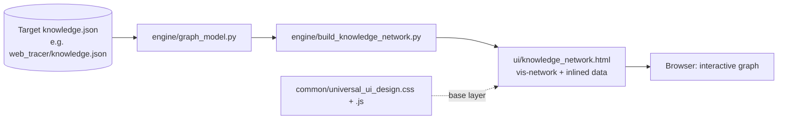
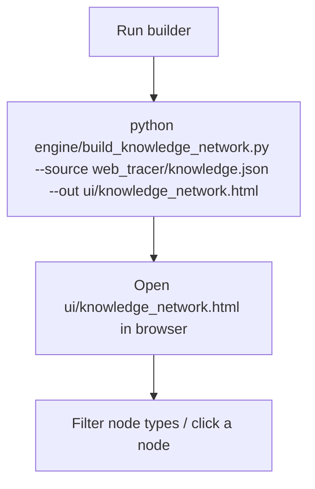

# Knowledge Network Viewer — Workplan (WP-KNV-001)

| Field | Value |
|---|---|
| **Title** | Knowledge Network Viewer — render any `knowledge.json` as an interactive "nero network" |
| **Workplan ID** | WP-KNV-001 |
| **Date** | 2026-10-01 |
| **Author** | AI assistant |
| **Canonical name** | Knowledge Network Viewer |
| **Abbreviation** | `knowledge_network` |
| **Source proposal** | User request: "use folder `knowledge` in root folder, prepare a workplan for `knowledge_network.html` that reads `knowledge.json` and shows it as a nero network" |
| **Upstream context** | `web_tracer/` work (T00 compliance), `dcc/ui/log_neurogram.html` (existing vis-network viewer, model for the rendering approach), `common/universal_ui_design.*` shared UI |
| **Target environment** | Native Linux (current workstation); generated HTML opens in any modern browser via `file://` |
| **Project root** | `knowledge/` (top level of the repository) |
| **Baseline (read-only)** | `eks/knowledge.json`, `web_tracer/knowledge.json` — used as fixtures; never modified by this project |
| **Audience** | Non-specialist users and AI agents who want a visual map of a project's knowledge base |

## Revision Control / Version History

| Revision | Date | Author | Summary |
|---|---|---|---|
| r0 | 2026-10-01 | AI assistant | Inception workplan per AGENTS.md §15: object, scope, index, glossary, dependencies, evaluation/alignment, architecture (Mermaid), 10 required folders, graph model (§8.3), phases with eight elements, task table T00–T07, decisions Q1–Q4, risks R1–R4, gates, testing, logs, compliance table (§9). T00 compliance scaffolding created. |

## 1. Object

Deliver a **standalone, dependency-light viewer** that reads a project's `knowledge.json` and renders it as an interactive graph ("nero network") using `vis-network`. The viewer must open directly from the filesystem (`file://`) with the data inlined — no backend server required — and let a user filter node types and click a node to inspect its source text.

## 2. Scope Summary

| ID | Item | Status |
|---|---|---|
| S-01 | Read any `<project>/knowledge.json` and map it to `{nodes, edges}` | Planned (P1) |
| S-02 | Self-contained HTML with inlined graph data (opens via `file://`) | Planned (P1) |
| S-03 | vis-network canvas: zoom/pan, click-to-inspect side panel | Planned (P1) |
| S-04 | Node-type colouring + filter (modules, entities, schemas, workflows, functions, dependencies, issues) | Planned (P2) |
| S-05 | Shared UI design system base (`common/universal_ui_design.*`), project CSS override only | Planned (P1) |
| S-06 | CLI parameter matrix (`--source`, `--out`, `--filter`, `--theme`) | Planned (P1) |
| S-07 | Robust offline open (CDN fallback / bundling decision Q2) | Planned (P3) |
| S-08 | Tests on `web_tracer` + `eks` knowledge.json fixtures; CI check | Planned (P2/P3) |
| S-09 | Repository compliance: 10 folders, `knowledge.json`, logs, compliance table | Done (T00, this change) |

## 3. Key Features (for beginners)

- **One file in, one file out:** point the builder at a `knowledge.json`, get an HTML you can double-click.
- **Interactive graph:** drag, zoom, pan; click a node to see its raw text in a side panel.
- **Colour by type:** modules, domain entities, schemas, workflows, functions, dependencies and issues each get a colour; issues are red.
- **Filter:** hide node types you don't care about (e.g. show only issues + modules).
- **No server:** data is embedded in the page, so `file://` works (this avoids the browser CORS block that breaks `fetch()` of local JSON).

## 4. Index of Content

1. Object · 2. Scope Summary · 3. Key Features · 4. Index · 5. Glossary · 6. Dependencies · 7. Evaluation & Alignment · 8. Architecture & Graph Model (8.1 Mermaid, 8.2 Quick start, 8.3 Graph model, 8.4 Functions, 8.5 I/O, 8.6 Parameter matrix, 8.7 Coding standards, 8.8 Debugging, 8.9 Usage examples) · 9. Repository Compliance (AGENTS.md) · 10. Folder Structure · 11. Phases (P0–P3 + Closeout, eight elements each) · 12. Task Table (T00–T07) · 13. Decisions (Q1–Q4) · 14. Risks (R1–R4) · 15. Gates · 16. Testing & Logs · 17. Pending Issues · 18. Revision History.

## 5. Glossary (plain language)

- **`knowledge.json`** — a machine-readable "charter" each project must keep at its root (AGENTS.md §5.10); it lists the project's modules, domain concepts, schemas, workflows, functions, dependencies and known issues.
- **nero network** — the user's name for this knowledge-graph view (a network of the knowledge base).
- **node / edge** — a dot in the graph (a concept) and a line between two dots (a relationship).
- **vis-network** — a JavaScript library that draws interactive node/edge graphs in a browser.
- **inline data** — copying the graph data into the HTML file so it works without fetching a separate file.
- **file://** — opening an HTML file straight from disk (not through a web server); browsers block `fetch()` of local files here, which is why we inline.

## 6. Dependencies

- **Internal:** `common/universal_ui_design.css` + `common/universal_ui_design.js` (base UI, AGENTS.md §18); fixture `knowledge.json` files in `eks/` and `web_tracer/`.
- **External:** `vis-network` (CDN); Python 3.10+ stdlib (`json`, `argparse`, `pathlib`) for the builder. Optional `pyvis` for an offline server mode (T06).
- **Infrastructure:** any modern browser; Native Linux workstation.

## 7. Evaluation and Alignment (AGENTS.md)

This workplan is written to satisfy AGENTS.md §15 (workplan rules) and §14 (16 documentation items). The §9 table maps every relevant AGENTS.md rule to its handling. Naming follows §1 (canonical name + abbreviation declared in `knowledge.json` `project_metadata.name`). Logging follows §5.4/§5.17; revision metadata §5.7; knowledge base §5.10; shared UI §18.

## 8. Architecture & Graph Model

### 8.1 Architecture (Mermaid)



### 8.2 Quick start (Mermaid)



### 8.3 Graph model — `knowledge.json` → `{nodes, edges}`

This is the core contract (frozen in **T01**). Every `knowledge.json` becomes a graph with one project hub and typed nodes/edges.

**Node types (`kind`)**

| kind | source field in knowledge.json | notes |
|---|---|---|
| `project` | `project_metadata.name` | the hub (star); one per file |
| `module` | `architecture_overview.key_modules[]` | each bullet → one node |
| `entity` | `domain_concepts.core_entities[]` | domain concept |
| `relation` | `domain_concepts.relationships[]` | relationship type concept |
| `term` | `domain_concepts.terminology[]` | lighter label node |
| `schema` | `key_schemas[]` | schema/file reference |
| `workflow` | `workflows[].name` | operational workflow |
| `function` | `functions[]` | function/entry point |
| `dependency` | `dependencies.{external_services,libraries,infrastructure}[]` | supports the project |
| `issue` | `known_issues[]` | red; `affects` edge to referenced module/entity |

**Edge types (`type`)**

| type | from → to | meaning |
|---|---|---|
| `belongs_to` | module / schema / workflow → project | part of the project |
| `part_of` | entity / term → project | part of the domain |
| `defines` | schema → module / entity | schema describes it |
| `uses` | workflow / function → module | entry point uses module |
| `in` | function → module | function lives in module |
| `supports` | dependency → project (or module) | dependency supports it |
| `affects` | issue → module / entity | known issue touches it |
| `connects` | relation → entity | relationship connects entities |
| `references` | any → any (by name) | loose link |

**Worked example (web_tracer/knowledge.json)**

```json
{
  "nodes": [
    {"id":"proj", "kind":"project", "label":"Web Application Tracer (web_tracer)"},
    {"id":"mod:config", "kind":"module", "label":"engine/config.py"},
    {"id":"ent:trace", "kind":"entity", "label":"Trace"},
    {"id":"iss:i003", "kind":"issue", "label":"I003 shared schema absent"}
  ],
  "edges": [
    {"id":"e1", "type":"belongs_to", "from":"mod:config", "to":"proj"},
    {"id":"e2", "type":"part_of", "from":"ent:trace", "to":"proj"},
    {"id":"e3", "type":"affects", "from":"iss:i003", "to":"mod:config"}
  ]
}
```

### 8.4 Functions

- `graph_model.map(kb: dict) -> dict` — pure mapping → `{nodes, edges, entry_points, hotspots, stats}`; no I/O; unit-testable.
- `graph_model.node_id(kind, name)` / `edge_id(...)` — stable ids for filter/inspect.
- `build_knowledge_network.render(graph, template, theme) -> str` — emits self-contained HTML with inlined JSON + vis-network options.
- CLI: `--source` (required path), `--out` (output HTML), `--filter` (comma list of node kinds), `--theme` (shared UI theme name).

### 8.5 I/O table

| Item | Source | Destination |
|---|---|---|
| Input | `<project>/knowledge.json` (valid JSON) | `graph_model.map` |
| Intermediate | `{nodes, edges, ...}` | `build_knowledge_network.render` |
| Output | `ui/knowledge_network.html` (self-contained, inlined data) | browser `file://` |

### 8.6 Parameter matrix

| Parameter | Default | Required | Effect |
|---|---|---|---|
| `--source` | — | yes | path to the `knowledge.json` to render |
| `--out` | `ui/knowledge_network.html` | no | output HTML path |
| `--filter` | all kinds | no | comma list of node kinds to include |
| `--theme` | default (shared UI) | no | theme name passed to the shared UI base |

### 8.7 Coding standards

- One front end, no new frameworks beyond `vis-network` (AGENTS.md §18 base layer only).
- Path resolution only via stdlib `pathlib` with `--source`/`--out` as the SSOT (no hardcoded literals).
- Every module logs status/warnings/errors; no silent failure (AGENTS.md §5.9).
- JSON artefacts carry `schema_version`/version and are validated before write where applicable.
- Tests live in `knowledge/test/` only (AGENTS.md §6.1).

### 8.8 Debugging guide

| Symptom | Likely cause | Where to look |
|---|---|---|
| Blank graph | `--source` not valid JSON or missing `project_metadata.name` | `graph_model.map` → `KNV-MAP-001` banner |
| Graph does not open (file://) | data not inlined / `fetch()` used | `build_knowledge_network.render` (must inline) |
| vis-network missing | CDN blocked, no fallback | Q2 offline policy; `initGraph()` |
| Red banner on load | version mismatch / unmapped keys | UI header version check |

### 8.9 Usage examples

```bash
# Build the web_tracer knowledge network
python engine/build_knowledge_network.py --source web_tracer/knowledge.json --out ui/knowledge_network.html

# Show only issues + modules, dark theme
python engine/build_knowledge_network.py --source eks/knowledge.json --filter issue,module --theme dark --out ui/eks_knowledge_network.html
```

Then open the generated HTML in any browser.

## 9. Repository Compliance (AGENTS.md)

| AGENTS.md rule | How this workplan complies | Gap / action |
|---|---|---|
| §1 Project registry — canonical name + abbreviation | Canonical name **Knowledge Network Viewer**, abbreviation **`knowledge_network`**; declared in `knowledge.json` `project_metadata.name` and used here | — |
| §5.1 Plan before code | Workplan approved before implementation | — |
| §5.3 Archive before delete | No deletions yet; archive/ kept for future use | — |
| §5.4 Log everything | `log/update_log.md`, `log/issue_log.md` created this change | — |
| §5.7 Revision metadata | Revision table at top of every document | — |
| §5.10 `knowledge.json` required | Created in T00 (v0.1.0); I002 analogue resolved | — |
| §5.13 Cross-source consistency audit | Grep audit at each phase end (§16) | — |
| §5.16 No hardcoded fallback duplicates | Builder uses `--source`/`--out` as SSOT; no duplicate path lists | — |
| §5.17 `issue_log.md` fixed structure | Fixed 9-column table + Legend + Status Summary + Priority Resolution Sequence | created this change |
| §6 Required folders | `archive/ config/ data/ output/ test/ ui/ engine/ log/ docs/ workplan/` all created (T00) | — |
| §6.1 Tests only in `test/` | Unit + integration tests planned under `knowledge/test/` | — |
| §14 Documentation — 16 items | Covered: summary (§1), index (§4), features (§3), doc map (§4), quick start Mermaid (§8.1/8.2), structure (§10), functions (§8.4), I/O (§8.5), parameter matrix (§8.6), function details (§8.4), debugging (§8.8), usage (§8.9), pending issues (§17), tests (§16), dependencies (§6), coding standards (§8.7) | — |
| §15 Workplan rules | Full structure present | — |
| §18 Shared UI design system | `ui/knowledge_network.html` uses `common/universal_ui_design.css`+`.js` as base; project CSS overrides only | enforce in T03 |
| §19 Error codes single source | Error codes `KNV-*` declared in `knowledge.json` `initiation_integrity` (SSOT) | — |

## 10. Folder Structure

```
knowledge/
├── archive/    config/     data/       output/     test/
├── ui/         engine/     log/        docs/       workplan/
├── knowledge.json          # Required at project root (T00)
└── workplan/knowledge_network_workplan.md   # this document
```

## 11. Phases (eight elements each)

### Phase 0 — Planning & compliance (P0)
- **Timeline:** 1 day
- **Milestones:** M1 workplan approved · M2 ten folders + knowledge.json + logs
- **Deliverables:** `knowledge/knowledge.json`, `knowledge/workplan/*`, `knowledge/log/*`, 10 folders
- **Updated or created:** `knowledge/` tree; `knowledge.json`; `log/issue_log.md`; `log/update_log.md`
- **Risks & mitigation:** R-convention — top-level `knowledge/` dir is intentional per user instruction (AGENTS.md §6 "no unexpected top-level directories" overridden by explicit request)
- **Potential future issues:** default `--source` policy (KNV-I002)
- **Success criteria:** workplan passes AGENTS.md §15 review; all 10 folders present; knowledge.json valid JSON declaring canonical name
- **References:** T00; AGENTS.md §1/§5/§6/§14/§15

### Phase 1 — MVP builder + viewer (P1)
- **Timeline:** 3 days
- **Milestones:** M1 graph model frozen · M2 builder emits HTML · M3 viewer renders + inspect
- **Deliverables:** `engine/graph_model.py`, `engine/build_knowledge_network.py`, `ui/knowledge_network.html` (generated), `cli` entry
- **Updated or created:** `engine/`, `ui/`; `test/` starts
- **Risks & mitigation:** R1 (file:// fetch) → inline data; R3 (schema drift) → lenient parse
- **Potential future issues:** large knowledge.json performance
- **Success criteria:** `python engine/build_knowledge_network.py --source web_tracer/knowledge.json` opens offline and shows project hub + modules + entities + issues with no JS errors
- **References:** T01–T04; Q1–Q4

### Phase 2 — Enrich + tests (P2)
- **Timeline:** 3 days
- **Milestones:** M1 filters + themes · M2 tests on both fixtures · M3 stats/hotspots
- **Deliverables:** filter UI, theme switch, `test/test_graph_model.py`, `test/test_build.py`
- **Updated or created:** `ui/`, `test/`
- **Risks & mitigation:** R2 (large graph) → collapse-by-default + degree-based sizing
- **Potential future issues:** terminology/relation nodes clutter
- **Success criteria:** build passes on `web_tracer` + `eks` knowledge.json; node/edge counts asserted; no orphan nodes
- **References:** T05; §8.6

### Phase 3 — Robustness + CI (P3)
- **Timeline:** 2 days
- **Milestones:** M1 offline CDN policy · M2 CI check
- **Deliverables:** offline fallback (bundled vis-network or pyvis mode), CI script
- **Updated or created:** `scripts/` (optional), `test/`
- **Risks & mitigation:** R4 (CDN offline) → bundle or pyvis
- **Potential future issues:** CDN version drift
- **Success criteria:** CI builds both fixtures and fails on a broken/missing `project_metadata.name`
- **References:** T06; Q2

### Closeout
- **Deliverables:** `README.md`, `workplan/` archive, release zip
- **Success criteria:** docs + code in same change; README has the two attach command sets (§8.9)

## 12. Task Table (T00–T07)

| ID | Task | Ph | Depends on | Output files | Acceptance criteria |
|---|---|---|---|---|---|
| **T00** | Repository compliance: folders, `knowledge.json`, logs | P0 | — | 10 folders, `knowledge.json` | All ten folders exist; knowledge.json declares "Knowledge Network Viewer" / `knowledge_network` |
| T01 | Graph model spec frozen (`knowledge.json` → nodes/edges) | P1 | T00 | `engine/graph_model.py`, workplan §8.3 | map() on a fixture returns typed nodes/edges; no orphan nodes |
| T02 | Python builder (inline-data HTML emitter) | P1 | T01 | `engine/build_knowledge_network.py` | running it produces a self-contained HTML; opens via file:// |
| T03 | HTML viewer (vis-network + shared UI + inspect panel) | P1 | T02 | `ui/knowledge_network.html` | graph renders; click shows source text; uses shared UI base |
| T04 | CLI parameter matrix | P1 | T02 | `cli/main.py` or engine entry | `--source/--out/--filter/--theme` all work |
| T05 | Tests (mapping + build on both fixtures) | P2 | T01,T02 | `test/test_graph_model.py`, `test/test_build.py` | unit + integration pass on web_tracer + eks knowledge.json |
| T06 | Offline robustness + CI | P3 | T03,T05 | offline fallback, CI script | CI builds both fixtures; fails on missing `project_metadata.name` |
| T07 | Docs + release | Closeout | T06 | `README.md`, archive | README has both command sets; code+docs together |

## 13. Decisions (Q1–Q4)

- **Q1 — Delivery model:** standalone self-contained HTML with **inlined** graph data (opens via `file://`), not a server-fed page. Rationale: avoids the browser CORS block on `fetch()` of local JSON and needs no runtime backend. (Decided.)
- **Q2 — Rendering library / offline:** `vis-network` via CDN, with an offline fallback (bundle a local copy or provide a `pyvis` server mode) to be finalised in T06. (Needs Decision → KNV-I002.)
- **Q3 — Default `--source`:** `--source` is required; when omitted, scan the repo for `*/knowledge.json` and let the user pick, or default to the caller's. (Needs Decision → KNV-I002.)
- **Q4 — Schema validation:** do **not** require the absent shared `knowledge_base_schema.json` (web_tracer I003); parse structurally and tolerate unknown keys. (Decided.)

## 14. Risks (R1–R4)

- **R1** Browser `file://` blocks `fetch()` of local JSON → mitigated by inlining data (Q1).
- **R2** Large `knowledge.json` (eks ~28 KB, many modules) → collapse-by-default node types + degree-based sizing; lazy expand.
- **R3** `knowledge.json` shape drift (no shared schema, I003) → lenient structural parser; warn on unknown keys; surface version in header.
- **R4** `vis-network` CDN unreachable offline → bundle a local copy or `pyvis` server mode (T06).

## 15. Gates

- **P1 gate:** generated HTML opens offline and renders project hub + modules + entities + issues with no console errors.
- **P3 gate:** CI succeeds on both `web_tracer/knowledge.json` and `eks/knowledge.json`; fails on a `knowledge.json` missing `project_metadata.name`.

## 16. Testing & Logs

- **Unit:** `test/test_graph_model.py` — `map()` on a fixture; asserts node/edge kinds, no orphans, stable ids.
- **Integration:** `test/test_build.py` — build `web_tracer` + `eks` knowledge.json; assert `nodes>0`, every non-hub node has an edge, HTML contains inlined JSON.
- **Acceptance:** open the generated HTML via `file://` and confirm interactive behaviour.
- **Logs:** `log/issue_log.md` (fixed structure), `log/update_log.md`, `log/test_log.md` (created at T05).

## 17. Pending Issues

- **KNV-I002** (🔶 Needs Decision) — offline CDN policy (Q2) and default `--source` (Q3). Tracked in §13.
- **Inherited** — web_tracer I003 (blocked): shared `knowledge_base_schema.json` absent; knowledge_network parses structurally (Q4).

## 18. Revision History

| Revision | Date | Author | Summary |
|---|---|---|---|
| r0 | 2026-10-01 | AI assistant | Inception workplan + T00 compliance scaffolding (10 folders, knowledge.json v0.1.0, logs). Graph model, phases, tasks T00–T07, decisions Q1–Q4, risks R1–R4 defined. |
