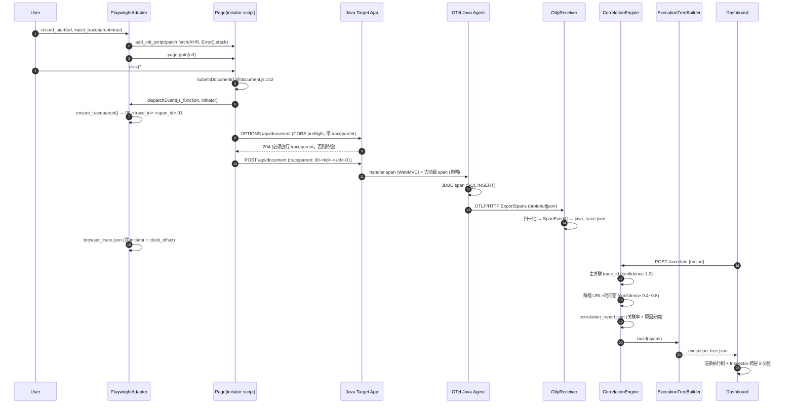

# Workplan: Web Application Tracer（跨层 Web 应用追踪器）

> **RETIRED / 已归档 — 2026-09-30**
> 本文件为 r0 中文草案（802 行），已被英文主 workplan 取代：
> `../web_application_tracing_workplan.md`（r1，按 AGENTS.md §15 结构重写）。
> 归档原因：语言改为英文（面向用户与开发者）；结构补齐 Object / Scope Summary / Evaluation and Alignment / 各阶段 Risks 与 Success Criteria 等强制段落；基线由 `ref/` 副本改为只读引用 `../code_tracer/`。
> **保留价值**：任务编号 T01–T61、契约编号 WT-xx、风险编号 R1–R12、问题编号 Q1–Q11 全部沿用，历史评审记录仍然可追溯。
> 请勿在此文件上继续编辑，所有更新写入英文主 workplan。

| 项 | 值 |
|---|---|
| **Workplan ID** | `WP-WEB-TRACER-001` |
| **状态** | **RETIRED — 已归档（2026-09-30），由 r1 英文版取代** |
| **日期** | 2026-09-29 |
| **来源提案** | `web_tracing_proposal.md`（959 行，用户 Song Qinghua 原始提案；建议置于 `docs/`） |
| **上游输入** | PRD（许清楚）6 条裁决 + Phase 0–8 划分 + WT-xx 需求池；Python Code Tracer 基线调研报告 |
| **目标环境** | Windows 主机 + WSL Ubuntu + Docker Desktop；远期 EKS |
| **工程根** | `web_tracer/`（根目录，新建） |
| **基线（只读）** | `web_tracer/ref/`（code_tracer 的只读副本，**禁止修改**，仅复制演进） |

---

## 1. 项目概述

把已交付的 **Python Code Tracer**（单语言、单运行时、静态分析为主）扩展为 **Web Application Tracer**：跨层追踪「用户动作 → 浏览器 → HTTP → Java 后端 → DB」，产出**一棵可交互的统一执行树**。

核心不是"再多画一张调用图"，而是 **Correlation Engine（跨层关联引擎）**——用 `trace_id` 把浏览器侧与 JVM 侧两条独立采集流缝成同一棵树；拿不到 `trace_id` 时用 URL + 时间窗降级关联，并**显式标注 confidence < 1.0**。

### 1.1 与现有 Python Code Tracer 的关系

| 类别 | 内容 | 处理方式 |
|---|---|---|
| **复用（复制演进）** | 静态流水线四段式 `crawler → parser → metrics → graph` 架构范式 | 照搬范式，Java/JS 各实现一遍 |
| | `networkx` DiGraph + `_func_map`/`_name_index` 双索引 + `_SKIP_CALLS` 黑名单 | 复制到 `static/unified_graph.py` |
| | FastAPI 单端口服务 + `_resolve_base()` 三级优先级 + `Path.is_relative_to()` 路径安全 | 复制到 `engine/paths.py`，**单点** |
| | `ref/ui/static_dashboard.html`（66KB，VS Code 三段式）+ `code-tracer.css`（5 主题） | **复制**到 `web_tracer/ui/` 后增量演进（唯一前端） |
| | 图产物 schema 顶层 `{nodes, edges, entry_points, hotspots, stats}` | 向后兼容扩展 |
| | pyvis 渲染 + vis-network CDN fallback；CC 配色 1-4/5-9/10-19/20+；`size=min(12+cc*2,40)`；入口点 `shape:'star'` | 复用配色与尺寸规则，新增 layer 色带 |
| **新增** | 统一 Span/Event 模型 + 三个 JSON Schema | 契约先行（Phase 1） |
| | BrowserTracer 抽象 + PlaywrightAdapter + initiator 捕获 + traceparent 注入 | Phase 2 |
| | OTLP/HTTP 最小接收端 + JavaMethodInstrumentation 四策略 | Phase 3 |
| | **CorrelationEngine + ExecutionTreeBuilder** | Phase 4（核心） |
| | tree-sitter-java / JS-TS / HTML 静态分析 + 跨语言端点匹配 | Phase 5 / 6 |
| | UnifiedGraph（edge 补 `type`/`line`/`confidence`）+ Dashboard 完整演进 | Phase 7 |
| **废弃（反面教材）** | `ref/engine/core/trace_engine.py` 的 `sys.settrace` 运行时引擎（只有自增 `call_%06d`，无 trace_id/span_id、无跨进程传播） | **不复用**，Java 侧改用 OTel；Python 运行时线保持现状独立 |
| | `ref/ui/tracer_pro.html`（与后端契约全线错配：POST vs GET、`/ws` vs `/ws/trace`、`/trace/clear` 不存在；socket.io vs 原生 WS） | **不复活**，Out of Scope |
| | Jaeger / Tempo 作为交付组件（自带 UI → 两套前端） | 仅 Phase 0 spike 期临时对照 |
| | 新建 React/Vite/Tailwind 前端 | **明令禁止** |

### 1.2 对原始提案的技术性修正（必须明确指出）

> **最重要的一条：OTel Java Agent 默认不会自动产生 Controller / Service / Repository 的业务方法级 span。**
> 提案 §6 给出的那棵树（`HTTP POST /api/document → DocumentController.create → DocumentService.create → Validator.validate → Repository.save → SQL INSERT`）中，**中间的 Controller/Service/Repository 三层默认是不存在的**。OTel Java Agent 是**框架层**自动插桩：Servlet/Spring WebMVC handler（只有 `POST /api/document` 一个 handler span，不含方法名）、JDBC（只有 SQL 语句 span）、RPC、MQ、Redis。业务方法默认是黑盒。

补救路径与代价（**全局最大技术分叉，见 Q1**）：

| 路径 | 嵌套正确性 | 改业务源码 | 成本 | 结论 |
|---|---|---|---|---|
| `otel.instrumentation.methods.include` 配置 | ❌ **平铺无嵌套**（同一父 span 下的兄弟） | 否 | 低 | 不足以支撑执行树，仅作兜底 |
| `@WithSpan` 注解 | ✅ 正确 | **是**（逐个方法加注解） | 中 | 侵入中等，精确可控 |
| Spring AOP `@Around` 切面 | ✅ 正确 | 否（仅新增一个切面类 + 依赖） | 中 | **Spring Boot 场景首选** |
| Byte Buddy 自定义 agent | ✅ 正确 | 否（零侵入） | 高 | 成本高，Phase 8 增强 |

其余修正：
- 提案 §14 优先级顺序与 §13 Phase 编号**自相矛盾**（优先级里没有"网页静态分析"但它却是 Phase 1）→ 改为**风险驱动重排**，静态分析后移，新增 **Phase 0 Spike**。
- 提案 §3 建议 JavaParser/Spoon → 改用 **tree-sitter-java**（Python binding，与 JS/TS 共用 parser 架构），避免把 JDK+Maven 拖进以 Python 为主的项目；JavaParser 降为 P8 可选后端（仅用于解 `@Autowired` 接口注入 → 实现类）。
- 提案 §3 建议 Jaeger/Tempo → Phase 0–4 改为极简 Python OTLP/HTTP receiver 落 JSON 文件。
- 提案默认隐含"近实时流式" → 改为**默认离线回放**（导入 trace 文件），与已验证的 pull 模型一致；WS 降为 P2。

---

## 2. 架构总览

```
                    ┌────────────────────────────────────────────────┐
                    │  web_tracer · Python · FastAPI :8100 (可配置)    │
                    │  ui/static_dashboard.html  (唯一前端, pull 模型) │
                    └────────────────────────────────────────────────┘

┌─────────── STATIC ANALYSIS ────────────┐   ┌────────── RUNTIME TRACE ──────────┐
│                                         │   │                                   │
│  Web  HTML ─┐                           │   │  BROWSER   Playwright ── CDP      │
│       JS/TS ─┼─ tree-sitter ─┐          │   │    │ navigation / click / XHR      │
│       CSS   ─┘               ▼          │   │    │ console / error / screenshot  │
│                  web_static_graph.json  │   │    │ traceparent 注入 (traceparent)│
│                                         │   │    │ add_init_script 抓 initiator  │
│  Java  *.java ─ tree-sitter-java ─┐     │   │    ▼                              │
│                                   ▼     │   │  browser_trace.json               │
│                  java_call_graph.json   │   │                                   │
│                                         │   │  JAVA  OTel Java Agent            │
│              ▲ 端点匹配 (URL ↔ @Mapping) │   │    │ + 方法级策略(4选1, Q1 决定)   │
│              └──────────────────────────┼───┤    ▼  OTLP/HTTP                   │
│                                         │   │  OtlpReceiver (Python, 极简)      │
│                                         │   │    ▼                              │
│                                         │   │  java_trace.json                  │
└──────────────────────┬──────────────────┘   └───────────────┬───────────────────┘
                       │                                      │
                       └──────────► CorrelationEngine ◄────────┘
                                     │  主: trace_id 精确匹配
                                     │  降级: URL + 时间窗 (±200ms) → confidence<1.0
                                     │  产出: correlation_report.json (关联率 + 未关联原因)
                                     ▼
                              ExecutionTreeBuilder
                                     ▼
                             execution_tree.json   ◄── 提案 §13 示例树即此产物
                                     │
              ┌──────────────────────┼──────────────────────┐
              ▼                      ▼                      ▼
     UnifiedGraphBuilder      correlation_report      Dashboard (Phase4 最小
     unified_graph.json                              / Phase7 完整)
     (node+layer/language/kind/confidence
      edge+type/line/confidence/metadata)
```

### 2.1 跨层关联关键调用流程（Mermaid）



---

## 3. 统一数据模型（核心 · 字段级）

三个 schema 存于 `web_tracer/engine/schema/`，**早于任何 adapter 代码**（契约先行）。版本号 `schema_version: "1.0"`，破坏性变更需 +1 并保留读取兼容。

### 3.1 `SpanEvent` — 统一 Span/事件模型（WT-01）

| 字段 | 类型 | 必填 | 说明 |
|---|---|---|---|
| `schema_version` | string | ✓ | `"1.0"` |
| `trace_id` | string(32 hex) | ✓ | W3C TraceContext 兼容 |
| `span_id` | string(16 hex) | ✓ | |
| `parent_span_id` | string \| null | ✓ | 根为 `null` |
| `layer` | enum | ✓ | `user` \| `browser` \| `http` \| `java` \| `db` \| `external` |
| `event_type` | enum | ✓ | `user_action` `dom_event` `js_function` `navigation` `resource` `http_request` `http_response` `controller` `service` `repository` `method` `sql` `external_call` `console` `error` |
| `name` | string | ✓ | 函数名 / `POST /api/document` / `SELECT ...` |
| `kind` | enum | ✓ | `function` `method` `request` `statement` `event` |
| `language` | enum \| null | | `javascript` `typescript` `java` `sql` `html` |
| `source` | object | ✓ | `{file, line, column?, symbol?, class_name?, package?}` |
| `start_time` | string(ISO8601 UTC) | ✓ | 已做 clock_offset 归一化后的时间 |
| `start_time_unix_ns` | int | ✓ | 排序/窗口计算用（纳秒） |
| `end_time` | string \| null | | |
| `duration_ms` | float | ✓ | `-1` 表示未结束 |
| `status` | enum | ✓ | `ok` `error` `timeout` `aborted` `unknown` |
| `confidence` | float [0,1] | ✓ | 该 span 自身信息的可信度 |
| `correlation` | object | ✓ | `{method, score, reason}`；`method ∈ trace_id\|url_time_window\|inferred\|unmatched` |
| `attributes` | object | ✓ | 层特有扩展（HTTP status/size、SQL text、args、stack…） |
| `clock_offset_ms` | float | ✓ | 采集端相对基准时钟的偏移（已用于归一化） |
| `collector` | object | ✓ | `{name, version, run_id}` |
| `resource` | object | | `{service_name, host, env: local\|docker\|eks, thread?}` |

> **与提案 §11 的兼容**：提案给的 Java 示例把 `class` / `method` 放在顶层。本 schema 统一归一化到 `source.class_name` / `name`；`validate.py` 提供 `compat_load()`，若遇到顶层 `class`/`method` 自动搬运到标准位置，保证提案两个示例 JSON **可直接被加载**。

**示例（browser 侧，对齐提案 §11 第一个示例）**

```json
{
  "schema_version": "1.0",
  "trace_id": "8f3a1c2e4b5d6a7f8f3a1c2e4b5d6a7f",
  "span_id": "a1b2c3d4e5f60718",
  "parent_span_id": "0f1e2d3c4b5a6978",
  "layer": "browser", "event_type": "js_function", "name": "submitDocument",
  "kind": "function", "language": "javascript",
  "source": { "file": "static/js/document.js", "line": 142, "column": 7, "symbol": "submitDocument" },
  "start_time": "2026-09-29T10:12:33.482Z",
  "start_time_unix_ns": 1759145553482000000,
  "end_time": "2026-09-29T10:12:33.500Z",
  "duration_ms": 18.4, "status": "ok", "confidence": 1.0,
  "correlation": { "method": "trace_id", "score": 1.0, "reason": null },
  "attributes": { "stack": ["submitDocument@142:7", "onSubmit@88:21"], "http_requests": 1 },
  "clock_offset_ms": 0.0,
  "collector": { "name": "playwright-adapter", "version": "0.1.0", "run_id": "run-20260929-101233" },
  "resource": { "service_name": "web-frontend", "host": "WIN-HOST", "env": "local" }
}
```

**示例（http 侧，initiator 由 P2 捕获）**

```json
{
  "trace_id": "8f3a1c2e4b5d6a7f8f3a1c2e4b5d6a7f",
  "span_id": "b2c3d4e5f6071829", "parent_span_id": "a1b2c3d4e5f60718",
  "layer": "http", "event_type": "http_request", "name": "POST /api/document",
  "kind": "request", "language": null,
  "source": { "file": "static/js/document.js", "line": 145, "symbol": "fetch" },
  "start_time_unix_ns": 1759145553489000000, "duration_ms": 42.1, "status": "ok",
  "confidence": 1.0, "correlation": { "method": "trace_id", "score": 1.0, "reason": null },
  "attributes": {
    "http": { "method": "POST", "url": "https://t/api/document", "status": 200,
              "req_bytes": 512, "res_bytes": 1284, "resource_type": "fetch",
              "from_cache": false, "redirects": 0 },
    "initiator": { "file": "static/js/document.js", "line": 145, "function": "submitDocument",
                   "type": "fetch", "stack": ["submitDocument@142:7"] },
    "preflight": { "observed": true, "allowed": true }
  },
  "clock_offset_ms": 0.0, "collector": { "name": "playwright-adapter", "version": "0.1.0", "run_id": "run-20260929-101233" }
}
```

> `initiator` 是本项目相对普通 APM 的关键增量：**必须**用 `page.add_init_script()` patch `window.fetch` / `XMLHttpRequest` 并用 `new Error().stack` 抓调用栈；`extraHTTPHeaders` 是 page 级，拿不到发起函数。

**示例（java 侧，对齐提案 §11 第二个示例；含 db）**

```json
{
  "trace_id": "8f3a1c2e4b5d6a7f8f3a1c2e4b5d6a7f",
  "span_id": "0a9b8c7d6e5f4031", "parent_span_id": "c3d4e5f60718293a",
  "layer": "java", "event_type": "service", "name": "DocumentService.create",
  "kind": "method", "language": "java",
  "source": { "file": "com/example/doc/DocumentService.java", "line": 84,
              "symbol": "create", "class_name": "DocumentService", "package": "com.example.doc" },
  "start_time_unix_ns": 1759145553498000000, "duration_ms": 32.7, "status": "ok",
  "confidence": 1.0, "correlation": { "method": "trace_id", "score": 1.0, "reason": null },
  "attributes": { "strategy": "spring_aop", "thread": "http-nio-8080-exec-3",
                  "code": { "namespace": "com.example.doc.DocumentService", "function": "create" } },
  "clock_offset_ms": 3.2, "collector": { "name": "otlp-receiver", "version": "0.1.0", "run_id": "run-20260929-101233" },
  "resource": { "service_name": "doc-service", "host": "wsl-ubuntu", "env": "local" }
}
```

### 3.2 `ExecutionTree`（WT-31）

```json
{
  "schema_version": "1.0",
  "trace_id": "8f3a1c2e4b5d6a7f8f3a1c2e4b5d6a7f",
  "run_id": "run-20260929-101233",
  "clock": { "base": "browser", "offset_ms": { "browser": 0.0, "java": -3.2 } },
  "root": {
    "id": "span:deadbeef00000001", "span_id": "deadbeef00000001",
    "layer": "user", "name": "Click \"Submit\"", "kind": "event",
    "source": { "file": "static/index.html", "line": 88, "symbol": "#submit" },
    "start_offset_ms": 0.0, "duration_ms": 61.2, "self_time_ms": 0.4,
    "status": "ok", "confidence": 1.0,
    "correlation": { "method": "trace_id", "score": 1.0, "reason": null },
    "attributes": {},
    "children": [{                                     /* 👤 Click "Submit" (user) */
      "layer": "browser", "name": "submitDocument",    /* └── 🌐 JS: submitDocument */
      "start_offset_ms": 1.1, "duration_ms": 18.4, "self_time_ms": 2.0,
      "children": [{
        "layer": "http", "name": "POST /api/document", /*      └── HTTP POST */
        "start_offset_ms": 8.0, "duration_ms": 42.1,
        "children": [{
          "layer": "java", "name": "DocumentController.create",  /* └── ☕ Java Controller */
          "start_offset_ms": 12.3, "duration_ms": 37.0,
          "children": [{
            "layer": "java", "name": "DocumentService.create",   /*   └── Service */
            "start_offset_ms": 13.0, "duration_ms": 32.7,
            "children": [{
              "layer": "db", "name": "INSERT INTO document",     /*     └── 🗄 SQL */
              "start_offset_ms": 30.0, "duration_ms": 9.8, "self_time_ms": 9.8, "children": [] }]
          }]
        }]
      }]
    }]
  },
  "stats": { "node_count": 6, "max_depth": 5, "total_duration_ms": 61.2,
             "layers": { "user": 1, "browser": 1, "http": 1, "java": 2, "db": 1 },
             "unmatched_count": 0, "correlation_rate": 1.0 }
}
```

### 3.3 `UnifiedGraph`（WT-50，向后兼容 Python 线产物）

顶层仍为 `{nodes, edges, entry_points, hotspots, stats, schema_version, run_id?}`。

**node 新增字段**（原有字段全部保留）：

| 新增 | 类型 | 说明 |
|---|---|---|
| `layer` | enum | `browser`\|`http`\|`java`\|`db`\|`external` |
| `language` | enum\|null | `javascript`\|`typescript`\|`java`\|`sql` |
| `kind` | enum | `function`\|`method`\|`class`\|`endpoint`\|`sql`\|`page`\|`component` |
| `confidence` | float | 静态推断/运行时证据可信度 |
| `source_of_truth` | enum | `static`\|`runtime`\|`both` |
| `span_count` / `total_duration_ms` / `error_count` | int/float | 运行时叠加（WT-33） |
| `endpoints[]` | string[] | 该 JS 函数/HTML 元素发起的 API URL（Phase 6） |

**edge 新增字段**（原 `{source, target}` 保留）：

| 新增 | 类型 | 说明 |
|---|---|---|
| `type` | enum | `static_call` `dynamic_call` `http_call` `sql_call` `event_bind` `initiator` `correlation` |
| `line` | int\|null | 调用发生行 |
| `confidence` | float | 见 §10.6 |
| `metadata` | object | `{count, avg_duration_ms, last_trace_id, strategy}` |

**stats 扩展**：`{modules, functions, edges, entry_points, hotspots, layers{}, correlation_rate, span_count, trace_count}`

---

## 4. 目录结构

相对 `web_tracer/` 根。**标注 `[复用]` 的文件从 `ref/` 复制后演进；`[新建]` 为首次编写。**

```
web_tracer/
├── web_application_tracing_workplan.md        [本文档；按 AGENTS.md 亦可置于 workplan/ 子目录]
├── ref/                                       [只读基线：code_tracer 副本，禁止修改]
├── knowledge.json                             [新建·项目知识库，AGENTS.md §5.10 强制]
├── README.md / requirements.txt / requirements-optional.txt          P1
├── engine/
│   ├── config.py             P1 · 端点常量/层枚举/端口【单一来源】
│   ├── capability.py         P1 · 依赖探测 + FATAL/WARN 分级 (WT-04)
│   ├── paths.py              P1 · _resolve_base() 三级优先级【单点】(WT-05)
│   ├── clock.py / ids.py / logging_setup.py   P1 · UTC+clock_offset / W3C ID (WT-15)
│   ├── schema/
│   │   ├── span_schema.json / execution_tree_schema.json / unified_graph_schema.json  P1
│   │   ├── examples/{browser,http,java,execution_tree}.json   P1 · 兼容提案 §11
│   │   └── validate.py       P1 · jsonschema + compat_load() (WT-02)
│   ├── browser/
│   │   ├── base.py           P2 · BrowserTracer ABC (WT-10)
│   │   ├── playwright_adapter.py  P2 · 6 类事件采集 (WT-10)
│   │   ├── initiator_script.js    P2 · patch fetch/XHR + Error().stack (WT-12)
│   │   ├── traceparent.py    P2 · 注入 + CORS 预检探测 (WT-11/14)
│   │   ├── actions.py        P2 · 用户动作 → trace root (WT-13)
│   │   ├── recorder.py       P2 · 会话编排 + trace.zip (WT-16)
│   │   └── cdp_adapter.py / bidi_adapter.py   P8 · 预留 (WT-17)
│   ├── java/
│   │   ├── otlp_receiver.py  P0 · 极简 OTLP/HTTP 接收端 (WT-20)
│   │   ├── otlp_decode.py    P0 · protobuf/json 双通道
│   │   ├── method_instrumentation.py  P0 · ABC + REGISTRY 注册表【Q1 分叉点】
│   │   ├── strategies/{framework_only, spring_aop【首选】, with_span}.py  P0
│   │   │   └── strategies/bytebuddy.py         P8 · 零侵入
│   │   ├── java_resources/{TracedAspect.java, pom-snippet.xml, CorsConfig.java}  P0/P3
│   │   ├── agent_configs/{local_jvm.env, docker.env+docker-compose.yml,
│   │   │                  eks.yaml, otel-collector-config.yaml}   P3 · 三套挂载 (WT-24)
│   │   └── source_mapper.py  P3/P5 · span → 源码行 (WT-23)
│   ├── correlation/
│   │   ├── engine.py         P4 · 主关联 trace_id (WT-30)
│   │   ├── fallback.py       P4 · URL+时间窗降级 (WT-30)
│   │   ├── metrics.py        P4 · 关联率 + 原因分类 (WT-32)
│   │   └── execution_tree.py P4 · ExecutionTreeBuilder (WT-31)
│   ├── static/
│   │   ├── java/{crawler,parser,metrics,graph}.py   P5 · tree-sitter-java (WT-42)
│   │   ├── web/{html_parser,js_parser,url_extractor,endpoint_matcher,graph}.py  P6 (WT-40/41/43)
│   │   └── unified_graph.py  P7 · 融合 + edge 扩展 + 规模治理 (WT-50/51)
│   ├── backend/
│   │   ├── web_server.py     P1 · FastAPI :8100 主应用
│   │   └── routes/{system,browser,java,correlation,static_web,unified}.py  P1–P7
│   ├── cli/main.py           P1 · analyze/record/serve/correlate
│   └── launch.py             P1 · [复用] uvicorn 子进程 + 健康检查 + 开浏览器
├── ui/
│   ├── static_dashboard.html [复用 ref/ui] → P4 最小版 / P7 完整版【唯一前端】
│   └── code-tracer.css       [复用 ref/ui] · 追加 layer 色带 (WT-52)
├── output/
│   ├── .target               [复用] 靶场路径
│   ├── runs/<run_id>/{browser_trace.json, java_trace.json,
│   │                  execution_tree.json, correlation_report.json}
│   └── {web_static_graph.json (P6), java_call_graph.json (P5), unified_graph.json (P7)}
├── scripts/
│   ├── verify_clean_env.py            P1 · 干净环境验收 (WT-06)
│   ├── check_contracts.py             P1 · CI：fetch URL ⊆ routes (WT-02)
│   ├── check_undefined_functions.py   P1 · CI：未定义函数 (WT-03)
│   └── run_spike.py                   P0 · 一键跑通 Phase 0
├── test/                                      [AGENTS.md §6.1 单一测试真源，原 tests/ 改名]
│   └── {test_schema,test_correlation,test_java_static,test_web_static}.py  P1/P4/P5/P6
├── target_app/                                [P0 靶场 Spring Boot：Controller/Service/Repository + H2]
└── archive/ config/ data/ log/ docs/ workplan/   [AGENTS.md §6 必备目录，空脚手架]
```

> **端口约定**：Python 静态线保持 `:8000` 不动；Web Tracer 用 `:8100`（`WEB_TRACER_PORT` 可配），两条线独立并存，Phase 7 仅在数据层合并为 `unified_graph.json`。

> **合规补充（AGENTS.md）**：① 测试目录为 `test/`（非 `tests/`），是项目内唯一测试真源；② 必须具备 `archive/ config/ data/ log/ docs/ workplan/` 空脚手架目录；③ 工程根须含 `knowledge.json`，声明 canonical name = "Web Application Tracer"、abbrev = "web_tracer"，并填充架构概览与已知问题；④ 本 workplan 当前位于 `web_tracer/` 根，按 AGENTS.md §6 亦可迁移至 `web_tracer/workplan/`。

---

## 5. 模块与接口设计

### 5.1 契约与工程基座

```python
# engine/config.py —— 常量单一来源（端点字符串只在此出现一次）
LAYERS = ("user", "browser", "http", "java", "db", "external")
PORT = int(os.getenv("WEB_TRACER_PORT", "8100"))
ENDPOINTS = {"health": "/health", "capabilities": "/api/capabilities", ...}

# engine/paths.py —— 路径解析单点（移植 ref/.../server.py::_resolve_base）
def resolve_base() -> Path: ...          # 1) output/.target → 2) env TRACER_TARGET → 3) cwd
def assert_within_base(p: Path) -> Path: ...   # 否则 raise PathEscapeError

# engine/capability.py —— 可选依赖缺失显式 FATAL，禁止静默降级
def probe_all() -> list[CapabilityStatus]      # {name, available, version, level: OK|WARN|FATAL}
def require(name: str, feature: str) -> None   # 缺失且必选 → FATAL + UI 红条

# engine/ids.py —— W3C
def new_trace_id() -> str: ...                 # 32 hex
def new_span_id() -> str: ...                  # 16 hex
def make_traceparent(tid, sid, sampled=True) -> str: ...   # 00-<tid>-<sid>-01

# engine/clock.py
def normalize(ts_local_ns: int, offset_ms: float) -> int: ...
def estimate_offset(browser_ts: int, server_ts: int) -> float: ...
```

### 5.2 浏览器运行时（WT-10 ~ WT-16）

```python
class BrowserTracer(ABC):                                  # browser/base.py
    @abstractmethod def start(self, cfg: RecordConfig) -> str            # → run_id
    @abstractmethod def stop(self) -> list[SpanEvent]
    @abstractmethod def get_events(self) -> list[SpanEvent]
    @abstractmethod def capabilities(self) -> dict                       # {initiator, traceparent, cdp}

@dataclass
class RecordConfig:
    url: str; headless: bool = True; inject_traceparent: bool = True
    capture_initiator: bool = True; capture_console: bool = True
    screenshot_on_error: bool = True; actions: list[Action] = field(default_factory=list)
    timeout_ms: int = 30_000; out_dir: Path | None = None

class PlaywrightAdapter(BrowserTracer):                    # browser/playwright_adapter.py
    def start(self) -> str: ...        # browser/page → add_init_script → goto → 绑定 6 类事件
    def stop(self) -> list[SpanEvent]: ...
    def _on_request/_on_response/_on_console/_on_pageerror(self, e): ...
    def _to_span(self, raw: dict) -> SpanEvent: ...        # raw → 校验 → SpanEvent

# browser/initiator_script.js（add_init_script 注入）
#   window.__wt_patch(): 包裹 window.fetch / XMLHttpRequest.prototype.open|send
#   → new Error().stack 抓调用栈 → initiator {file, line, function}
#   → 存 window.__wt_initiators[url+ts]，Python 按 URL+时间取回

# browser/traceparent.py
def ensure_headers(page, inject: bool) -> None: ...        # 注意 extraHTTPHeaders 仅 page 级
def probe_cors(url: str) -> CorsProbe: ...                 # OPTIONS 带 traceparent → allowed: bool
#   allowed=False → 降级 url_time_window，confidence ≤ 0.8，attributes.preflight.allowed=false
```

### 5.3 Java 运行时（WT-20 ~ WT-25）

```python
class OtlpReceiver:                                        # java/otlp_receiver.py
    def __init__(self, host="127.0.0.1", port=4318, out_dir: Path, channel="auto")
    def start(self) -> None            # FastAPI/Uvicorn 子应用：POST /v1/traces
    def stop(self) -> list[SpanEvent]
    def decode(self, body: bytes, content_type: str) -> list[SpanEvent]   # protobuf|json → SpanEvent
    # 已知：OTel 默认导出 http/protobuf；protobuf 缺失 → 强制 -Dotel.exporter.otlp.protocol=http/json

class JavaMethodInstrumentation(ABC):                      # java/method_instrumentation.py —— Q1 分叉点
    name: str                                              # framework_only|spring_aop|with_span|bytebuddy
    def probe(self, project: JavaProject) -> ProbeResult   # 能否适用：Spring? AOP 依赖? 源码可改?
    def emit_config(self, project) -> AgentConfig          # 生成 -javaagent 参数/env/挂载片段
    def emit_snippets(self, project) -> list[CodeSnippet]  # 需落盘的 Java 源码片段（切面/注解）
    def validate(self, spans: list[SpanEvent]) -> ValidationResult   # 方法级 span 是否存在且嵌套正确
    def nested_ok(self) -> bool                            # 该策略能否产生正确嵌套（决定 UI 是否告警）

REGISTRY: dict[str, type[JavaMethodInstrumentation]] = {
    "framework_only": FrameworkOnlyStrategy,   # 兜底：只有 handler+JDBC，UI 标注"无方法级 span"
    "spring_aop":     SpringAopStrategy,       # 首选：不改业务代码，嵌套正确
    "with_span":      WithSpanStrategy,        # 改源码加 @WithSpan
    "bytebuddy":      ByteBuddyStrategy,       # P8：零侵入
}
def select_strategy(preference: str, project: JavaProject) -> JavaMethodInstrumentation
    # preference="auto" → 按 probe() 结果择优：spring_aop > with_span > bytebuddy > framework_only

class SourceMapper:                                        # java/source_mapper.py (WT-23)
    def map_span(self, span: SpanEvent) -> SourceLocation | None: ...
        # FQCN+method → file:line；静态图优先，未命中则读 class 行号表，否则 confidence<1
```

### 5.4 关联引擎与执行树（WT-30 ~ WT-33）★核心

```python
@dataclass
class CorrelationInput:
    browser: list[SpanEvent]; java: list[SpanEvent]; window_ms: int = 200; clock_offset_ms: float = 0.0

class CorrelationEngine:                                   # correlation/engine.py
    def correlate(self, inp: CorrelationInput) -> CorrelationResult: ...
    # 1) 归一化时间戳（clock_offset）
    # 2) 主关联：trace_id 相同 / java handler.parent == browser http.span_id → confidence 1.0
    # 3) 未命中 → FallbackMatcher：method + path(去 query、去 path 变量) + |Δt| ≤ window_ms
    #    唯一候选 → 0.8；多候选取最近 → 0.6；仅 path 模糊 → 0.4
    # 4) 仍无 → unmatched + reason   5) 输出 linked_pairs + 关联率

class FallbackMatcher:      def match(self, http_spans, java_handler_spans) -> list[Match]: ...
class CorrelationMetrics:   def report(self, res) -> dict: ...
    # {total, matched, rate, by_method{}, unmatched_reasons{}}
    # reason ∈ no_candidate | multiple_candidates | cors_preflight_blocked
    #          | clock_skew_exceeded | no_trace_id | out_of_window
class ExecutionTreeBuilder:                                # correlation/execution_tree.py
    def build(self, spans: list[SpanEvent], result: CorrelationResult) -> ExecutionTree: ...
    # 按 parent_span_id 建树 → 缺父补 SYNTHETIC_ROOT（confidence 0.3, layer=user）
    # → 算 start_offset_ms / self_time_ms / depth → stats
```

### 5.5 静态分析与统一图（WT-40 ~ WT-52）

```python
# static/java/parser.py —— tree-sitter-java
@dataclass JavaMethod: qualified_name, name, class_name, package, file_path, start_line, end_line,
                       args[], annotations[], is_static, raw_calls[], complexity
@dataclass JavaClass: qualified_name, package, annotations[], superclass, interfaces[], methods[]

# static/web/js_parser.py —— tree-sitter-javascript / typescript
@dataclass JsFunction: name, file_path, start_line, end_line, is_async, raw_calls[], fetch_urls[]

# static/web/endpoint_matcher.py (WT-43)
def normalize_url(raw: str) -> str                 # /api/doc/123 → /api/doc/{id}
def match_endpoints(js_urls: list[str], java_endpoints: list[JavaEndpoint]) -> list[EndpointMatch]
    # 返回 {js_url, java_method, method, confidence} ≥80% 命中率为 P6 门禁

class UnifiedGraphBuilder:                                 # static/unified_graph.py
    def __init__(self): self.g = nx.DiGraph()              # 沿用 ref 范式
    def add_static_java / add_static_web / add_runtime / add_endpoint_links
    def to_json(self) -> dict                              # UnifiedGraph schema
    def govern(self, max_nodes=20000)                      # WT-51：折叠低置信度静态边 / 分包 LOD
```

---

## 6. REST / WS 端点设计

> `现有` = 已从 `ref/engine/backend/server.py`（:8000）继承；`新增` = 本 workplan 引入。Web Tracer 服务独立监听 **:8100**。

| # | 方法 | 路径 | 入参 | 返回 | 状态 | Phase |
|---|---|---|---|---|---|---|
| 1 | GET | `/health` | — | `{status, version, schema_version}` | 现有（移植） | P1 |
| 2 | GET | `/api/capabilities` | — | `[{name, available, version, level, message}]` | **新增** | P1 |
| 3 | POST | `/api/target/set` | `{path}` | `{base}` | 现有（移植） | P1 |
| 4 | GET | `/api/target` | — | `{base, source}` | **新增** | P1 |
| 5 | POST | `/file/read` | `{path, start, end}` | `{content}` | 现有（移植） | P1 |
| 6 | POST | `/browser/record/start` | `RecordConfig` | `{run_id, cors_probe}` | **新增** | P2 |
| 7 | POST | `/browser/record/stop` | `{run_id}` | `{span_count, path}` | **新增** | P2 |
| 8 | GET | `/browser/record/status` | `run_id?` | `{recording, span_count, cors}` | **新增** | P2 |
| 9 | GET | `/browser/trace/{run_id}` | — | `SpanEvent[]` | **新增** | P2 |
| 10 | POST | `/browser/import` | `trace.zip` / json | `{run_id, span_count}` | **新增** | P2 |
| 11 | POST | `/java/receiver/start` | `{port, out_dir, channel}` | `{port, channel}` | **新增** | P0 |
| 12 | POST | `/java/receiver/stop` | — | `{span_count}` | **新增** | P0 |
| 13 | GET | `/java/receiver/status` | — | `{running, port, span_count, last_batch_at}` | **新增** | P0 |
| 14 | GET | `/java/trace/{run_id}` | — | `SpanEvent[]` | **新增** | P0 |
| 15 | POST | `/java/import` | `java_trace.json` / otlp 文件 | `{run_id, span_count}` | **新增** | P3 |
| 16 | GET | `/java/instrumentation/strategies` | — | `[{name, nested_ok, probe_hint}]` | **新增** | P3 |
| 17 | POST | `/java/instrumentation/config` | `{preference, project_path}` | `{selected, snippets[], agent_args, env}` | **新增** | P3 |
| 18 | POST | `/correlate` | `{run_id, window_ms, strategy}` | `{rate, matched, unmatched[]}` | **新增** | P4 |
| 19 | GET | `/correlation/report/{run_id}` | — | `correlation_report.json` | **新增** | P4 |
| 20 | GET | `/execution_tree/{run_id}` | `trace_id?` | `ExecutionTree` | **新增** | P4 |
| 21 | POST | `/static/java/analyze` | `{path}` | `{classes, methods, edges}` | **新增** | P5 |
| 22 | GET | `/static/java/graph` | — | `java_call_graph.json` | **新增** | P5 |
| 23 | POST | `/static/web/analyze` | `{path}` | `{pages, functions, urls}` | **新增** | P6 |
| 24 | GET | `/static/web/graph` | — | `web_static_graph.json` | **新增** | P6 |
| 25 | POST | `/static/endpoints/match` | — | `{matches[], hit_rate}` | **新增** | P6 |
| 26 | GET | `/unified/graph` | `run_id?` | `unified_graph.json` | **新增** | P7 |
| 27 | GET | `/unified/stats` | — | `{nodes, edges, layers, correlation_rate}` | **新增** | P7 |
| 28 | WS | `/ws/live` | — | 近实时 span 推送 | **新增（P2 优先级）** | P8 |

**契约硬性规则**：所有端点路径字符串只出现在 `engine/config.py::ENDPOINTS`；前端 `fetch()` 一律用 `ENDPOINTS` 注入值；`scripts/check_contracts.py` 在 CI 断言「前端 fetch URL 集合 ⊆ FastAPI routes 集合」。

---

## 7. 任务分解（有序）

`ID / 任务 / Phase / 依赖 / 产出文件 / 验收标准`

| ID | 任务 | Ph | 依赖 | 产出文件 | 验收标准 |
|---|---|---|---|---|---|
| T01 | 工程骨架 + 常量单源 + capability 探测 | P1 | — | `requirements*.txt`, `engine/config.py`, `engine/capability.py`, `engine/logging_setup.py` | `python -c "import engine.config"` 通过；卸载 networkx 后 `probe_all()` 返回 FATAL 且前端红条 |
| T02 | 路径解析单点 + 工作区/run 目录 | P1 | T01 | `engine/paths.py`, `output/.target` | 三级优先级正确；越界路径抛 `PathEscapeError` |
| T03 | **SpanEvent Schema 定稿** + 校验器 + 提案示例兼容 | P1 | T01 | `schema/span_schema.json`, `schema/validate.py`, `schema/examples/*.json` | 提案 §11 两个示例 + 本文档 §3.1 三例均通过校验；非法 span 被拒 |
| T04 | ExecutionTree / UnifiedGraph Schema 定稿 | P1 | T03 | `schema/execution_tree_schema.json`, `schema/unified_graph_schema.json` | 本文档 §3.2/§3.3 示例通过校验 |
| T05 | ID 生成 + 时间基准与 clock_offset 归一化 | P1 | T01 | `engine/ids.py`, `engine/clock.py` | trace_id 32hex / span_id 16hex / traceparent 格式 `00-...-01`；偏移注入后可还原 |
| T06 | CI：契约校验脚本（端点比对） | P1 | T03,T01 | `scripts/check_contracts.py` | 故意注入错配端点 → CI 失败并指出 URL |
| T07 | CI：未定义函数静态检查 | P1 | T01 | `scripts/check_undefined_functions.py` | 对 `ui/static_dashboard.html` 扫描无漏报；注入假调用 → 失败 |
| T08 | 干净环境验收脚本 | P1 | T01,T02 | `scripts/verify_clean_env.py` | 新 venv + 空目录 + 靶场一键跑通，退出码 0；缺依赖退出码非 0 |
| T09 | FastAPI 主应用 + 路由骨架 + 启动器 | P1 | T01,T02 | `backend/web_server.py`, `backend/routes/system.py`, `launch.py`, `cli/main.py` | `:8100/health` 返回 ok；自动开浏览器 |
| T10 | 前端基座落地（复制 dashboard + css） | P1 | T09 | `ui/static_dashboard.html`, `ui/code-tracer.css` | 复制后可独立打开；无 React/Vite 文件 |
| T11 | **OTLP/HTTP 极简接收端（spike 版）** | P0 | T03 | `java/otlp_receiver.py`, `java/otlp_decode.py` | 手工 POST 一条 OTLP json → 落 `java_trace.json` 且字段合规 |
| T12 | 靶场 Spring Boot 应用搭建 | P0 | — | `target_app/`（Controller/Service/Repository + H2） | `/api/document` 可 POST 并返回 200，含一次 DB 写 |
| T13 | OTel Java Agent 本地 JVM 挂载 | P0 | T11,T12 | `java/agent_configs/local_jvm.env` | 启动日志见 agent 加载；receiver 收到 handler+JDBC span |
| T14 | **JavaMethodInstrumentation 抽象 + 4 策略 probe/emit** | P0 | T13 | `java/method_instrumentation.py`, `strategies/*.py`, `java_resources/*` | `select_strategy("auto")` 在靶场返回 `spring_aop`；`nested_ok` 标记正确 |
| T15 | 策略实际挂载验证（至少 2 条路径可跑） | P0 | T14 | spike 记录文档 + JSON | 方法级 span 出现且**嵌套正确**（非平铺） |
| T16 | Playwright 最小采集器（spike 版） | P0 | T03 | `browser/playwright_adapter.py`(最小), `browser/base.py` | 能采集 navigation + request + response 三类 span |
| T17 | traceparent 注入 + CORS 预检探测 | P0 | T16 | `browser/traceparent.py` | 靶场收到 `traceparent`；CORS 不通时标记降级 |
| T18 | initiator 捕获（add_init_script） | P0 | T16 | `browser/initiator_script.js` | 浏览器侧能给出 `submitDocument@document.js:142` |
| T19 | CorrelationEngine 最小版 + 文本树输出 | P0 | T11,T16 | `correlation/engine.py`(最小), `run_spike.py` | **Go/No-Go**：树中同时出现 click/JS/HTTP/Controller/Service/SQL；关联成功率 ≥80% |
| T20 | Phase 0 Go/No-Go 评审 + Q1 定案 | P0 | T19 | 评审记录 + workplan 更新 | 方法级 span 路径定案；未达标则调整策略重跑 |
| T21 | 后端服务补全（capabilities/target/file 路由） | P1 | T09 | `backend/routes/system.py` | 4 个系统端点通过 pytest |
| T22 | BrowserTracer 抽象定稿 + RecordConfig | P2 | T03 | `browser/base.py`, `recorder.py` | 抽象接口可被 mock adapter 实现并跑通 |
| T23 | PlaywrightAdapter 完整版（nav/click/XHR/console/error/截图） | P2 | T22 | `browser/playwright_adapter.py` | 6 类事件均落 SpanEvent 且过 schema |
| T24 | initiator 映射落库 + 关联到 http span | P2 | T18,T23 | `browser/initiator_script.js`, adapter | UI 上 API 请求可显示 `document.js:145` |
| T25 | 用户动作作为 trace root | P2 | T23 | `browser/actions.py` | click 生成 `layer=user` 根 span，子 span 挂其下 |
| T26 | 时钟偏移校准 | P2 | T05,T23 | `engine/clock.py` 扩 | Playwright 与 JVM 时间归一，|Δt| 计算稳定 |
| T27 | trace.zip 录制打包 + 离线导入 | P2 | T23 | `browser/recorder.py`, `/browser/import` | 打包→换机器导入→执行树一致 |
| T28 | 浏览器侧路由接入 | P2 | T09,T23 | `backend/routes/browser.py` | 6 个浏览器端点可用 |
| T29 | OTLP receiver 强化（双通道 + 批量落盘 + 状态端点） | P3 | T11 | `java/otlp_receiver.py`, `otlp_decode.py` | protobuf 缺失→自动降级 http/json + WARN（非静默） |
| T30 | 三套挂载配置（本地/Docker/EKS）+ 文档 | P3 | T13 | `java/agent_configs/*` | 三种环境均能收到 span；README 有可复制命令 |
| T31 | Java 方法级策略落地 + 配置端点 | P3 | T14,T20 | `backend/routes/java.py`, `strategies/*` | `/java/instrumentation/config` 返回选中策略与片段 |
| T32 | Java span → 源码位置映射 | P3 | T31 | `java/source_mapper.py` | ≥80% 方法级 span 能给出 file:line |
| T33 | 后端 CORS 放行 traceparent（配置模板 + 检测） | P3 | T17 | `java_resources/CorsConfig.java`, README | 靶场放行后不再触发 CORS 降级 |
| T34 | **CorrelationEngine 完整版（主关联）** | P4 | T19,T28,T29 | `correlation/engine.py` | trace_id 匹配率在靶场 ≥95% |
| T35 | 降级关联（URL + 时间窗） | P4 | T34 | `correlation/fallback.py` | 制造无 trace_id 场景仍可关联，confidence ≤0.8 |
| T36 | 关联率指标 + 未关联原因分类 | P4 | T35 | `correlation/metrics.py`, `correlation_report.json` | 6 类 reason 均可复现；报告字段完整 |
| T37 | **ExecutionTreeBuilder** | P4 | T34 | `correlation/execution_tree.py`, `execution_tree.json` | 提案 §13 示例树结构可真实生成 |
| T38 | 执行树相关路由 | P4 | T37,T09 | `backend/routes/correlation.py` | `/execution_tree/{run_id}` 返回合规树 |
| T39 | **Dashboard 最小可视版**（执行树 tab + 回放） | P4 | T10,T38 | `ui/static_dashboard.html` | 能导入 trace → 渲染执行树 → 节点点击出 Inspector |
| T40 | Inspector 跨层分区（最小 4 分区） | P4 | T39 | `ui/static_dashboard.html` | 点击 HTTP 节点能看到 initiator + Java span 栈 |
| T41 | tree-sitter-java 环境 + grammar 加载 | P5 | T01 | `requirements.txt`, `static/java/parser.py` | 缺失 → FATAL 告警；能解析靶场源文件 |
| T42 | Java crawler + 类/方法/注解/继承抽取 | P5 | T41 | `static/java/crawler.py`, `parser.py` | 抽到 Controller/Service/Repository 全量方法 |
| T43 | Java 调用图 + `java_call_graph.json` | P5 | T42 | `static/java/graph.py`, `output/java_call_graph.json` | 边数量与手工抽查一致；接口注入边标 `confidence<1` |
| T44 | Java 静态节点与 span 源码行对齐 | P5 | T32,T43 | `java/source_mapper.py` | span 可跳源码行 |
| T45 | HTML 解析（script/事件绑定/元素 id） | P6 | T01 | `static/web/html_parser.py` | 靶场页面抽到全部 script 与 onclick |
| T46 | JS/TS 解析（函数/调用/fetch URL） | P6 | T41 | `static/web/js_parser.py`, `url_extractor.py` | 抽到 `submitDocument` 及其 fetch URL |
| T47 | **跨语言端点匹配** | P6 | T43,T46 | `static/web/endpoint_matcher.py` | **≥80%** API URL 匹配到 Java 端点 |
| T48 | `web_static_graph.json` 产出 | P6 | T45,T46,T47 | `static/web/graph.py`, `output/web_static_graph.json` | HTML→JS→URL→Java 链可追溯 |
| T49 | **UnifiedGraphBuilder**（融合 + edge 扩展） | P7 | T43,T48,T37 | `static/unified_graph.py`, `output/unified_graph.json` | 边含 `type`/`line`/`confidence`；Python 线产物仍可读 |
| T50 | 图规模治理（折叠/分包 LOD） | P7 | T49 | `static/unified_graph.py` | 10000 节点渲染 <3s |
| T51 | Dashboard 中央区：执行树（默认）+ 时间轴 tab | P7 | T39 | `ui/static_dashboard.html` | 执行树为默认主视图；时间轴可缩放 |
| T52 | Dashboard 底部 5 面板 | P7 | T51 | `ui/static_dashboard.html` | Timeline/Network/Console/SQL/Metrics 可折叠 ~200px |
| T53 | Inspector 360px + 跨层 8 分区 | P7 | T40 | `ui/static_dashboard.html` | 8 分区（概要/源码/调用者被调用者/网络/时序/控制台错误/Java span 栈/Trace-Flow）齐全 |
| T54 | layer 色带 + 状态栏关联率 | P7 | T51,T36 | `ui/code-tracer.css`, dashboard | browser 蓝/http 紫/java 橙/db 绿；状态栏显 trace_id/span 数/关联率 |
| T55 | 左侧栏三类数据源 + Controls 扩展 | P7 | T51 | `ui/static_dashboard.html` | 导入 trace / Web 前端 / Java 源码；录制开关/目标 URL/Agent 挂载/traceparent/关联策略/时钟校准 |
| T56 | 端到端性能与门禁验证 | P7 | T50,T54 | `scripts/verify_clean_env.py` 扩 | 10000 节点 <3s；干净环境脚本通过 |
| T57 | CDP / Selenium BiDi adapter 预留 | P8 | T22 | `browser/cdp_adapter.py`, `bidi_adapter.py` | 接口可实现，默认不启用 |
| T58 | JFR 采集（可选） | P8 | T31 | `java/jfr.py` | 独立模块，不进主链路 |
| T59 | JavaParser 可选后端（接口注入/动态分派） | P8 | T43 | `static/java/javaparser_backend.py` | 能解 `@Autowired` 接口→实现，默认关闭 |
| T60 | 近实时 WS 流式（契约先行） | P8 | T28,T38 | `backend/routes/*.py`, `/ws/live` | 契约与前端一致；默认关闭，不影响离线回放 |
| T61 | 文档与实现同批收口 + 发布 | 全 | T56 | `README.md`, `ref/workplan/` 归档 | 文档与代码同 PR；README 含三套挂载命令 |

**任务总数 61**（P0:10 / P1:11 / P2:7 / P3:5 / P4:7 / P5:4 / P6:4 / P7:8 / P8:4 / 收口:1）

> 执行顺序提示：**Phase 1（T01–T10、T21）与 Phase 0（T11–T20）可并行**。T19 的 Go/No-Go 未通过前，不得启动 P5 之后的静态分析投入（除非按裁决 3 提前到 P2.5）。

---

## 8. 依赖关系包清单

### 8.1 Python 侧

| 包 | 版本 | 必选 | 缺失行为 |
|---|---|---|---|
| `fastapi` | `>=0.110` | ✓ | FATAL（服务无法启动） |
| `uvicorn[standard]` | `>=0.27` | ✓ | FATAL |
| `pydantic` | `>=2.5` | ✓ | FATAL |
| `jsonschema` | `>=4.20` | ✓ | FATAL（契约校验不可用） |
| `networkx` | `>=3.0` | ✓ | FATAL + UI 红条（历史教训） |
| `playwright` | `>=1.44` | ✓（P2 起） | FATAL（浏览器采集不可用）；需 `playwright install chromium` |
| `tree-sitter` | `>=0.22` | ✓（P5 起） | FATAL |
| `tree-sitter-java` | `>=0.20` | ✓（P5 起） | FATAL |
| `tree-sitter-javascript` / `-typescript` / `-html` | `>=0.20` | ✓（P6 起） | FATAL |
| `pyvis` | `>=0.3.2` | 可选 | WARN + 回退 vis-network CDN（沿用 ref 行为） |
| `protobuf` | `>=4.25` | 可选 | WARN + 强制 OTLP `http/json` 通道（非静默） |
| `beautifulsoup4` / `lxml` | `>=4.12` | 可选 | WARN + 回退正则 HTML 解析，confidence 下调 |
| `orjson` | `>=3.9` | 可选 | WARN + 回退 stdlib json |
| `pytest` / `httpx` | 最新 | dev | — |

### 8.2 Java 侧

| 组件 | 版本 | 必选 | 说明 |
|---|---|---|---|
| `opentelemetry-javaagent.jar` | `2.x` | ✓ | `-javaagent` 挂载 |
| JDK | `17+` | ✓ | JFR 需 21+（P8） |
| Maven / Gradle | — | ✓ | 构建靶场 |
| `spring-boot-starter-aop` | 随 Boot | 策略 `spring_aop` 必需 | 首选策略依赖 |
| `opentelemetry-instrumentation-annotations` | `2.x` | 策略 `with_span` 必需 | `@WithSpan` |
| `net.bytebuddy` | `1.14+` | 策略 `bytebuddy`（P8） | 零侵入 |
| `otel-collector-contrib` | `0.100+` | 可选 | fileexporter 通道，非交付组件 |

### 8.3 浏览器侧

| 组件 | 说明 |
|---|---|
| Chromium（Playwright 自带） | `playwright install chromium` |
| 靶场 Web 前端 | 内置 demo 或用户提供（见 Q2） |

---

## 9. 共享知识（跨文件约定）★

1. **只养一套前端**：禁止新建 React/Vite/Tailwind；一律在 `ui/static_dashboard.html` 增量演进。`tracer_pro.html` 不复活。
2. **契约先行**：`schema/*.json` 早于任何 adapter 代码；端点常量唯一真源是 `engine/config.py::ENDPOINTS`；CI 断言「前端 fetch URL ⊆ FastAPI routes」。
3. **路径解析单点**：只有 `engine/paths.py::resolve_base()` 决定靶场根（`.target` → `TRACER_TARGET` → cwd）；任何越界访问抛 `PathEscapeError`。
4. **可选依赖缺失显式 FATAL**：`engine/capability.py` 分级 `OK/WARN/FATAL`，FATAL 必须在 UI 顶部红条展示 + 日志 ERROR；**禁止静默降级**。
5. **干净环境验收**：`scripts/verify_clean_env.py` 必须在新 venv + 空目录 + 靶场跑通。
6. **文档与实现同批更新**：任何 schema/端点变更，同 PR 更新 `README.md` + 本文档 + `schema/examples/`。
7. **Span ID 规则**：`trace_id` 32 hex、`span_id` 16 hex（W3C）；`traceparent: 00-<trace_id>-<span_id>-01`；浏览器侧生成并注入，Java 侧沿用。
8. **时间基准**：所有内部时间 **UTC**；`start_time_unix_ns` 为权威排序键；采集端各自记录 `clock_offset_ms`，关联前统一归一化。
9. **置信度规范**：

   | 场景 | confidence |
   |---|---|
   | trace_id 精确匹配 | 1.0 |
   | URL+时间窗，唯一候选 | 0.8 |
   | URL+时间窗，多候选取最近 | 0.6 |
   | 仅 path 模糊匹配 | 0.4 |
   | 合成根/推测父节点 | 0.3 |
   | 未关联 | 0.0（附 `reason`） |
10. **未关联原因枚举**：`no_candidate` / `multiple_candidates` / `cors_preflight_blocked` / `clock_skew_exceeded` / `no_trace_id` / `out_of_window`。
11. **layer 色带**：`browser=#58a6ff`（蓝）/ `http=#bc8cff`（紫）/ `java=#f0883e`（橙）/ `db=#3fb950`（绿）/ `user=#8b949e` / `external=#db61a2`。CC 配色沿 ref（1-4 `#3fb950` / 5-9 `#d29922` / 10-19 `#f0883e` / 20+ `#f85149`）。
12. **命名规范**：Python 模块 `snake_case`，类 `PascalCase`，常量 `UPPER_CASE`；JSON 字段 `snake_case`；Java 片段 `PascalCase.java`。
13. **产物目录**：单次录制 → `output/runs/<run_id>/{browser_trace.json, java_trace.json, execution_tree.json, correlation_report.json}`；静态 → `output/*.json`。
14. **run_id 格式**：`run-YYYYMMDD-HHMMSS`。

---

## 10. 风险登记册

| # | 风险 | 概率 | 影响 | 缓解措施 |
|---|---|---|---|---|
| R1 | **OTel Agent 拿不到业务方法级 span**（提案未识别） | 高 | 高 | Phase 0 spike 先验证；四策略抽象 + `select_strategy("auto")` 择优；最坏走 `framework_only` 并 UI 明确标注 |
| R2 | CORS 预检拦截 `traceparent` | 中 | 高 | 靶场侧 `CorsConfig` 放行（T33）；被拦则降级 URL+时间窗并 `confidence≤0.8` |
| R3 | Playwright 与 JVM 时钟偏移导致误关联 | 中 | 中 | T26 采集 `clock_offset`；超阈值判 `clock_skew_exceeded` 而非硬匹配 |
| R4 | `extraHTTPHeaders` 拿不到发起函数 | 高 | 中 | 必须 `add_init_script` patch fetch/XHR + `new Error().stack`（T18/T24） |
| R5 | tree-sitter 解不了 `@Autowired` 接口注入 | 高 | 中 | 静态边标 `confidence<1`；靠运行时 trace 补全；P8 JavaParser 后端 |
| R6 | 前端契约再次错配（历史 16 issue） | 中 | 高 | 常量单源 + `check_contracts.py` CI + `check_undefined_functions.py` |
| R7 | 图规模爆炸（1175 节点已是基线） | 中 | 中 | WT-51 折叠/分包 LOD；执行树为默认视图（规模可控） |
| R8 | 引入 Jaeger 触发"两套前端" | 中 | 中 | 明令 Out of Scope；仅 spike 期临时对照 |
| R9 | Windows / WSL / Docker 三环境 Playwright 行为差异 | 中 | 中 | 三套挂载配置 + 干净环境脚本覆盖 |
| R10 | SQL / header 含敏感数据 | 中 | 中 | 脱敏开关（默认关闭 body 采集）；见 Q8 |
| R11 | Phase 0 spike No-Go 导致重排 | 中 | 高 | spike 只做最小闭环；No-Go 时按裁决 3 把 Java 静态分析提前到 P2.5 |
| R12 | 可选依赖缺失被静默忽略 | 低 | 高 | capability 分级 + FATAL 红条（硬性约束 4） |

---

## 11. 待用户拍板的问题（Q1–Q11）

| # | 问题 | 选项 | 阻塞 |
|---|---|---|---|
| **Q1** | **Java 端可接受侵入程度？**（全局最大技术分叉） | ① Spring AOP 切面（加依赖+一个切面类，不改业务代码，**推荐**）② `@WithSpan` 改源码 ③ Byte Buddy 零侵入（成本高） ④ 仅框架层（无方法级 span） | **阻塞 Phase 0** |
| **Q2** | **Phase 0 靶场应用形态？** | ① 我方新建最小 Spring Boot demo（可控，推荐） ② 用你现有业务应用 ③ Docker Compose 起 ④ EKS 上现成服务 | **阻塞 Phase 0** |
| Q3 | Phase 0–3 跑在哪一端？ | ① Windows 原生 ② WSL Ubuntu ③ Docker Desktop | 影响时钟/网络方案 |
| Q4 | 靶场 Java 构建与版本？ | Maven / Gradle；JDK 8 / 11 / 17 / 21 | 影响 agent 版本与 AOP 依赖 |
| Q5 | DB 类型与 SQL 捕获粒度？ | MySQL / Postgres / H2；是否捕获完整 SQL 文本与参数 | 影响 WT-21 与脱敏 |
| Q6 | 靶场前端形态？ | ① SPA（React/Vue）② SSR（Thymeleaf/JSP）③ 纯静态 + jQuery | 决定 P6 HTML→JS 静态分析收益 |
| Q7 | OTLP 传输通道？ | ① http/protobuf（默认）② http/json（免 protobuf）③ gRPC | 影响 T11/T29 |
| Q8 | 敏感数据策略？ | header/cookie/body 是否采集；默认脱敏级别 | 影响全链路 |
| Q9 | Dashboard 是否保留 Python 静态分析 4 tab？ | ① 保留（切 tab）② 执行树为默认且弱化旧 tab | 影响 P7 布局 |
| Q10 | 单次录制规模上限与采样？ | 未定 → 建议默认上限 5 万 span + 按 trace 采样 | 影响 T50 |
| Q11 | 交付节奏？ | Phase 0 spike 预计 1–2 周且**可能 No-Go**，是否接受"先证明再投入" | 影响整体排期 |

---

## 12. 验收与测试策略

### 12.1 干净环境验收脚本（`scripts/verify_clean_env.py`）必须做的事

1. 新建 venv，仅 `pip install -r requirements.txt`（**不含**可选依赖）；
2. 在空目录准备靶场（Spring Boot demo + 前端页面）；
3. `pip uninstall networkx` → 启动服务 → 断言 UI 顶部出现 **FATAL 红条**（验证不静默降级）；
4. 恢复依赖 → 跑一次完整录制 → 断言 `execution_tree.json` 生成且通过 schema；
5. 跑 `check_contracts.py` + `check_undefined_functions.py`，退出码必须为 0；
6. 输出 PASS/FAIL 摘要，退出码 0/1。

### 12.2 各 Phase Go/No-Go 门禁

| Phase | 门禁 |
|---|---|
| **0** | ① Java 方法级 span 路径**定案**（Q1 有答）② 树中同时出现 click/JS/HTTP/Controller/Service/SQL 节点 ③ 关联成功率 ≥80% → 否则 No-Go，按裁决 3 把 Java 静态分析提前到 P2.5 并行 |
| **1** | 故意注入错配端点 → CI **必须失败**；卸载 networkx → UI **必须显 FATAL**；干净环境脚本退出码 0 |
| **2** | 任一 API 请求在 UI 上能显示 JS initiator 的 `file:line`；trace.zip 换机器导入一致 |
| **3** | 方法级 span **嵌套正确**（非平铺）；三套挂载配置至少本地 + Docker 实测通过 |
| **4** | 提案 §13 示例树可真实渲染；关联率与未关联原因报告可读 |
| **5** | ≥80% 方法级 span 能映射到源码行 |
| **6** | **≥80%** API URL 匹配到 Java 端点 |
| **7** | 10000 节点渲染 **<3s**；Inspector 8 分区齐全；状态栏显示关联率 |
| **8** | 各增强模块独立可开关，默认关闭不影响主链路 |

### 12.3 测试分层

- **单元**：schema 校验、ID/时间工具、correlation 匹配逻辑、URL 规范化（≥80% 覆盖）
- **契约**：前端 fetch URL ⊆ 后端 routes；三个 schema 的示例回归
- **集成**：Playwright 录靶场 → receiver 收 span → correlate → 执行树（happy path + CORS 降级 path 各一条）
- **端到端**：干净环境脚本，每 Phase 结束必跑，失败即门禁不通过

---

## 13. 附：PRD 需求池 WT-xx → 任务覆盖对照

- **基座（WT-01~07）**：T03 / T06 / T07 / T01 / T02 / T08+T56 / T61
- **浏览器（WT-10~17）**：T22+T23 / T17 / T18+T24 / T25 / T17+T35 / T26 / T27 / T57(P8)
- **Java（WT-20~25）**：T11+T29 / T13 / **T14+T15+T20+T31（方法级裁决）** / T32+T44 / T30 / T33
- **关联与执行树（WT-30~33）**：T34+T35 / T37 / T36 / T49
- **静态分析（WT-40~44）**：T45+T46+T48 / T46 / T41–T43 / T47 / T59(P8)
- **统一图与 UI（WT-50~64）**：T49 / T50 / T54 / T51 / T52 / T40+T53 / T39 / T60(P8)

> 全部 WT-xx 均有落点；P0 需求（WT-01/02/03/04/05/10/11/12/13/14/20/21/22/25/30/31/50/60/61/62/63）全部落在 P0–P4，无遗漏。

---

**状态：DRAFT — 待用户批准。** 批准后按 T01 → T61 顺序执行；**Phase 0（T11–T20）与 Phase 1（T01–T10）可并行**，但 T19 的 Go/No-Go 未通过前不得启动 Phase 5 之后的静态分析投入（除非按裁决 3 提前）。
