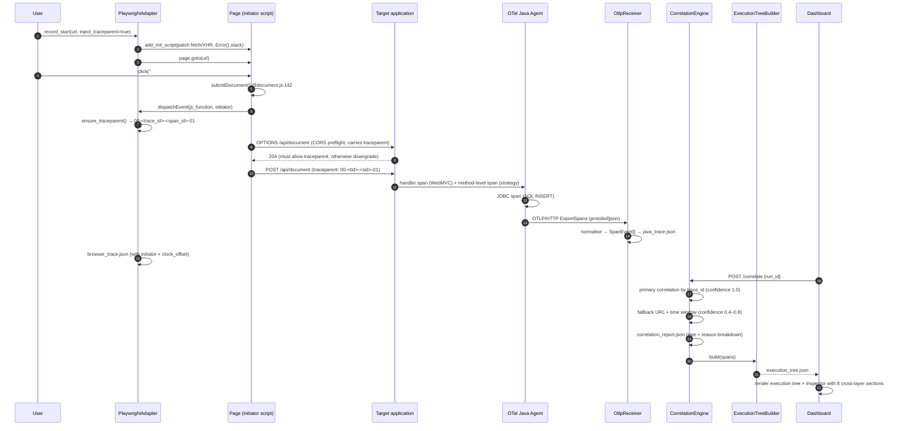

# Workplan — Web Application Tracer (Cross-Layer Web Tracing)

| Field | Value |
|---|---|
| **Document ID** | `WP-WEB-TRACER-001` |
| **Canonical project name** | Web Application Tracer |
| **Project abbreviation** | `web_tracer` |
| **Status** | ACTIVE DRAFT — pending user approval. No implementation code has been written yet |
| **Author** | Song Qinghua (requester) / AI assistant (workplan maintainer) |
| **Date** | 2026-09-30 |
| **Source proposal** | `web_tracing_proposal.md` (959 lines, original proposal by Song Qinghua; to be filed under `docs/`) |
| **Upstream inputs** | PRD by Xu Qingchu — 6 rulings + Phase 0–8 split + WT-xx requirement pool; Python Code Tracer baseline study report |
| **Target environment** | Native Linux (the current workstation). WSL Ubuntu / Docker Desktop / EKS are deferred to later phases |
| **Project root** | `web_tracer/` (top level of the repository) |
| **Baseline (read-only)** | `../code_tracer/` at the repository root. **Reference only — never modified.** No `ref/` copy folder is created (see §7.2) |
| **Retired draft** | `workplan/archive/web_application_tracing_workplan.zh-CN.r0.md` — the Chinese draft (802 lines, revision r0). Superseded by this document. Its task IDs, contract IDs, risk IDs and question IDs are carried over unchanged so historical review notes stay valid |
| **Audience** | End users (non-specialist) and developers. Every technical term is explained in plain language on first use — see §5 Glossary |

## Revision Control / Version History

| Revision | Date | Author | Summary |
|---|---|---|---|
| r0 | 2026-09-29 | AI assistant | Chinese draft `WP-WEB-TRACER-001` created: 61 tasks, WT-01..WT-52 contracts, R1–R12 risks, Q1–Q11 open questions, phase gates. Filed as `workplan/archive/web_application_tracing_workplan.zh-CN.r0.md` |
| r1 | 2026-09-30 | AI assistant | English master workplan created per AGENTS.md §15. Baseline changed to read-only reference `../code_tracer/` (no `ref/` folder). Decisions Q1–Q4 recorded as decided (§12.1). Target application changed to the user's existing business system (§12.2). Repository compliance section added (§9). Glossary for beginners added (§5) |
| r2 | 2026-09-30 | AI assistant | Added §8.3.4 "Webpage Graph Model" — a beginner guide to how a web page is turned into `nodes` (page / function / component / endpoint) and `edges` (`event_bind`, `static_call`, `http_call`, `correlation`, …), with the `JsFunction` dataclass, `web_static_graph.json` shape, endpoint-matching link to Java, and a worked example. The retired Chinese draft r0 remains archived as the single historical record |

---

## 1. Title and Description

**Title:** Web Application Tracer — cross-layer tracing from a user click all the way down to the SQL statement.

**One-sentence description:** Extend the already delivered **Python Code Tracer** (single language, single runtime, mostly static analysis) into a tool that follows one user action across every technical layer — browser, HTTP, Java backend, database — and shows the result as **one interactive execution tree**.

**Description in plain language:** Today, when a user clicks a button on a web page and something is slow or broken, the front-end team looks at the browser, the back-end team looks at Java logs, and the database team looks at SQL. Everybody sees a piece of the story and nobody sees the whole story. This project builds a tool that records **both** sides at the same time and stitches them into a single tree:

```
Click "Submit"                      <- user
  └── JS function submitDocument    <- browser, file + line
        └── POST /api/document      <- HTTP
              └── DocumentController.create   <- Java
                    └── DocumentService.create
                          └── INSERT INTO document   <- database
```

The heart of the project is not "one more call graph". It is the **Correlation Engine** — the piece that proves the browser-side record and the Java-side record belong to the same user action, by matching a shared `trace_id` (a unique number carried along the whole request). When the `trace_id` is missing, the engine falls back to matching by URL plus a time window, and it **marks the result with a lower confidence value** instead of pretending it is certain.

---

## 2. Object

**Object (goal):** Deliver a working tool that lets a user record one interaction with a web application and then explore it as a single cross-layer execution tree, with source-level detail on every node.

**Why this matters (beginner version):** the tool answers three questions that are currently hard to answer:
1. *Which line of my JavaScript caused this request?* (answered by the initiator capture, §8.3)
2. *Which Java method handled it, and how long did each layer really take?* (answered by method-level spans, §7.4)
3. *Where did the time actually go?* (answered by `self_time` in the execution tree, §8.4)

**Success criteria of the whole project:**
- A recorded run produces `execution_tree.json` that contains nodes from at least five layers (user / browser / http / java / db).
- The tree is validated against the `ExecutionTree` schema and rendered in the dashboard.
- The correlation rate (share of nodes that could be joined across the browser/Java boundary) is **≥ 80 %** on the target application.
- The tool runs from a clean environment: new virtual environment, empty output folder, one command.

**Definition of "done" for any single feature** (AGENTS.md §15): a feature is complete only when (a) it works end to end, (b) its tests pass, (c) the schema and README were updated in the same change, and (d) the relevant log files were updated. **A stub, a placeholder or a mock is never marked ✅.**

---

## 3. Scope Summary

| ID | Details | Category | Status | Related phase |
|---|---|---|---|---|
| S-01 | Runtime capture in the browser: navigation, click, XHR/fetch, console, error, screenshot | Runtime | Not started | P0, P2 |
| S-02 | Runtime capture on the Java side: OTLP/HTTP receiver, agent attach, method-level spans | Runtime | Not started | P0, P3 |
| S-03 | **Correlation Engine**: join the two capture streams by `trace_id`, with URL + time-window fallback | Core | Not started | P0, P4 |
| S-04 | **Execution Tree** builder and `execution_tree.json` | Core | Not started | P0, P4 |
| S-05 | Python static analysis (tree-sitter-python): modules, functions, decorators, call graph | Static | Not started | P5 |
| S-06 | Web static analysis (HTML / JS / TS): pages, functions, extracted URLs | Static | Not started | P6 |
| S-07 | Cross-language endpoint matching: JS `fetch` URL ↔ Java `@Mapping` endpoint | Static | Not started | P6 |
| S-08 | Unified graph: merge static + runtime into `unified_graph.json`, with scale governance | Integration | Not started | P7 |
| S-09 | Dashboard: execution tree view, timeline, inspector with 8 cross-layer sections | UI | Not started | P4, P7 |
| S-10 | Contracts and CI: three JSON schemas, endpoint single source of truth, contract checker | Engineering | Not started | P1 |
| S-11 | Repository compliance: folder layout, `knowledge.json`, logs, shared UI design system | Governance | Partially started (this document) | P0, P1 |
| S-12 | Packaging, README, release | Delivery | Not started | Closeout |

---

## 4. Index of Content

| Section | Content |
|---|---|
| [§1](#1-title-and-description) | Title and Description |
| [§2](#2-object) | Object and overall success criteria |
| [§3](#3-scope-summary) | Scope Summary |
| [§4](#4-index-of-content) | Index of Content |
| [§5](#5-glossary-for-beginners) | Glossary for Beginners |
| [§6](#6-dependencies) | Dependencies (project, decision, environment) |
| [§7](#7-evaluation-and-alignment-with-existing-architecture) | Evaluation and Alignment with Existing Architecture |
| [§8](#8-architecture-and-data-flow) | Architecture and Data Flow (diagram, schemas, endpoints, I/O, parameters) |
| [§9](#9-repository-compliance-agentsmd) | Repository Compliance (AGENTS.md) |
| [§10](#10-implementation-phases) | Implementation Phases P0–P8 + Closeout |
| [§11](#11-task-table-t01t61) | Task Table T01–T61 |
| [§12](#12-decisions) | Decisions (Q1–Q11) and target-application intake |
| [§13](#13-risk-register-r1r12) | Risk Register R1–R12 |
| [§14](#14-phase-gates) | Phase Gates |
| [§15](#15-testing-strategy) | Testing Strategy |
| [§16](#16-logs-and-reporting) | Logs and Reporting |
| [§17](#17-revision-history) | Revision History |

---

## 5. Glossary for Beginners

Read this section first if you are not a specialist. Every term below also appears later in the document.

| Term | Plain-language meaning |
|---|---|
| **Span** | One recorded piece of work with a start time, an end time and a name. Like a single line on a timecard: "DocumentService.create, 13.0 ms–45.7 ms" |
| **Trace** | The whole journey of one user action, made of many spans. A trace is a tree of spans |
| **`trace_id`** | The unique number (32 hexadecimal characters) shared by every span belonging to the same journey. It is the "glue" of this project |
| **`span_id`** | The unique number of one span (16 hexadecimal characters) |
| **`parent_span_id`** | Which span called this one. This is what builds the tree shape |
| **`traceparent`** | An HTTP header that carries `trace_id` + `span_id` from the browser to the server, in the form `00-<trace_id>-<span_id>-01`. Standardised as **W3C TraceContext** |
| **OTel / OpenTelemetry** | An open industry standard (and its libraries) for recording spans and sending them somewhere |
| **OTLP** | The wire format OpenTelemetry uses to ship spans. We receive it over HTTP, either protobuf (binary) or JSON |
| **Java agent (`-javaagent`)** | A JAR file you add to the Java start command. It plugs itself into the running program and records what happens, without the program knowing |
| **Instrumentation** | The act of adding recording code to a program. "Auto-instrumentation" means a library does it for you |
| **AOP (Aspect-Oriented Programming)** | A way to wrap many methods at once with the same extra behaviour, **without editing those methods**. Our aspect wraps every Controller/Service/Repository method and records a span around it |
| **`@Around` advice** | The specific AOP recipe we use: "run this code around the real method" |
| **Spring bean** | An object whose life cycle is managed by the Spring framework. AOP only works on Spring beans — a plain `new MyService()` is invisible to it |
| **CORS preflight** | Before a browser sends a cross-site request, it first sends a small `OPTIONS` request asking "am I allowed?". If the server does not allow our `traceparent` header, the browser drops it and we lose the trace link |
| **Initiator** | *Which JavaScript function and which line* started a network request. This is the special ingredient of this project: normal monitoring tools only know "a request happened", we also know "line 145 of document.js caused it" |
| **Playwright** | A library that drives a real Chromium browser from Python. We use it to click and to record |
| **`add_init_script`** | A Playwright command that injects our JavaScript into the page **before** the page's own code runs. This is how we capture the initiator |
| **Clock offset / clock skew** | The browser clock and the server clock are never perfectly identical. We measure the difference and normalise all timestamps before matching |
| **Correlation** | Deciding that a browser-side record and a Java-side record describe the same event |
| **Confidence** | A number from 0.0 to 1.0 telling how sure we are. 1.0 = matched by `trace_id`. Lower = guessed by URL and time |
| **`self_time`** | Time spent in a node itself, excluding its children. This is the number that tells you where the delay really is |
| **Static analysis** | Reading source code without running it |
| **Runtime trace** | Recording while the application actually runs |
| **tree-sitter** | A fast parser that reads source code and returns its structure. We use it for Java, JavaScript, TypeScript and HTML |
| **CC (cyclomatic complexity)** | A rough "how complicated is this function" score. Used for node colour and size |
| **LOD (level of detail)** | Hiding detail when a graph gets too big, so the screen stays usable |
| **`run_id`** | The id of one recording session, formatted `run-YYYYMMDD-HHMMSS` |
| **FATAL / WARN / OK** | Our three capability levels. FATAL means a required piece is missing: the tool must show a red banner, never silently continue |

---

## 6. Dependencies

### 6.1 Dependency on other projects

| Dependency | Kind | Notes |
|---|---|---|
| `../code_tracer/` | Baseline, **read-only** | Source of architecture patterns and UI starting point. Never modified. See §7 |
| `common/universal_ui_design.css` + `.js` | Shared UI base layer | Mandatory per AGENTS.md §18. See §9.5 |
| `../web_tracing_proposal.md` | Input document | Original 959-line proposal; to be filed under `docs/` |
| AGENTS.md | Governance rules | Defines folder layout, workplan structure, logging, revision control |

### 6.2 Dependency on decisions

| Decision | Status | Impact if unanswered |
|---|---|---|
| Q1 — backend span strategy | **Decided** (§12.1): OTel Python SDK + `@traced` for `dcc`; `spring_aop` template kept for non-dcc Java | Blocks Phase 0 (P3) |
| Q2 — target application | **Decided** (§12.2 / §12.4): `dcc` pipeline UI (Case A) + standalone HTML (Case B) | Blocks T12/T13, therefore Phase 0 |
| Q3 — run environment | **Decided** (§12.1) | Blocks environment setup |
| Q4 — backend language / tooling | **Decided** (§12.1): Python 3.13 (conda) + OTel Python SDK | Blocks P3 dependency versions |
| Q5–Q11 | Open (§12.3) | Blocks specific later tasks, see table |

### 6.3 Dependency packages

**Python side**

| Package | Version | Required | Behaviour if missing |
|---|---|---|---|
| `fastapi` | `>=0.110` | Yes | FATAL — service cannot start |
| `uvicorn[standard]` | `>=0.27` | Yes | FATAL |
| `pydantic` | `>=2.5` | Yes | FATAL |
| `jsonschema` | `>=4.20` | Yes | FATAL — contract validation unavailable |
| `networkx` | `>=3.0` | Yes | FATAL + red banner in UI (historical lesson: silent degradation must never happen) |
| `playwright` | `>=1.44` | Yes (from P2) | FATAL; also needs `playwright install chromium` |
| `tree-sitter` | `>=0.22` | Yes (from P5) | FATAL |
| `tree-sitter-python` | `>=0.20` | Yes (from P5) | FATAL |
| `tree-sitter-javascript` / `-typescript` / `-html` | `>=0.20` | Yes (from P6) | FATAL |
| `pyvis` | `>=0.3.2` | Optional | WARN + fall back to vis-network CDN |
| `protobuf` | `>=4.25` | Optional | WARN + force OTLP `http/json` channel (never silent) |
| `beautifulsoup4` / `lxml` | `>=4.12` | Optional | WARN + fall back to regex HTML parsing, confidence lowered |
| `orjson` | `>=3.9` | Optional | WARN + fall back to stdlib `json` |
| `pytest` / `httpx` | latest | Development only | — |

**Java side**

| Component | Version | Required | Notes |
|---|---|---|---|
| `opentelemetry-javaagent.jar` | `2.x` | Yes | Attached with `-javaagent` |
| **Python** | **3.13** (conda `dcc` env) | Yes | Decision Q4: `dcc` target is Python; OTel Python SDK is the backend instrumentor |
| **JDK / Maven** | — | No (for `dcc`) | Only a template for a future non-dcc Java target; not installed for Phase 0 |
| `opentelemetry` (Python SDK) | latest | **Yes — required by the chosen strategy** | Q1 decision: OTel Python SDK + `@traced` decorator is the default for `dcc` |
| `opentelemetry-instrumentation-annotations` | `2.x` | Optional | Needed only by the alternative `@WithSpan` strategy |
| `net.bytebuddy` | `1.14+` | Optional | Needed only by the P8 zero-intrusion strategy |
| `otel-collector-contrib` | `0.100+` | Optional | File-exporter channel, **not** a delivered component |

**Browser side**

| Component | Notes |
|---|---|
| Chromium (bundled with Playwright) | `playwright install chromium` |
| Target application front end | Provided by the user (existing business system, decision Q2) — see §12.2 |

### 6.4 Environment prerequisites

| Item | State | Action |
|---|---|---|
| Native Linux workstation | Confirmed (current environment, decision Q3) | — |
| Python 3.13 (conda `dcc`) | Present (conda env `dcc`) | Activate; install `opentelemetry` SDK if absent (P0 task) |
| JDK / Maven | Not needed for `dcc` | Only if a future non-dcc Java target is added |
| Python venv + `requirements.txt` | Not created | P1 |
| Playwright + Chromium | Not installed | P0/P2 |
| `dcc` pipeline UI, startable locally | **Resolved** (served on `:5000`, same-origin) | See §12.2 / §12.4 |

---

## 7. Evaluation and Alignment with Existing Architecture

### 7.1 What we reuse from Python Code Tracer

| Item | How it is reused |
|---|---|
| Static pipeline shape `crawler → parser → metrics → graph` | Same shape, implemented once for Java and once for JS/TS |
| `networkx` DiGraph with `_func_map` / `_name_index` double index and `_SKIP_CALLS` blacklist | Copied into `static/unified_graph.py` |
| FastAPI single-port service, `_resolve_base()` three-level priority, `Path.is_relative_to()` path safety | Copied into `engine/paths.py` as the **single** path-resolution point |
| `../code_tracer/ui/static_dashboard.html` (≈64 KB, VS Code three-pane layout) + `code-tracer.css` (30 KB, 5 themes) | **Copied file by file** into `web_tracer/ui/`, then evolved. This is the only front end |
| Graph artefact schema top level `{nodes, edges, entry_points, hotspots, stats}` | Extended, kept backward compatible |
| pyvis rendering + vis-network CDN fallback; CC colours 1-4 / 5-9 / 10-19 / 20+; `size = min(12 + cc*2, 40)`; entry point `shape:'star'` | Reused; a new **layer colour band** is added |

**Verified baseline file paths** (checked, all exist):

| Purpose | Path |
|---|---|
| Dashboard starting point | `../code_tracer/ui/static_dashboard.html` (64.4 KB) |
| Stylesheet starting point | `../code_tracer/ui/code-tracer.css` (30.02 KB) |
| Counter-example front end | `../code_tracer/ui/tracer_pro.html` (20.83 KB) — **not revived** |
| Runtime engine (not reused) | `../code_tracer/engine/core/trace_engine.py` (9.63 KB) |
| `_resolve_base()` source | `../code_tracer/engine/backend/server.py` (26.77 KB) |
| Launcher starting point | `../code_tracer/engine/launch.py` (2.93 KB) |

### 7.2 Why there is no `ref/` folder

The original draft planned a `ref/` folder holding a copy of `code_tracer`. That plan is **cancelled**:

- `code_tracer/engine/` contains roughly **41 740 files**, mostly front-end dependencies. Copying the whole tree is impractical and would drift out of sync.
- Decision: the baseline is the repository-root `../code_tracer/`, used as a **read-only reference**. Files marked `[reuse]` are copied **one file at a time** into `web_tracer/` and then evolved there. The baseline itself is never modified.

### 7.3 What we explicitly do NOT reuse

| Item | Reason |
|---|---|
| `sys.settrace` runtime engine in `../code_tracer/engine/core/trace_engine.py` | It only produces incrementing `call_%06d` ids — no `trace_id`, no `span_id`, no cross-process propagation. The Java side uses OpenTelemetry instead; the Python runtime line stays as it is, separate |
| `../code_tracer/ui/tracer_pro.html` | Historically mismatched the backend contract on every endpoint (POST vs GET, `/ws` vs `/ws/trace`, a non-existent `/trace/clear`, socket.io vs native WebSocket) — 16 issues. **Not revived**, out of scope |
| Jaeger / Tempo as delivered components | They bring their own UI, which would create a second front end. Allowed only as a temporary cross-check during the Phase 0 spike |
| Any new React / Vite / Tailwind front end | **Forbidden.** One front end only |

### 7.4 The single most important technical correction

> **The OpenTelemetry Java agent does NOT produce business-method spans by default.**
>
> The original proposal showed a tree with `Controller.create → Service.create → Repository.save`. Those middle layers **do not exist out of the box**. The agent instruments the **framework layer** only: the Servlet / Spring WebMVC handler (a single span named `POST /api/document`, with no class or method name), JDBC (only the SQL statement), RPC, MQ and Redis. Business methods are black boxes by default.

Remedies considered:

| Approach | Correct nesting? | Edit business code? | Cost | Verdict |
|---|---|---|---|---|
| `otel.instrumentation.methods.include` property | No — flat, all siblings under one parent | No | Low | Only a fallback; cannot build a tree |
| `@WithSpan` annotation | Yes | **Yes**, annotation on every method | Medium | Precise, but coverage depends on humans |
| **Spring AOP `@Around` aspect** | **Yes** | No — one aspect class + one dependency | Medium | **Chosen (decision Q1)** |
| Custom Byte Buddy agent | Yes | No | High | Deferred to P8 |

Other corrections carried over from the draft:
- The proposal's priority list contradicted its phase numbering → the plan is now **risk-driven**: static analysis is moved later and a **Phase 0 spike** was inserted.
- JavaParser / Spoon are replaced by **tree-sitter-python** for the `dcc` target (Python binding, shares the parser architecture with JS/TS) so we do not drag JDK + Maven into a Python-first project. JavaParser becomes an optional P8 backend, used only for a future non-dcc Java target to resolve `@Autowired` interface injection.
- Jaeger / Tempo are replaced by a minimal Python OTLP/HTTP receiver writing JSON files.
- The proposal implied near-real-time streaming. The default is now **offline replay** (import a trace file), matching the already-proven pull model. WebSocket is deferred to P8.

---

## 8. Architecture and Data Flow

### 8.1 Overview diagram

```
                    ┌────────────────────────────────────────────────┐
                    │  web_tracer · Python · FastAPI :8100 (configurable) │
                    │  ui/static_dashboard.html  (only front end, pull model) │
                    └────────────────────────────────────────────────┘

┌─────────── STATIC ANALYSIS ────────────┐   ┌────────── RUNTIME TRACE ──────────┐
│  Web  HTML ─┐                           │   │  BROWSER   Playwright ── CDP      │
│       JS/TS ─┼─ tree-sitter ─┐          │   │    │ navigation / click / XHR      │
│       CSS   ─┘               ▼          │   │    │ console / error / screenshot  │
│                  web_static_graph.json  │   │    │ traceparent injection          │
│                                         │   │    │ add_init_script for initiator  │
│  Python *.py ─ tree-sitter-python ─┐    │   │    ▼                              │
│                                   ▼     │   │  browser_trace.json               │
│                 python_call_graph.json   │   │                                   │
│              ▲ endpoint matching        │   │  PYTHON  OTel Python SDK          │
│              │ (URL ↔ @Mapping)         │   │    │ + method-level strategy       │
│              └──────────────────────────┼───┤    ▼  OTLP/HTTP                   │
│                                         │   │  OtlpReceiver (Python, minimal)   │
│                                         │   │    ▼                              │
│                                         │   │  python_trace.json                │
└──────────────────────┬──────────────────┘   └───────────────┬───────────────────┘
                       │                                      │
                       └──────────► CorrelationEngine ◄────────┘
                                     │  primary: exact trace_id match
                                     │  fallback: URL + time window (±200 ms) → confidence < 1.0
                                     │  output: correlation_report.json (rate + reasons)
                                     ▼
                              ExecutionTreeBuilder
                                     ▼
                             execution_tree.json
                                     │
              ┌──────────────────────┼──────────────────────┐
              ▼                      ▼                      ▼
     UnifiedGraphBuilder      correlation_report      Dashboard (P4 minimal
     unified_graph.json                              / P7 complete)
```

### 8.2 Cross-layer sequence (Mermaid)



### 8.3 Data contracts (schemas come first)

Three schemas live in `web_tracer/engine/schema/` and must be written **before any adapter code**. Version `schema_version: "1.0"`; breaking changes require a version bump while keeping read compatibility.

#### 8.3.1 `SpanEvent` — the unified span/event model (WT-01)

| Field | Type | Required | Meaning |
|---|---|---|---|
| `schema_version` | string | Yes | `"1.0"` |
| `trace_id` | string, 32 hex | Yes | W3C TraceContext compatible |
| `span_id` | string, 16 hex | Yes | |
| `parent_span_id` | string \| null | Yes | `null` for a root |
| `layer` | enum | Yes | `user` \| `browser` \| `http` \| `java` \| `db` \| `external` |
| `event_type` | enum | Yes | `user_action` `dom_event` `js_function` `navigation` `resource` `http_request` `http_response` `controller` `service` `repository` `method` `sql` `external_call` `console` `error` |
| `name` | string | Yes | Function name / `POST /api/document` / `SELECT ...` |
| `kind` | enum | Yes | `function` `method` `request` `statement` `event` |
| `language` | enum \| null | No | `javascript` `typescript` `java` `sql` `html` |
| `source` | object | Yes | `{file, line, column?, symbol?, class_name?, package?}` |
| `start_time` | string, ISO8601 UTC | Yes | Already normalised by clock offset |
| `start_time_unix_ns` | int | Yes | Authoritative sort key, nanoseconds |
| `end_time` | string \| null | No | |
| `duration_ms` | float | Yes | `-1` means not finished |
| `status` | enum | Yes | `ok` `error` `timeout` `aborted` `unknown` |
| `confidence` | float 0–1 | Yes | Trustworthiness of this span itself |
| `correlation` | object | Yes | `{method, score, reason}`; `method ∈ trace_id \| url_time_window \| inferred \| unmatched` |
| `attributes` | object | Yes | Layer-specific extras (HTTP status/size, SQL text, args, stack…) |
| `clock_offset_ms` | float | Yes | Collector's offset from the base clock, already applied |
| `collector` | object | Yes | `{name, version, run_id}` |
| `resource` | object | No | `{service_name, host, env: local\|docker\|eks, thread?}` |

> **Compatibility note:** the original proposal put `class` / `method` at the top level. This schema normalises them into `source.class_name` and `name`. `validate.py` provides `compat_load()`, which moves legacy top-level fields to the standard place, so the two example JSON files from the proposal load without change.

Example (browser side):

```json
{
  "schema_version": "1.0",
  "trace_id": "8f3a1c2e4b5d6a7f8f3a1c2e4b5d6a7f",
  "span_id": "a1b2c3d4e5f60718",
  "parent_span_id": "0f1e2d3c4b5a6978",
  "layer": "browser", "event_type": "js_function", "name": "submitDocument",
  "kind": "function", "language": "javascript",
  "source": { "file": "static/js/document.js", "line": 142, "column": 7, "symbol": "submitDocument" },
  "start_time": "2026-09-29T10:12:33.482Z",
  "start_time_unix_ns": 1759145553482000000,
  "end_time": "2026-09-29T10:12:33.500Z",
  "duration_ms": 18.4, "status": "ok", "confidence": 1.0,
  "correlation": { "method": "trace_id", "score": 1.0, "reason": null },
  "attributes": { "stack": ["submitDocument@142:7", "onSubmit@88:21"], "http_requests": 1 },
  "clock_offset_ms": 0.0,
  "collector": { "name": "playwright-adapter", "version": "0.1.0", "run_id": "run-20260929-101233" },
  "resource": { "service_name": "web-frontend", "host": "linux-ws", "env": "local" }
}
```

Example (HTTP side, showing the initiator captured in P2):

```json
{
  "trace_id": "8f3a1c2e4b5d6a7f8f3a1c2e4b5d6a7f",
  "span_id": "b2c3d4e5f6071829", "parent_span_id": "a1b2c3d4e5f60718",
  "layer": "http", "event_type": "http_request", "name": "POST /api/document",
  "kind": "request", "language": null,
  "source": { "file": "static/js/document.js", "line": 145, "symbol": "fetch" },
  "start_time_unix_ns": 1759145553489000000, "duration_ms": 42.1, "status": "ok",
  "confidence": 1.0, "correlation": { "method": "trace_id", "score": 1.0, "reason": null },
  "attributes": {
    "http": { "method": "POST", "url": "https://t/api/document", "status": 200,
              "req_bytes": 512, "res_bytes": 1284, "resource_type": "fetch",
              "from_cache": false, "redirects": 0 },
    "initiator": { "file": "static/js/document.js", "line": 145, "function": "submitDocument",
                   "type": "fetch", "stack": ["submitDocument@142:7"] },
    "preflight": { "observed": true, "allowed": true }
  },
  "clock_offset_ms": 0.0,
  "collector": { "name": "playwright-adapter", "version": "0.1.0", "run_id": "run-20260929-101233" }
}
```

> The `initiator` field is the key advantage of this project over ordinary APM tools. It **must** be captured by patching `window.fetch` / `XMLHttpRequest` through `page.add_init_script()` and reading `new Error().stack`. Playwright's `extraHTTPHeaders` is page-level and cannot tell you which function started the request.

Example (Java side):

```json
{
  "trace_id": "8f3a1c2e4b5d6a7f8f3a1c2e4b5d6a7f",
  "span_id": "0a9b8c7d6e5f4031", "parent_span_id": "c3d4e5f60718293a",
  "layer": "java", "event_type": "service", "name": "DocumentService.create",
  "kind": "method", "language": "java",
  "source": { "file": "com/example/doc/DocumentService.java", "line": 84,
              "symbol": "create", "class_name": "DocumentService", "package": "com.example.doc" },
  "start_time_unix_ns": 1759145553498000000, "duration_ms": 32.7, "status": "ok",
  "confidence": 1.0, "correlation": { "method": "trace_id", "score": 1.0, "reason": null },
  "attributes": { "strategy": "spring_aop", "thread": "http-nio-8080-exec-3",
                  "code": { "namespace": "com.example.doc.DocumentService", "function": "create" } },
  "clock_offset_ms": 3.2,
  "collector": { "name": "otlp-receiver", "version": "0.1.0", "run_id": "run-20260929-101233" },
  "resource": { "service_name": "doc-service", "host": "linux-ws", "env": "local" }
}
```

#### 8.3.2 `ExecutionTree` (WT-31)

```json
{
  "schema_version": "1.0",
  "trace_id": "8f3a1c2e4b5d6a7f8f3a1c2e4b5d6a7f",
  "run_id": "run-20260929-101233",
  "clock": { "base": "browser", "offset_ms": { "browser": 0.0, "java": -3.2 } },
  "root": {
    "id": "span:deadbeef00000001", "span_id": "deadbeef00000001",
    "layer": "user", "name": "Click \"Submit\"", "kind": "event",
    "source": { "file": "static/index.html", "line": 88, "symbol": "#submit" },
    "start_offset_ms": 0.0, "duration_ms": 61.2, "self_time_ms": 0.4,
    "status": "ok", "confidence": 1.0,
    "correlation": { "method": "trace_id", "score": 1.0, "reason": null },
    "attributes": {},
    "children": [
      { "layer": "browser", "name": "submitDocument",
        "start_offset_ms": 1.1, "duration_ms": 18.4, "self_time_ms": 2.0,
        "children": [
          { "layer": "http", "name": "POST /api/document",
            "start_offset_ms": 8.0, "duration_ms": 42.1,
            "children": [
              { "layer": "java", "name": "DocumentController.create",
                "start_offset_ms": 12.3, "duration_ms": 37.0,
                "children": [
                  { "layer": "java", "name": "DocumentService.create",
                    "start_offset_ms": 13.0, "duration_ms": 32.7,
                    "children": [
                      { "layer": "db", "name": "INSERT INTO document",
                        "start_offset_ms": 30.0, "duration_ms": 9.8,
                        "self_time_ms": 9.8, "children": [] }
                    ] }
                ] }
            ] }
        ] }
    ]
  },
  "stats": { "node_count": 6, "max_depth": 5, "total_duration_ms": 61.2,
             "layers": { "user": 1, "browser": 1, "http": 1, "java": 2, "db": 1 },
             "unmatched_count": 0, "correlation_rate": 1.0 }
}
```

#### 8.3.3 `UnifiedGraph` (WT-50, backward compatible with the Python line)

Top level stays `{nodes, edges, entry_points, hotspots, stats, schema_version, run_id?}`.

New node fields (all existing fields kept):

| New field | Type | Meaning |
|---|---|---|
| `layer` | enum | `browser` \| `http` \| `java` \| `db` \| `external` |
| `language` | enum \| null | `javascript` \| `typescript` \| `java` \| `sql` |
| `kind` | enum | `function` \| `method` \| `class` \| `endpoint` \| `sql` \| `page` \| `component` |
| `confidence` | float | Trustworthiness of static inference or runtime evidence |
| `source_of_truth` | enum | `static` \| `runtime` \| `both` |
| `span_count` / `total_duration_ms` / `error_count` | int / float | Runtime overlay (WT-33) |
| `endpoints[]` | string[] | API URLs triggered by this JS function or HTML element (Phase 6) |

New edge fields (original `{source, target}` kept):

| New field | Type | Meaning |
|---|---|---|
| `type` | enum | `static_call` `dynamic_call` `http_call` `sql_call` `event_bind` `initiator` `correlation` |
| `line` | int \| null | Line where the call happens |
| `confidence` | float | See §8.8 |
| `metadata` | object | `{count, avg_duration_ms, last_trace_id, strategy}` |

`stats` extended: `{modules, functions, edges, entry_points, hotspots, layers{}, correlation_rate, span_count, trace_count}`.

#### 8.3.4 Webpage Graph Model — how a web page becomes nodes and edges (beginner guide)

> **Plain-language preamble.** A *graph* is just two lists: **nodes** (the "things") and **edges** (the "arrows between things"). For a single web page we turn the page, its JavaScript/TypeScript, and its wired-up buttons into a graph. The same `nodes` / `edges` shape is used by the static graph (read from source) and the runtime graph (recorded during a real click); the Unified Graph (§8.3.3) is simply the two merged together.

**Two views of the same page**

| View | Where it comes from | Phase | What it captures |
|---|---|---|---|
| **Web static graph** | Reading the HTML / JS / TS source files | P6 (S-06) | every page, function, component and button, plus the calls and URL fetches written in the code |
| **Web runtime graph** | Recording what actually happened during one click (Playwright) | P0 / P2 (S-02) | the *real* path taken, with timing and the `trace_id` that links to Java |

The static graph is the "map"; the runtime graph is the "route actually driven". The Dashboard draws the merged result.

**Node model for a web page.** A web-page node is *not* just "the page" — it is broken down into the page itself, each JS/TS function, each wired HTML element, and each API endpoint it reaches. Fields follow §8.3.3:

| Field | Example for a webpage | Plain meaning |
|---|---|---|
| `kind` | `page` \| `component` \| `function` \| `endpoint` | *what type of thing is this* |
| `layer` | `browser` (or `http` for the request node) | *which world it lives in* |
| `name` | `submitForm` or `index.html` | the label you see |
| `language` | `javascript` \| `typescript` | the source language |
| `file_path` + `start_line` | `app.js:42` | *where in the source it lives* — this is what the Inspector jumps to |
| `endpoints[]` | `["POST /api/document"]` | *API URLs this function or element triggers* |
| `confidence` | `0.9` | *how sure we are* (lower when code is minified / bundled) |
| `source_of_truth` | `static` \| `runtime` \| `both` | read from code, seen at runtime, or both |

**Edge model for a web page.** Edges are typed arrows. The `type` enum (§8.3.3) applied to a web page:

| Edge `type` | Means (webpage example) |
|---|---|
| `event_bind` | a button is wired to a handler: `button#save → submitForm` |
| `static_call` | one JS function calls another: `submitForm → validate` |
| `dynamic_call` | a call resolved only at runtime (lower trust) |
| `http_call` | a function fires a request: `submitForm → POST /api/document` |
| `initiator` | "this click started the whole chain" (supplied by Playwright) |
| `correlation` | the special edge that joins the browser side to the Java side (built by the Correlation Engine) |

Each edge also stores `line` (where the call happens in source) and `confidence` (how certain we are it really happens).

**Implementation shape.** The static extractor (Phase 6) produces a `web_static_graph.json` with the same top level as §8.3.3 (`{nodes, edges, entry_points, hotspots, stats}`). The per-function record is the `JsFunction` dataclass from §8.4:

```python
# engine/static/web/js_parser.py — tree-sitter-javascript / typescript
@dataclass
class JsFunction:
    name: str
    file_path: str
    start_line: int
    end_line: int
    is_async: bool
    raw_calls: list[str]      # static_call / dynamic_call targets
    fetch_urls: list[str]     # becomes http_call edges + node.endpoints[]
```

**How the webpage graph links to the Java side.** This is the step that makes it a *cross-layer* graph (Phase 6, `endpoint_matcher.py`, WT-43):

1. From the page we collect every `fetch` / XHR URL → `js_urls`.
2. From the Java source we collect every `@Mapping` annotation → `java_endpoints`.
3. `normalize_url("/api/doc/123")` → `"/api/doc/{id}"` so dynamic IDs do not break the match.
4. `match_endpoints(js_urls, java_endpoints)` returns `{js_url, java_method, method, confidence}`.

When `confidence ≥ 0.8`, a **`correlation` edge** is drawn joining the browser `http_call` node to the Java `Controller` node. That single edge is the whole point of the project — it proves "your click" and "the database write" belong to the same action.

**Worked example (one page, one click):**

```json
{
  "nodes": [
    {"id":"n1","kind":"page","layer":"browser","name":"index.html","file_path":"index.html"},
    {"id":"n2","kind":"function","layer":"browser","name":"submitForm","language":"javascript",
     "file_path":"app.js","start_line":42,"endpoints":["POST /api/document"]},
    {"id":"n3","kind":"endpoint","layer":"java","name":"DocumentController.create",
     "file_path":"DocumentController.java","start_line":18}
  ],
  "edges": [
    {"source":"n1","target":"n2","type":"event_bind","line":null,"confidence":1.0},
    {"source":"n2","target":"n3","type":"correlation","confidence":0.95}
  ]
}
```

*Summary:* for a web page, **nodes = the page + each JS/TS function + each wired element + each API endpoint it hits; edges = click bindings, function calls, and the correlation arrow that links the browser to the backend.** See §10.6 (Phase 6) for the build plan and §8.4 (`endpoint_matcher`) for the linking logic.

### 8.4 Module and interface design

```python
# engine/config.py — single source of constants (each endpoint string appears exactly once)
LAYERS = ("user", "browser", "http", "java", "db", "external")
PORT = int(os.getenv("WEB_TRACER_PORT", "8100"))
ENDPOINTS = {"health": "/health", "capabilities": "/api/capabilities", ...}

# engine/paths.py — single path-resolution point (ported from ../code_tracer/engine/backend/server.py::_resolve_base)
def resolve_base() -> Path: ...          # 1) output/.target → 2) env TRACER_TARGET → 3) cwd
def assert_within_base(p: Path) -> Path: ...   # else raise PathEscapeError

# engine/capability.py — a missing required dependency is an explicit FATAL, never silent
def probe_all() -> list[CapabilityStatus]      # {name, available, version, level: OK|WARN|FATAL}
def require(name: str, feature: str) -> None   # missing and required → FATAL + red banner

# engine/ids.py — W3C
def new_trace_id() -> str: ...                 # 32 hex
def new_span_id() -> str: ...                  # 16 hex
def make_traceparent(tid, sid, sampled=True) -> str: ...   # 00-<tid>-<sid>-01

# engine/clock.py
def normalize(ts_local_ns: int, offset_ms: float) -> int: ...
def estimate_offset(browser_ts: int, server_ts: int) -> float: ...
```

Browser runtime (WT-10 – WT-16):

```python
class BrowserTracer(ABC):                                  # browser/base.py
    @abstractmethod def start(self, cfg: RecordConfig) -> str            # → run_id
    @abstractmethod def stop(self) -> list[SpanEvent]
    @abstractmethod def get_events(self) -> list[SpanEvent]
    @abstractmethod def capabilities(self) -> dict                       # {initiator, traceparent, cdp}

@dataclass
class RecordConfig:
    url: str; headless: bool = True; inject_traceparent: bool = True
    capture_initiator: bool = True; capture_console: bool = True
    screenshot_on_error: bool = True; actions: list[Action] = field(default_factory=list)
    timeout_ms: int = 30_000; out_dir: Path | None = None

class PlaywrightAdapter(BrowserTracer):                    # browser/playwright_adapter.py
    def start(self) -> str: ...        # browser/page → add_init_script → goto → bind 6 event types
    def stop(self) -> list[SpanEvent]: ...
    def _on_request/_on_response/_on_console/_on_pageerror(self, e): ...
    def _to_span(self, raw: dict) -> SpanEvent: ...        # raw → validate → SpanEvent

# browser/initiator_script.js (injected with add_init_script)
#   window.__wt_patch(): wraps window.fetch / XMLHttpRequest.prototype.open|send
#   → new Error().stack captures the call stack → initiator {file, line, function}
#   → stored in window.__wt_initiators[url+ts], retrieved by Python via URL + time

# browser/traceparent.py
def ensure_headers(page, inject: bool) -> None: ...        # note: extraHTTPHeaders is page-level only
def probe_cors(url: str) -> CorsProbe: ...                 # OPTIONS carrying traceparent → allowed: bool
#   allowed=False → downgrade to url_time_window, confidence ≤ 0.8, attributes.preflight.allowed=false
```

Java runtime (WT-20 – WT-25):

```python
class OtlpReceiver:                                        # java/otlp_receiver.py
    def __init__(self, host="127.0.0.1", port=4318, out_dir: Path, channel="auto")
    def start(self) -> None            # FastAPI/Uvicorn sub-application: POST /v1/traces
    def stop(self) -> list[SpanEvent]
    def decode(self, body: bytes, content_type: str) -> list[SpanEvent]   # protobuf|json → SpanEvent
    # known: OTel exports http/protobuf by default; if protobuf is missing,
    #        force -Dotel.exporter.otlp.protocol=http/json

class JavaMethodInstrumentation(ABC):                      # java/method_instrumentation.py
    name: str                                              # framework_only|spring_aop|with_span|bytebuddy
    def probe(self, project: JavaProject) -> ProbeResult   # applicable? Spring? AOP dependency? source editable?
    def emit_config(self, project) -> AgentConfig          # generate -javaagent args / env / mount snippet
    def emit_snippets(self, project) -> list[CodeSnippet]  # Java source snippets to drop in (aspect / annotation)
    def validate(self, spans: list[SpanEvent]) -> ValidationResult   # method-level spans present and correctly nested?
    def nested_ok(self) -> bool                            # can this strategy produce correct nesting?

REGISTRY: dict[str, type[JavaMethodInstrumentation]] = {
    "framework_only": FrameworkOnlyStrategy,   # fallback: handler + storage only, UI says "no method-level spans"
    "spring_aop":     SpringAopStrategy,        # template for non-dcc Java targets: no business-code change, correct nesting
    "with_span":      WithSpanStrategy,        # alternative: edit source, add @WithSpan
    "bytebuddy":      ByteBuddyStrategy,       # P8: zero intrusion
}
# For the dcc (Python) target the analogous registry is PythonMethodInstrumentation with:
#   framework_only | python_sdk (DEFAULT for dcc: OTel Python SDK + manual handler span) | decorator (@traced) | sys_settrace (P8)
def select_strategy(preference: str, project: JavaProject) -> JavaMethodInstrumentation
    # preference="auto" → best probe() result: spring_aop > with_span > bytebuddy > framework_only

class SourceMapper:                                        # java/source_mapper.py (WT-23)
    def map_span(self, span: SpanEvent) -> SourceLocation | None: ...
        # FQCN + method → file:line; static graph first, then class line-number table,
        # otherwise confidence < 1
```

Correlation engine and execution tree (WT-30 – WT-33) — the core:

```python
@dataclass
class CorrelationInput:
    browser: list[SpanEvent]; java: list[SpanEvent]; window_ms: int = 200; clock_offset_ms: float = 0.0

class CorrelationEngine:                                   # correlation/engine.py
    def correlate(self, inp: CorrelationInput) -> CorrelationResult: ...
    # 1) normalise timestamps (clock_offset)
    # 2) primary: same trace_id, or java handler.parent == browser http.span_id → confidence 1.0
    # 3) miss → FallbackMatcher: method + path (strip query, strip path variables) + |Δt| ≤ window_ms
    #    unique candidate → 0.8; several candidates, take nearest → 0.6; path only → 0.4
    # 4) still nothing → unmatched + reason   5) output linked_pairs + correlation rate

class FallbackMatcher:      def match(self, http_spans, java_handler_spans) -> list[Match]: ...
class CorrelationMetrics:   def report(self, res) -> dict: ...
    # {total, matched, rate, by_method{}, unmatched_reasons{}}
    # reason ∈ no_candidate | multiple_candidates | cors_preflight_blocked
    #          | clock_skew_exceeded | no_trace_id | out_of_window
class ExecutionTreeBuilder:                                # correlation/execution_tree.py
    def build(self, spans: list[SpanEvent], result: CorrelationResult) -> ExecutionTree: ...
    # build tree by parent_span_id → missing parent gets a SYNTHETIC_ROOT
    #   (confidence 0.3, layer=user) → compute start_offset_ms / self_time_ms / depth → stats
```

Static analysis and the unified graph (WT-40 – WT-52):

```python
# static/python/parser.py — tree-sitter-python
@dataclass JavaMethod: qualified_name, name, class_name, package, file_path, start_line, end_line,
                       args[], annotations[], is_static, raw_calls[], complexity
@dataclass JavaClass: qualified_name, package, annotations[], superclass, interfaces[], methods[]

# static/web/js_parser.py — tree-sitter-javascript / typescript
@dataclass JsFunction: name, file_path, start_line, end_line, is_async, raw_calls[], fetch_urls[]

# static/web/endpoint_matcher.py (WT-43)
def normalize_url(raw: str) -> str                 # /api/doc/123 → /api/doc/{id}
def match_endpoints(js_urls: list[str], java_endpoints: list[JavaEndpoint]) -> list[EndpointMatch]
    # returns {js_url, java_method, method, confidence}; ≥80% hit rate is the P6 gate

class UnifiedGraphBuilder:                                 # static/unified_graph.py
    def __init__(self): self.g = nx.DiGraph()              # follows the baseline pattern
    def add_static_java / add_static_web / add_runtime / add_endpoint_links
    def to_json(self) -> dict                              # UnifiedGraph schema
    def govern(self, max_nodes=20000)                      # WT-51: collapse low-confidence
                                                           # static edges / package-level LOD
```

### 8.5 REST endpoints

`existing` = inherited from `../code_tracer/engine/backend/server.py` (port :8000); `new` = introduced by this workplan. The Web Tracer service listens on **:8100** independently.

| # | Method | Path | Input | Returns | Status | Phase |
|---|---|---|---|---|---|---|
| 1 | GET | `/health` | — | `{status, version, schema_version}` | existing (ported) | P1 |
| 2 | GET | `/api/capabilities` | — | `[{name, available, version, level, message}]` | new | P1 |
| 3 | POST | `/api/target/set` | `{path}` | `{base}` | existing (ported) | P1 |
| 4 | GET | `/api/target` | — | `{base, source}` | new | P1 |
| 5 | POST | `/file/read` | `{path, start, end}` | `{content}` | existing (ported) | P1 |
| 6 | POST | `/browser/record/start` | `RecordConfig` | `{run_id, cors_probe}` | new | P2 |
| 7 | POST | `/browser/record/stop` | `{run_id}` | `{span_count, path}` | new | P2 |
| 8 | GET | `/browser/record/status` | `run_id?` | `{recording, span_count, cors}` | new | P2 |
| 9 | GET | `/browser/trace/{run_id}` | — | `SpanEvent[]` | new | P2 |
| 10 | POST | `/browser/import` | `trace.zip` / json | `{run_id, span_count}` | new | P2 |
| 11 | POST | `/java/receiver/start` | `{port, out_dir, channel}` | `{port, channel}` | new | P0 |
| 12 | POST | `/java/receiver/stop` | — | `{span_count}` | new | P0 |
| 13 | GET | `/java/receiver/status` | — | `{running, port, span_count, last_batch_at}` | new | P0 |
| 14 | GET | `/java/trace/{run_id}` | — | `SpanEvent[]` | new | P0 |
| 15 | POST | `/java/import` | `java_trace.json` / otlp file | `{run_id, span_count}` | new | P3 |
| 16 | GET | `/java/instrumentation/strategies` | — | `[{name, nested_ok, probe_hint}]` | new | P3 |
| 17 | POST | `/java/instrumentation/config` | `{preference, project_path}` | `{selected, snippets[], agent_args, env}` | new | P3 |
| 18 | POST | `/correlate` | `{run_id, window_ms, strategy}` | `{rate, matched, unmatched[]}` | new | P4 |
| 19 | GET | `/correlation/report/{run_id}` | — | `correlation_report.json` | new | P4 |
| 20 | GET | `/execution_tree/{run_id}` | `trace_id?` | `ExecutionTree` | new | P4 |
| 21 | POST | `/static/python/analyze` | `{path}` | `{modules, functions, edges}` | new | P5 |
| 22 | GET | `/static/python/graph` | — | `python_call_graph.json` | new | P5 |
| 23 | POST | `/static/web/analyze` | `{path}` | `{pages, functions, urls}` | new | P6 |
| 24 | GET | `/static/web/graph` | — | `web_static_graph.json` | new | P6 |
| 25 | POST | `/static/endpoints/match` | — | `{matches[], hit_rate}` | new | P6 |
| 26 | GET | `/unified/graph` | `run_id?` | `unified_graph.json` | new | P7 |
| 27 | GET | `/unified/stats` | — | `{nodes, edges, layers, correlation_rate}` | new | P7 |
| 28 | WS | `/ws/live` | — | near-real-time span push | new (P2 priority) | P8 |

**Hard contract rule:** every endpoint path string exists **only** in `engine/config.py::ENDPOINTS`. The front end must use the injected `ENDPOINTS` values. `scripts/check_contracts.py` asserts in CI that *front-end fetch URLs ⊆ FastAPI routes*.

### 8.6 Input / Output contract

| Input | Source | Output | Consumer |
|---|---|---|---|
| Target application URL + click script | User (intake checklist, §12.2) | `output/runs/<run_id>/browser_trace.json` | CorrelationEngine |
| OTLP spans over HTTP :4318 | OTel Java Agent in the target app | `output/runs/<run_id>/java_trace.json` | CorrelationEngine |
| Python source folder (`dcc`) | Target application | `output/python_call_graph.json` | UnifiedGraphBuilder, SourceMapper |
| HTML / JS / TS source folder | Target application front end | `output/web_static_graph.json` | UnifiedGraphBuilder |
| Both trace files | Local disk | `execution_tree.json`, `correlation_report.json` | Dashboard |
| Both static graphs + runtime overlay | Local disk | `output/unified_graph.json` | Dashboard |
| Recorded session | `browser/recorder.py` | `trace.zip` (portable, replayable elsewhere) | `/browser/import` |

### 8.7 Global parameter trace matrix

| Parameter | Defined in | Read by | Override |
|---|---|---|---|
| `WEB_TRACER_PORT` (default 8100) | `engine/config.py` | `web_server.py`, `launch.py`, front end | Environment variable |
| `ENDPOINTS` | `engine/config.py` | all routes, front end, `check_contracts.py` | none — single source |
| `LAYERS` | `engine/config.py` | schema validation, CSS colour band | none |
| `TRACER_TARGET` | environment | `engine/paths.py::resolve_base()` | `output/.target` file wins |
| `window_ms` (default 200) | `correlation/engine.py` | `FallbackMatcher` | request body of `/correlate` |
| `max_nodes` (default 20000) | `static/unified_graph.py::govern()` | dashboard | request parameter |
| OTLP protocol | `-Dotel.exporter.otlp.protocol` | `otlp_decode.py` | auto: http/json when protobuf missing |
| Method-level strategy | `select_strategy()` | `strategies/*`, `/java/instrumentation/config` | user preference, default `auto` |

### 8.8 Shared conventions (cross-file rules)

1. **One front end only.** No React / Vite / Tailwind. Everything evolves inside `ui/static_dashboard.html`. `tracer_pro.html` stays dead.
2. **Contracts first.** `schema/*.json` before any adapter code; endpoint constants have a single source (`engine/config.py::ENDPOINTS`); CI asserts *front-end fetch URL ⊆ FastAPI routes*.
3. **Single path-resolution point.** Only `engine/paths.py::resolve_base()` decides the target root (`.target` → `TRACER_TARGET` → cwd). Any escape raises `PathEscapeError`.
4. **Missing optional dependency = explicit FATAL.** `engine/capability.py` grades `OK / WARN / FATAL`. FATAL must show a red banner and log ERROR. **Silent degradation is forbidden.**
5. **Clean-environment acceptance.** `scripts/verify_clean_env.py` must pass on a new venv + empty folder + target app.
6. **Docs and code move together.** Any schema or endpoint change updates `README.md`, this workplan and `schema/examples/` in the same change.
7. **Span id rules.** `trace_id` 32 hex, `span_id` 16 hex (W3C); `traceparent: 00-<trace_id>-<span_id>-01`; generated and injected by the browser side, reused by the Java side.
8. **Time base.** All internal times are **UTC**; `start_time_unix_ns` is the authoritative sort key; each collector records its own `clock_offset_ms`; everything is normalised before correlation.
9. **Confidence scale:**

   | Situation | confidence |
   |---|---|
   | exact `trace_id` match | 1.0 |
   | URL + time window, unique candidate | 0.8 |
   | URL + time window, several candidates, nearest taken | 0.6 |
   | path-only fuzzy match | 0.4 |
   | synthetic root / inferred parent | 0.3 |
   | unmatched | 0.0 (with a `reason`) |

10. **Unmatched reason enum:** `no_candidate` / `multiple_candidates` / `cors_preflight_blocked` / `clock_skew_exceeded` / `no_trace_id` / `out_of_window`.
11. **Layer colour band:** `browser=#58a6ff` (blue) / `http=#bc8cff` (purple) / `java=#f0883e` (orange) / `db=#3fb950` (green) / `user=#8b949e` / `external=#db61a2`. CC colours follow the baseline (1-4 `#3fb950`, 5-9 `#d29922`, 10-19 `#f0883e`, 20+ `#f85149`).
12. **Naming.** Python modules `snake_case`, classes `PascalCase`, constants `UPPER_CASE`; JSON fields `snake_case`; Java snippets `PascalCase.java`.
13. **Artefact folders.** One recording → `output/runs/<run_id>/{browser_trace.json, java_trace.json, execution_tree.json, correlation_report.json}`; static results → `output/*.json`.
14. **`run_id` format:** `run-YYYYMMDD-HHMMSS`.

### 8.9 Usage examples and debugging

```bash
# 1. analyse a Java project statically
python -m engine.cli.main analyze --path /path/to/java/project

# 2. record one user action (starts the OTLP receiver too)
python -m engine.cli.main record --url https://internal/app --action "click:#submit"

# 3. correlate a run and print the tree in the terminal
python -m engine.cli.main correlate --run run-20260930-101233

# 4. serve the dashboard
python -m engine.cli.main serve            # opens http://127.0.0.1:8100

# 5. one-command Phase 0 spike
python scripts/run_spike.py
```

Debugging guide:

| Symptom | Likely cause | Where to look |
|---|---|---|
| Empty `java_trace.json` | Agent not attached, or wrong OTLP port/protocol | `/java/receiver/status`; JVM start log for "opentelemetry-javaagent" |
| Spans arrive but no method-level spans | Wrong strategy selected, or aspect not on the classpath | `/java/instrumentation/strategies`; `select_strategy()` result |
| All correlations are 0.0 | `traceparent` dropped (CORS) or clock skew | `correlation_report.json` reasons; `attributes.preflight.allowed` |
| Browser spans have no initiator | `add_init_script` not applied (page navigated too early) | `browser/initiator_script.js` injection order |
| Red banner in the UI | A required dependency is missing | `/api/capabilities` |
| Front end calls a URL the backend does not have | Contract drift | `python scripts/check_contracts.py` |

### 8.10 Coding standards

- One front end, no new frameworks (§8.8 rule 1).
- Path resolution only through `engine/paths.py` (rule 3).
- Every module logs status, warnings and errors; no silent failure (AGENTS.md §5.9).
- JSON artefacts always carry `schema_version` and are validated before being written.
- Tests live in `web_tracer/test/` only (AGENTS.md §6.1).
- Best practice carried from the baseline: keep the four-stage static pipeline shape; never maintain a hardcoded fallback list that duplicates a schema value (AGENTS.md §5.16).

---

## 9. Repository Compliance (AGENTS.md)

| AGENTS.md rule | How this workplan complies | Gap / action |
|---|---|---|
| §1 Project registry — canonical name and abbreviation | Canonical name **Web Application Tracer**, abbreviation **`web_tracer`**. Used in this document, and to be used in `README.md`, CLI help, `pyproject.toml` and UI | Must also be declared in `knowledge.json` (`project_metadata.name`) |
| §5.1 Plan before code | This workplan is approved before any implementation starts | — |
| §5.3 Archive before delete | The Chinese draft is archived, not deleted (§17) | — |
| §5.4 Log everything | `log/update_log.md`, `log/issue_log.md`, `log/test_log.md` (§16) | `log/` to be created in P0 |
| §5.7 Revision metadata | Revision table at the top of every document (§17) | — |
| §5.10 `knowledge.json` required | Listed as the first compliance task of Phase 0 (T00) | **Compliant as of T00 (2026-09-30)** — `knowledge.json` created (v0.1.0); I002 resolved; I003 (shared schema `config/schemas/knowledge_base_schema.json`) remains blocked |
| §5.13 Cross-source consistency audit | A grep audit runs at the end of every phase (§15.4) | — |
| §5.16 No hardcoded fallback duplicates | Enforced by §8.8 rule 3 and the parameter matrix | — |
| §5.17 `issue_log.md` fixed structure | Fixed 9-column table + Legend + Status Summary + Priority Resolution Sequence | `log/issue_log.md` created in this change |
| §6 Required folders | `archive/ config/ data/ output/ test/ ui/ engine/ log/ docs/ workplan/` | To be created in P0 |
| §6.1 Tests only in `test/` | Directory tree uses `test/`, never `tests/` | — |
| §14 Documentation — 16 required items | Covered: summary (§1), index (§4), key features (§3), doc map (§4), quick start with Mermaid (§8.1/8.2), structure (§10.1), function list (§8.4), I/O table (§8.6), parameter matrix (§8.7), function details (§8.4), debugging (§8.9), usage examples (§8.9), pending issues (§12/§13), test results (§16), dependencies (§6.3), coding standards (§8.10) | — |
| §15 Workplan rules | Full structure: title/description, object, scope summary, index, dependencies, evaluation and alignment, phases with all eight elements | — |
| §18 Shared UI design system | **Corrected:** the UI base layer is `common/universal_ui_design.css` + `common/universal_ui_design.js`; project CSS only overrides/extends. `ThemeManager` with 5 themes and localStorage persistence is required | **Conflict with the retired draft**, which copied `code-tracer.css` wholesale — see §9.5 |
| §19 Error codes single source | Error and message catalogue to be centralised in `engine/config.py` | To be added in P1 |
| §23 BootstrapManager | Entry points use `_preload_infrastructure()` with individually guarded non-stdlib imports (WT-04 style) | P1 |
| §25 Output file life cycle | Artefacts go to `output/`, never the repository root (§8.6) | — |
| §26 Issue life cycle | Issues logged in `log/issue_log.md` with status transitions (§16) | — |

### 9.5 Note on the UI decision

The retired draft said "copy `code-tracer.css` and evolve it". AGENTS.md §18 requires **two UI layers**: the shared `common/universal_ui_design.*` base, then a small project-specific override file. The dashboard HTML is still copied from `../code_tracer/ui/static_dashboard.html` (that is a file, not a design system), but styling must build on the shared base. The layer colour band (§8.8 rule 11) is a project extension and belongs in the project override CSS — and if this project type needs new colours, they must be added to the shared CSS, not only locally.

---

## 10. Implementation Phases

**Scope freeze (AGENTS.md §15):** once a phase starts, its task list is frozen. New work goes into the next phase or into a documented change request.

**Execution order:** Phase 1 (T01–T10, T21) and Phase 0 (T11–T20) **may run in parallel**. Until T19 passes its Go/No-Go gate, no effort goes into Phase 5 and later.

### 10.0 Phase 0 — Spike: prove the two streams can be stitched

- **Timeline:** 1–2 weeks (it may end in No-Go — that is an acceptable outcome)
- **Milestones:** M1 OTLP receiver writes a file · M2 OTel Python SDK instrumented in `dcc` (`serve.py` handler + `@traced` pipeline functions, `traceparent` passed to the subprocess) · M3 method-level spans appear with correct nesting · M4 minimal Playwright capture · M5 Go/No-Go review
- **Deliverables:** minimal `otlp_receiver.py` + `otlp_decode.py`; `method_instrumentation.py` with the four strategies; minimal Playwright adapter; `traceparent.py`; `initiator_script.js`; minimal `engine.py`; `scripts/run_spike.py`; spike record document
- **Updated or created:** creates `engine/java/`, minimal `engine/browser/`, minimal `engine/correlation/`, `scripts/`
- **Risks & mitigation:** R1 (no method-level spans) is the reason this phase exists; mitigated by the four-strategy abstraction and `select_strategy("auto")`. R2 (CORS blocks `traceparent`) mitigated by T17 probing and the documented fallback. R11 (No-Go) mitigated by keeping the spike minimal
- **Potential future issues:** `dcc/serve.py` is a stdlib `http.server` (not auto-instrumented) and runs the pipeline in a subprocess, so the `traceparent` must cross the process boundary by hand or the tree splits; if a future target is non-Spring Java, `spring_aop` will not apply and we fall back to `with_span` / `bytebuddy`
- **Success criteria:** the terminal tree shows `click` / JS / HTTP / Controller / Service / SQL nodes **in one tree**; correlation success rate **≥ 80 %**; strategy validated with `nested_ok = true`
- **References:** tasks T11–T20; contracts WT-01/02/03/10/11/12/13/14/20/21/22/30/31; §12.1 decisions; file `scripts/run_spike.py`
- **Blocking prerequisite:** the target-application intake checklist (§12.2)

### 10.1 Phase 1 — Skeleton and contracts

- **Timeline:** 1 week
- **Milestones:** M1 project skeleton and folder compliance · M2 three schemas frozen · M3 CI scripts working · M4 service starts on :8100
- **Deliverables:** `requirements.txt`, `requirements-optional.txt`, `engine/config.py`, `engine/capability.py`, `engine/paths.py`, `engine/ids.py`, `engine/clock.py`, `engine/logging_setup.py`, three schemas + examples + `validate.py`, `scripts/*`, `backend/web_server.py`, `backend/routes/system.py`, `cli/main.py`, `launch.py`, copied `ui/`
- **Updated or created:** creates `engine/`, `ui/`, `scripts/`, `test/`, `output/`, `config/`, `docs/`, `log/`, `archive/`, `data/`; creates `knowledge.json`
- **Risks & mitigation:** R6 (front-end contract mismatch, 16 historical issues) mitigated by the single source of constants plus two CI scripts; R12 (silent dependency loss) mitigated by the FATAL red banner
- **Potential future issues:** the port convention (Python static line stays :8000, Web Tracer :8100) must stay stable or old bookmarks break
- **Success criteria:** deliberately injecting a wrong endpoint makes CI **fail**; uninstalling `networkx` makes the UI show **FATAL**; `verify_clean_env.py` exits 0
- **References:** tasks T00–T10, T21; contracts WT-01..WT-07; §6.3; §9

### 10.2 Phase 2 — Browser runtime capture

- **Timeline:** 2 weeks
- **Milestones:** M1 `BrowserTracer` abstraction frozen · M2 six event types recorded · M3 initiator mapped to HTTP spans · M4 user action becomes the trace root · M5 `trace.zip` replay works elsewhere
- **Deliverables:** `browser/base.py`, `playwright_adapter.py`, `initiator_script.js`, `traceparent.py`, `actions.py`, `recorder.py`, `backend/routes/browser.py`
- **Updated or created:** completes `engine/browser/`, adds `backend/routes/browser.py`
- **Risks & mitigation:** R4 (`extraHTTPHeaders` cannot give the initiating function) mitigated by the mandatory `add_init_script` patch; R3 (clock skew) mitigated by T26 offset calibration
- **Potential future issues:** single-page applications rewrite the DOM constantly, so element selectors used for actions may become unstable
- **Success criteria:** every API request in the UI shows the initiator `file:line`; a `trace.zip` imported on another machine gives the same tree
- **References:** tasks T22–T28; contracts WT-10..WT-17; §8.4 browser section

### 10.3 Phase 3 — Java runtime hardening

- **Timeline:** 2 weeks
- **Milestones:** M1 dual-channel receiver with batch write · M2 three attach configurations documented · M3 strategy endpoint returns snippets · M4 ≥ 80 % of method spans map to a source line · M5 CORS allows `traceparent`
- **Deliverables:** strengthened `otlp_receiver.py` / `otlp_decode.py`, `java/agent_configs/*`, `java_resources/{TracedAspect.java, pom-snippet.xml, CorsConfig.java}`, `java/source_mapper.py`, `backend/routes/java.py`
- **Updated or created:** completes `engine/java/`, adds `backend/routes/java.py`
- **Risks & mitigation:** R2 handled by `CorsConfig` plus detection; R5 (tree-sitter cannot resolve `@Autowired`) handled by lowering confidence and relying on runtime evidence
- **Potential future issues:** for a non-dcc business system the `-javaagent` flag may need approval from an operations team, and adding an aspect/decorator needs a build review; for `dcc` no such approval is needed (local conda env)
- **Success criteria:** method-level spans are **nested, not flat**; at least local and Docker attach configurations tested
- **References:** tasks T29–T33; contracts WT-20..WT-25; §12.1 (Q1 decision)

### 10.4 Phase 4 — Correlation, execution tree, minimal dashboard

- **Timeline:** 2–3 weeks
- **Milestones:** M1 primary correlation ≥ 95 % on the target app · M2 fallback correlation reproducible · M3 metrics report with reason breakdown · M4 `ExecutionTreeBuilder` produces the proposal's example tree · M5 dashboard renders the tree
- **Deliverables:** `correlation/engine.py`, `fallback.py`, `metrics.py`, `execution_tree.py`, `backend/routes/correlation.py`, `execution_tree.json`, `correlation_report.json`, minimal dashboard with tree tab + inspector
- **Updated or created:** creates `engine/correlation/`; extends `ui/static_dashboard.html`
- **Risks & mitigation:** R3 (clock skew) again, handled by the ±200 ms window and the `clock_skew_exceeded` reason; R7 (graph size) handled by making the execution tree the default view
- **Potential future issues:** a very wide tree (thousands of siblings) will need virtualised rendering later
- **Success criteria:** the proposal's example tree can be produced for real; the correlation report is readable; clicking a node opens the inspector
- **References:** tasks T34–T40; contracts WT-30..WT-33; §8.3.2

### 10.5 Phase 5 — Java static analysis

- **Timeline:** 2 weeks
- **Milestones:** M1 tree-sitter-python environment · M2 crawler extracts modules/functions/decorators/call sites · M3 call graph artefact · M4 spans aligned with source lines
- **Deliverables:** `static/python/{crawler,parser,metrics,graph}.py`, `output/python_call_graph.json` (the `java_*` variant remains the template for a non-dcc Java target)
- **Updated or created:** creates `engine/static/python/`
- **Risks & mitigation:** R5 mitigated by marking interface-injected edges `confidence < 1` and deferring JavaParser to P8
- **Potential future issues:** generated code and Lombok annotations can confuse the parser
- **Success criteria:** ≥ 80 % of method-level spans can be mapped to a source line
- **References:** tasks T41–T44; contracts WT-40..WT-44

### 10.6 Phase 6 — Web static analysis and endpoint matching

- **Timeline:** 2 weeks
- **Milestones:** M1 HTML parsing · M2 JS/TS parsing with URL extraction · M3 cross-language endpoint matching · M4 `web_static_graph.json`
- **Deliverables:** `static/web/{html_parser,js_parser,url_extractor,endpoint_matcher,graph}.py`, `output/web_static_graph.json`
- **Updated or created:** creates `engine/static/web/`
- **Risks & mitigation:** R5-like ambiguity in dynamic URLs handled by `normalize_url()` collapsing `/api/doc/123` to `/api/doc/{id}`
- **Potential future issues:** bundled and minified front-end code makes static extraction much weaker
- **Success criteria:** **≥ 80 %** of API URLs match a backend endpoint (for `dcc`, a Python route equivalent to `@Mapping`)
- **References:** tasks T45–T48; contracts WT-40..WT-43; §8.4 `endpoint_matcher`

### 10.7 Phase 7 — Unified graph and complete dashboard

- **Timeline:** 3 weeks
- **Milestones:** M1 `UnifiedGraphBuilder` merges both graphs · M2 scale governance · M3 dashboard layout complete · M4 layer colour band and status bar · M5 performance gate met
- **Deliverables:** `static/unified_graph.py`, `output/unified_graph.json`, complete dashboard (execution tree + timeline, five bottom panels, 360 px inspector with 8 sections), project CSS override
- **Updated or created:** creates `engine/static/unified_graph.py`; finalises `ui/`
- **Risks & mitigation:** R7 (10 000-node rendering) mitigated by collapsing low-confidence edges and package-level LOD; R8 avoided by keeping Jaeger out
- **Potential future issues:** the inspector's eight sections need real data from every layer, so missing layers will look empty
- **Success criteria:** 10 000 nodes render in **< 3 s**; inspector has all 8 sections; status bar shows `trace_id`, span count and correlation rate
- **References:** tasks T49–T56; contracts WT-50..WT-64; §9.5

### 10.8 Phase 8 — Optional enhancements

- **Timeline:** 2 weeks
- **Milestones:** M1 CDP / BiDi adapters behind an interface · M2 JFR module · M3 JavaParser backend · M4 WebSocket contract
- **Deliverables:** `browser/cdp_adapter.py`, `browser/bidi_adapter.py`, `java/jfr.py`, `static/java/javaparser_backend.py`, `/ws/live` contract
- **Updated or created:** extends `engine/browser/`, `engine/java/`, `engine/static/java/`
- **Risks & mitigation:** each module is independently switchable and **off by default**, so the main path is never affected
- **Potential future issues:** WebSocket streaming changes the pull model the UI was validated against
- **Success criteria:** each enhancement can be enabled alone; with all of them off, offline replay still works
- **References:** tasks T57–T60; contracts WT-17, WT-44, P8 items

### 10.9 Closeout

- **Timeline:** 1 week
- **Milestones:** M1 README complete · M2 this workplan updated to final state · M3 release package
- **Deliverables:** `README.md` (with the three attach command sets), finalised workplan, release archive under `releases/`
- **Updated or created:** `README.md`, `workplan/`, `releases/`
- **Risks & mitigation:** documentation drifting from code — mitigated by the "docs and code in the same change" rule (§8.8 rule 6)
- **Potential future issues:** the release must not include recorded data from the customer's system
- **Success criteria:** a newcomer can follow the README from empty machine to first execution tree
- **References:** task T61; §16

---

## 11. Task Table (T01–T61)

`ID / Task / Phase / Depends on / Output files / Acceptance criteria`

| ID | Task | Ph | Depends on | Output files | Acceptance criteria |
|---|---|---|---|---|---|
| **T00** | Repository compliance: folders, `knowledge.json`, logs | P1 | — | `archive/ config/ data/ docs/ log/ output/ test/ ui/`, `knowledge.json` | All ten folders exist; `knowledge.json` declares canonical name "Web Application Tracer" and abbreviation `web_tracer` |
| T01 | Project skeleton + constant single source + capability probe | P1 | T00 | `requirements*.txt`, `engine/config.py`, `engine/capability.py`, `engine/logging_setup.py` | `python -c "import engine.config"` passes; after uninstalling `networkx`, `probe_all()` returns FATAL and the UI shows a red banner |
| T02 | Path resolution single point + workspace/run folders | P1 | T01 | `engine/paths.py`, `output/.target` | Three-level priority correct; out-of-bounds path raises `PathEscapeError` |
| T03 | **SpanEvent schema frozen** + validator + proposal compatibility | P1 | T01 | `schema/span_schema.json`, `schema/validate.py`, `schema/examples/*.json` | Both proposal examples and the three examples in §8.3 pass validation; an illegal span is rejected |
| T04 | ExecutionTree / UnifiedGraph schemas frozen | P1 | T03 | `schema/execution_tree_schema.json`, `schema/unified_graph_schema.json` | The §8.3.2 and §8.3.3 examples pass validation |
| T05 | Id generation + time base and clock-offset normalisation | P1 | T01 | `engine/ids.py`, `engine/clock.py` | `trace_id` 32 hex / `span_id` 16 hex / `traceparent` format `00-...-01`; an injected offset can be reversed |
| T06 | CI: contract checker (endpoint comparison) | P1 | T03,T01 | `scripts/check_contracts.py` | Deliberately injecting a mismatched endpoint fails CI and names the URL |
| T07 | CI: undefined-function static check | P1 | T01 | `scripts/check_undefined_functions.py` | Scanning `ui/static_dashboard.html` gives no false positives; injecting a fake call fails |
| T08 | Clean-environment acceptance script | P1 | T01,T02 | `scripts/verify_clean_env.py` | New venv + empty folder + target app runs end to end, exit code 0; missing dependency → non-zero |
| T09 | FastAPI main app + route skeleton + launcher | P1 | T01,T02 | `backend/web_server.py`, `backend/routes/system.py`, `launch.py`, `cli/main.py` | `:8100/health` returns ok; browser opens automatically |
| T10 | Front-end base in place (copy dashboard + shared CSS layers) | P1 | T09 | `ui/static_dashboard.html`, `ui/web-tracer.css` (override layer) | Opens standalone; no React/Vite files present; shared design system loaded |
| T11 | **Minimal OTLP/HTTP receiver (spike version)** | P0 | T03 | `java/otlp_receiver.py`, `java/otlp_decode.py` | Manually POSTing one OTLP JSON produces `java_trace.json` with compliant fields |
| T12 | **Register the `dcc` target (Case A) and define the standalone-HTML profile (Case B)** | P0 | — | `docs/target_app_access.md` | `dcc` intake resolved (§12.2); Case A + Case B profiles documented (§12.4); `dcc` starts on native Linux and is reachable on `:5000` |
| T13 | Attach the OTel Java agent to the local JVM | P0 | T11,T12 | `java/agent_configs/local_jvm.env` | Agent load appears in the start log; the receiver gets handler + JDBC spans |
| T14 | **JavaMethodInstrumentation abstraction + 4 strategies probe/emit** | P0 | T13 | `java/method_instrumentation.py`, `strategies/*.py`, `java_resources/*` | `select_strategy("auto")` returns `spring_aop` on the target system; `nested_ok` flag correct |
| T15 | Verify the strategy actually works (at least two paths runnable) | P0 | T14 | spike record + JSON | Method-level spans appear and are **correctly nested, not flat** |
| T16 | Minimal Playwright collector (spike version) | P0 | T03 | `browser/playwright_adapter.py` (minimal), `browser/base.py` | Captures navigation + request + response span types |
| T17 | `traceparent` injection + CORS preflight probe | P0 | T16 | `browser/traceparent.py` | Target receives `traceparent`; when CORS blocks it, the downgrade is flagged |
| T18 | Initiator capture (`add_init_script`) | P0 | T16 | `browser/initiator_script.js` | Browser side reports `submitDocument@document.js:142` |
| T19 | Minimal CorrelationEngine + text tree output | P0 | T11,T16 | `correlation/engine.py` (minimal), `run_spike.py` | **Go/No-Go:** the tree contains click/JS/HTTP/Controller/Service/SQL; correlation rate ≥ 80 % |
| T20 | Phase 0 Go/No-Go review | P0 | T19 | review record + workplan update | Method-level span path confirmed; if the gate fails, strategy is adjusted and the spike rerun |
| T21 | Backend service completion (capabilities/target/file routes) | P1 | T09 | `backend/routes/system.py` | Four system endpoints pass pytest |
| T22 | BrowserTracer abstraction frozen + RecordConfig | P2 | T03 | `browser/base.py`, `recorder.py` | Abstraction implementable by a mock adapter that runs |
| T23 | Full PlaywrightAdapter (nav/click/XHR/console/error/screenshot) | P2 | T22 | `browser/playwright_adapter.py` | All six event types become SpanEvents and pass schema |
| T24 | Initiator mapping persisted + linked to HTTP spans | P2 | T18,T23 | `browser/initiator_script.js`, adapter | The UI shows `document.js:145` for an API request |
| T25 | User action as trace root | P2 | T23 | `browser/actions.py` | A click creates a `layer=user` root span with children beneath it |
| T26 | Clock-offset calibration | P2 | T05,T23 | `engine/clock.py` (extended) | Playwright and JVM times normalised; \|Δt\| stable |
| T27 | `trace.zip` packaging + offline import | P2 | T23 | `browser/recorder.py`, `/browser/import` | Package → import on another machine → identical tree |
| T28 | Browser routes wired | P2 | T09,T23 | `backend/routes/browser.py` | Six browser endpoints usable |
| T29 | OTLP receiver hardening (dual channel, batch write, status) | P3 | T11 | `java/otlp_receiver.py`, `otlp_decode.py` | Missing protobuf → automatic downgrade to http/json + WARN (not silent) |
| T30 | Three attach configurations (local/Docker/EKS) + docs | P3 | T13 | `java/agent_configs/*` | Spans received in all three; README has copy-paste commands |
| T31 | Java method-level strategy landing + config endpoint | P3 | T14,T20 | `backend/routes/java.py`, `strategies/*` | `/java/instrumentation/config` returns the selected strategy and snippets |
| T32 | Java span → source location mapping | P3 | T31 | `java/source_mapper.py` | ≥ 80 % of method-level spans resolve to `file:line` |
| T33 | Backend CORS allows `traceparent` (template + detection) | P3 | T17 | `java_resources/CorsConfig.java`, README | After allowing it, the CORS downgrade no longer triggers |
| T34 | **Full CorrelationEngine (primary correlation)** | P4 | T19,T28,T29 | `correlation/engine.py` | `trace_id` match rate ≥ 95 % on the target system |
| T35 | Fallback correlation (URL + time window) | P4 | T34 | `correlation/fallback.py` | A scenario without `trace_id` still correlates, with confidence ≤ 0.8 |
| T36 | Correlation metrics + unmatched reason classification | P4 | T35 | `correlation/metrics.py`, `correlation_report.json` | All six reasons reproducible; report fields complete |
| T37 | **ExecutionTreeBuilder** | P4 | T34 | `correlation/execution_tree.py`, `execution_tree.json` | The proposal's example tree structure can be produced for real |
| T38 | Execution tree routes | P4 | T37,T09 | `backend/routes/correlation.py` | `/execution_tree/{run_id}` returns a compliant tree |
| T39 | **Minimal dashboard** (execution tree tab + replay) | P4 | T10,T38 | `ui/static_dashboard.html` | Import a trace → render the tree → click a node → inspector opens |
| T40 | Inspector cross-layer sections (minimum 4) | P4 | T39 | `ui/static_dashboard.html` | Clicking an HTTP node shows initiator + backend span stack |
| T41 | tree-sitter-python environment + grammar loading | P5 | T01 | `requirements.txt`, `static/python/parser.py` | Missing → FATAL warning; parses `dcc` source files |
| T42 | Python crawler + module/function/decorator/call-site extraction | P5 | T41 | `static/python/crawler.py`, `parser.py` | All pipeline functions extracted |
| T43 | Python call graph + `python_call_graph.json` | P5 | T42 | `static/python/graph.py`, `output/python_call_graph.json` | Edge count matches manual spot check; runtime-injected edges marked `confidence < 1` |
| T44 | Python static nodes aligned with span source lines | P5 | T32,T43 | `python/source_mapper.py` | A span can jump to its source line |
| T45 | HTML parsing (script / event binding / element ids) | P6 | T01 | `static/web/html_parser.py` | All scripts and onclick handlers of the target page extracted |
| T46 | JS/TS parsing (functions / calls / fetch URLs) | P6 | T41 | `static/web/js_parser.py`, `url_extractor.py` | `submitDocument` and its fetch URL extracted |
| T47 | **Cross-language endpoint matching** | P6 | T43,T46 | `static/web/endpoint_matcher.py` | **≥ 80 %** of API URLs match a backend endpoint (for `dcc`, a Python route) |
| T48 | `web_static_graph.json` produced | P6 | T45,T46,T47 | `static/web/graph.py`, `output/web_static_graph.json` | The HTML → JS → URL → Java chain is traceable |
| T49 | **UnifiedGraphBuilder** (merge + edge extension) | P7 | T43,T48,T37 | `static/unified_graph.py`, `output/unified_graph.json` | Edges carry `type`/`line`/`confidence`; Python-line artefacts still readable |
| T50 | Graph scale governance (collapse / package LOD) | P7 | T49 | `static/unified_graph.py` | 10 000 nodes render in < 3 s |
| T51 | Dashboard centre: execution tree (default) + timeline tab | P7 | T39 | `ui/static_dashboard.html` | Execution tree is the default main view; timeline is zoomable |
| T52 | Dashboard bottom five panels | P7 | T51 | `ui/static_dashboard.html` | Timeline / Network / Console / SQL / Metrics collapsible to ~200 px |
| T53 | Inspector 360 px + eight cross-layer sections | P7 | T40 | `ui/static_dashboard.html` | All 8 sections present (summary / source / callers-callees / network / timing / console errors / Java span stack / Trace-Flow) |
| T54 | Layer colour band + status-bar correlation rate | P7 | T51,T36 | `ui/web-tracer.css`, dashboard | browser blue / http purple / java orange / db green; status bar shows trace_id, span count, correlation rate |
| T55 | Left sidebar: three data sources + Controls extension | P7 | T51 | `ui/static_dashboard.html` | Import trace / Web front end / Java source; record switch / target URL / agent attach / traceparent / correlation strategy / clock calibration |
| T56 | End-to-end performance and gate verification | P7 | T50,T54 | `scripts/verify_clean_env.py` (extended) | 10 000 nodes < 3 s; clean-environment script passes |
| T57 | CDP / Selenium BiDi adapter placeholders | P8 | T22 | `browser/cdp_adapter.py`, `bidi_adapter.py` | Interface implementable, disabled by default |
| T58 | JFR collection (optional) | P8 | T31 | `java/jfr.py` | Standalone module, not in the main path |
| T59 | JavaParser optional backend (interface injection / dynamic dispatch) | P8 | T43 | `static/java/javaparser_backend.py` | Can resolve `@Autowired` interface → implementation; off by default |
| T60 | Near-real-time WebSocket streaming (contract first) | P8 | T28,T38 | `backend/routes/*.py`, `/ws/live` | Contract matches the front end; off by default, does not affect offline replay |
| T61 | Documentation and implementation closed together + release | all | T56 | `README.md`, `workplan/` archive | Docs and code in the same change; README contains the three attach command sets |

**Task count: 62** (including the new compliance task T00). Original distribution: P0:10 / P1:11 / P2:7 / P3:5 / P4:7 / P5:4 / P6:4 / P7:8 / P8:4 / closeout:1.

> Order hint: **Phase 1 (T01–T10, T21) and Phase 0 (T11–T20) can run in parallel.** Until T19 passes its Go/No-Go gate, no static-analysis effort beyond P4 may start.

### 11.1 WT-xx requirement coverage

- **Foundation (WT-01~07):** T03 / T06 / T07 / T01 / T02 / T08+T56 / T61
- **Browser (WT-10~17):** T22+T23 / T17 / T18+T24 / T25 / T17+T35 / T26 / T27 / T57 (P8)
- **Java (WT-20~25):** T11+T29 / T13 / **T14+T15+T20+T31 (method-level decision)** / T32+T44 / T30 / T33
- **Correlation and execution tree (WT-30~33):** T34+T35 / T37 / T36 / T49
- **Static analysis (WT-40~44):** T45+T46+T48 / T46 / T41–T43 / T47 / T59 (P8)
- **Unified graph and UI (WT-50~64):** T49 / T50 / T54 / T51 / T52 / T40+T53 / T39 / T60 (P8)

Every WT-xx has a landing task.

---

## 12. Decisions

### 12.1 Decided (2026-09-30)

| # | Question | Decision | Consequences |
|---|---|---|---|
| **Q1** | How much intrusion is acceptable on the backend side? | **OpenTelemetry Python SDK with a manual span in the server handler + a `@traced` decorator for pipeline functions, keeping the ABC + REGISTRY strategy abstraction** | `python_sdk` is the default strategy for the `dcc` target; `framework_only` (OTel auto-instrumentation), `decorator` (`@traced`, the `@WithSpan` equivalent) and `sys.settrace` (the Byte-Buddy equivalent, P8) stay registered so we can switch later. For a *non-dcc* Java target the original `spring_aop` strategy still applies. Two known limits are recorded below |
| **Q2** | What is the Phase 0 target application? | **`dcc` (Document Control) pipeline UI** — served by `dcc/serve.py` (Python 3.13, stdlib `http.server` on `:5000`), which spawns `dcc/workflow/dcc_engine_pipeline.py` as a subprocess. A second profile, a **standalone interactive HTML** that runs entirely in the browser, is also supported. See §12.4 | No `target_app/` source folder needed — `dcc` already lives in this repository. The two target profiles are recorded in §12.4 |
| **Q3** | Where do Phases 0–3 run? | **Native Linux** (the current workstation) | WSL, Docker Desktop and EKS are deferred to later phases |
| **Q4** | Backend language and tooling? | **Python 3.13 (conda `dcc` env) + OpenTelemetry Python SDK** | The OTel Collector (`:4318`, OTLP/http) is the receiver. JDK / Maven and `spring-boot-starter-aop` are **not** used for `dcc`; they remain only a template for a future non-dcc Java target |

**Known limits of the chosen Q1 strategy (Python SDK + `@traced`) — read before implementing:**
1. `dcc/serve.py` is a **stdlib `http.server`**, not Flask/FastAPI — it is **not** auto-instrumented, so the request handler span must be created by hand and the incoming `traceparent` read manually.
2. The pipeline runs in a **subprocess** (`dcc_engine_pipeline.py`). The `trace_id` from the browser must be passed across the process boundary (via an env var such as `OTEL_TRACEPARENT` / `TRACEPARENT`) or the tree splits into two disconnected traces — this is the key Phase 0 spike risk.
3. A `@traced` decorator covers module-level / class functions; dynamically dispatched calls resolved only at runtime are marked `confidence < 1` (same as the Java case).

**Rules that apply whatever strategy is used:**
- Span name must be `module.path::function` (so the source mapper can resolve it to `file:line`).
- The span must carry a `layer` attribute (`server` / `pipeline` / `storage`) so the dashboard can colour it.
- The instrumentation only creates **child** spans inside an existing trace. The parent chain is guaranteed by `traceparent` propagation — it never touches `trace_id`.

### 12.2 Target-application intake — resolved for `dcc`

Q2 chose the user's existing business system. That system is **`dcc`** and already lives in this repository, so most intake items are known. Recorded in `docs/target_app_access.md`:

| # | Item | Resolved value (`dcc`) |
|---|---|---|
| 1 | Code / repository | `dcc/` in this repository |
| 2 | Start command + port | `conda activate dcc && python dcc/serve.py --port 5000` |
| 3 | Authentication | None (local stdlib server) |
| 4 | Entry page + click | `dcc/ui/pipeline_dashboard.html` → **▶ Run** button (`#toolbarRunBtn`) → `triggerPipelineRun()` → `POST /api/v1/pipeline/run` |
| 5 | Same-origin / CORS | **Same-origin** (UI + API both on `localhost:5000`) — no CORS risk ✅ |
| 6 | Framework / language / version | **Python 3.13** (conda), stdlib `http.server`; **no Spring, no JDK** |
| 7 | Database / storage | DuckDB / CSV / Excel written by the pipeline (not JDBC) |
| 8 | May we instrument? | Yes — add OTel Python SDK spans + pass `traceparent` to the subprocess (no `-javaagent` needed) |
| 9 | Sensitive-data rules | **Open** — linked to Q8; default is "capture nothing sensitive" |

> Note: `pipeline_dashboard.html` disables the Run button on `file://` (no server). So **Case A (cross-layer) must serve `dcc`**; a standalone `file://` open of this page cannot trigger the backend. For **Case B (standalone interactive HTML)** the backend items (2, 6, 7, 8) do not apply because the HTML does all work in-page. For a future non-dcc business system the CORS / `traceparent` risk in the old checklist reappears (T17 / T33 still matter).

### 12.3 Still open (Q5–Q11)

| # | Question | Options | Blocks |
|---|---|---|---|
| Q5 | Database type and SQL capture granularity? | MySQL / PostgreSQL / H2 / other; full SQL text and parameters or not | WT-21, sanitisation |
| Q6 | What does the target front end look like? | SPA (React/Vue) / SSR (Thymeleaf/JSP) / static + jQuery | Determines how much P6 static analysis can deliver |
| Q7 | OTLP transport channel? | http/protobuf (default) / http/json (no protobuf needed) / gRPC | T11, T29 |
| Q8 | Sensitive-data policy? | Capture headers / cookies / body or not; default sanitisation level | Whole pipeline; linked to intake item 9 |
| Q9 | Keep the Python static-analysis tabs in the dashboard? | Keep as tabs / make the execution tree default and demote the old tabs | P7 layout |
| Q10 | Size limit and sampling for one recording? | Undecided — proposal: default cap 50 000 spans + per-trace sampling | T50 |
| Q11 | Delivery cadence? | Phase 0 spike is 1–2 weeks and **may end in No-Go**; is "prove first, invest later" acceptable? | Overall schedule |

### 12.4 Target profiles — Case A (cross-layer) and Case B (browser-only)

The tracer is built on a layered graph (`layer` ∈ `browser | http | java | db | external`), so the **same tool serves both cases**. The backend half is simply absent in Case B.

| | **Case A — cross-layer (primary Phase 0 target)** | **Case B — standalone interactive HTML** |
|---|---|---|
| Example | `dcc` pipeline UI served by `serve.py` | `excel_explorer_pro.html`, `log_neurogram.html`, any self-contained page |
| How it runs | `file://` disabled; must be served (`localhost:5000`) | Opened directly via `file://` |
| Layers in the tree | `user → browser → http → server(Python) → pipeline stages → storage` | `user → browser → (optional browser storage)` |
| `traceparent` injection | **Needed** — propagates across HTTP into Python | **Not needed** — no backend to receive it |
| Correlation Engine (Phase 4) | **Active** (joins browser + backend `trace_id`) | **Idle** (single side only) |
| Backend runtime (P3) / static (P5) | **Used** | Not applicable |
| Web static analysis (P6) | Used | Used — *more relevant* (all logic is in JS) |
| Phase 0 gate (T19) | Must show the **six-layer** tree → can pass Go/No-Go | Cannot show backend layers → **use a different gate** (browser-only tree with source-mapped, timed functions) |
| Value | Proves the core hypothesis: "your click == the data write" | Answers "where does time go inside this UI" |

**Decision:** Phase 0 spike uses **Case A (`dcc` pipeline UI, served)** because it is the only profile that validates the cross-layer hypothesis. **Case B** is used later as a Phase 6 web-static sample and for browser-only performance tracing.

---

## 13. Risk Register (R1–R12)

| # | Risk | Probability | Impact | Mitigation |
|---|---|---|---|---|
| R1 | **The OTel agent gives no business-method spans** (not recognised in the proposal) | High | High | Phase 0 spike proves it first; four-strategy abstraction with `select_strategy("auto")`; worst case `framework_only` with a clear UI label |
| R2 | CORS preflight strips `traceparent` | Medium | High | `CorsConfig` on the target side (T33); if blocked, downgrade to URL + time window with `confidence ≤ 0.8` |
| R3 | Clock skew between Playwright and the JVM causes wrong matches | Medium | Medium | T26 captures `clock_offset`; exceeding the threshold is reported as `clock_skew_exceeded`, not force-matched |
| R4 | `extraHTTPHeaders` cannot reveal the initiating function | High | Medium | Mandatory `add_init_script` patching fetch/XHR plus `new Error().stack` (T18/T24) |
| R5 | tree-sitter cannot resolve `@Autowired` interface injection | High | Medium | Static edges marked `confidence < 1`; runtime trace fills the gap; JavaParser backend in P8 |
| R6 | The front-end contract mismatches again (16 historical issues) | Medium | High | Constant single source + `check_contracts.py` in CI + `check_undefined_functions.py` |
| R7 | Graph size explosion (1 175 nodes is already the baseline) | Medium | Medium | WT-51 collapse / package-level LOD; execution tree as the default view keeps size manageable |
| R8 | Introducing Jaeger creates a second front end | Medium | Medium | Explicitly out of scope; allowed only as a temporary spike cross-check |
| R9 | Behaviour differences across Linux / WSL / Docker | Medium | Medium | Three attach configurations + clean-environment script coverage |
| R10 | SQL or headers contain sensitive data | Medium | Medium | Sanitisation switch (body capture off by default); see Q8 |
| R11 | A Phase 0 No-Go forces a re-plan | Medium | High | The spike is a minimal loop; on No-Go, Java static analysis moves earlier |
| R12 | A missing optional dependency is silently ignored | Low | High | Capability grading + FATAL red banner (§8.8 rule 4) |

---

## 14. Phase Gates

| Phase | Gate |
|---|---|
| **0** | **Case A (cross-layer, `dcc`):** ① backend span path confirmed (Q1: OTel Python SDK + `@traced`, `traceparent` crosses the subprocess boundary) ② the tree contains `click / JS / HTTP / server / pipeline / storage` nodes **at the same time** ③ correlation success rate **≥ 80 %** — otherwise No-Go. **Case B (standalone HTML):** the cross-layer gate does not apply; instead the browser-only tree must show `user → browser` nodes with source-mapped (`file:line`) functions and timings. The Phase 0 spike is run on **Case A** |
| **1** | Deliberately injecting a mismatched endpoint must **fail CI**; uninstalling `networkx` must **show FATAL** in the UI; the clean-environment script exits 0 |
| **2** | Every API request can display its JS initiator `file:line`; a `trace.zip` imported elsewhere gives the same tree |
| **3** | Method-level spans are **correctly nested, not flat**; at least local + Docker attach configurations tested |
| **4** | The proposal's example tree is produced for real; the correlation report and unmatched reasons are readable |
| **5** | ≥ 80 % of method-level spans map to a source line |
| **6** | **≥ 80 %** of API URLs match a backend endpoint (for `dcc`, a Python route equivalent to `@Mapping`) |
| **7** | 10 000 nodes render in **< 3 s**; the inspector has all 8 sections; the status bar shows the correlation rate |
| **8** | Every enhancement is independently switchable and off by default without affecting the main path |

### 14.1 What `scripts/verify_clean_env.py` must do

1. Create a new venv and install **only** `requirements.txt` (no optional dependencies).
2. Prepare the target application in an empty folder.
3. `pip uninstall networkx` → start the service → assert a **FATAL red banner** appears (proves there is no silent degradation).
4. Restore dependencies → run one full recording → assert `execution_tree.json` exists and passes the schema.
5. Run `check_contracts.py` + `check_undefined_functions.py`; exit code must be 0.
6. Print a PASS/FAIL summary and exit 0 / 1.

---

## 15. Testing Strategy

### 15.1 Test layers

- **Unit:** schema validation, id/time utilities, correlation matching logic, URL normalisation (≥ 80 % coverage)
- **Contract:** front-end fetch URLs ⊆ backend routes; regression on the three schema examples
- **Integration:** Playwright records the target → receiver collects spans → correlate → execution tree (one happy path and one CORS-downgrade path)
- **End to end:** the clean-environment script, run at the end of every phase; failure means the gate is not passed

### 15.2 Test location rule

All tests live in `web_tracer/test/` — the single source of truth (AGENTS.md §6.1). No `tests/` folder, no test files inside `engine/`. Runtime artefacts from tests go to `web_tracer/test_output/` or a temporary directory, never to the repository root.

### 15.3 Test files planned

| File | Covers | Phase |
|---|---|---|
| `test/test_schema.py` | three schemas + `compat_load()` | P1 |
| `test/test_correlation.py` | primary and fallback matching, confidence values, reason enum | P4 |
| `test/test_python_static.py` | tree-sitter-python parsing, call graph | P5 |
| `test/test_web_static.py` | HTML/JS parsing, URL extraction, endpoint matching | P6 |

### 15.4 Consistency audit at every phase end

Run a repository-wide grep to confirm: the canonical name is used everywhere (no `webtracer`, no `web_tracing/`); no `ref/` path remains; no `tests/` folder exists; Q1–Q4 appear with the same answer in every section (AGENTS.md §5.13).

---

## 16. Logs and Reporting

| File | Purpose | Rule |
|---|---|---|
| `log/update_log.md` | Every change, with date and summary | Append an entry per change |
| `log/issue_log.md` | Issues, with the fixed structure: metadata header → Legend (10 statuses, 5 severities) → Status Summary → Priority Resolution Sequence → Issue Log Table with 9 columns: Issue ID, Date, Phase, Severity, Title, Description, Status, Tasks, Resolution | Never rewrite the whole file (AGENTS.md §5.17 e); recount the Status Summary after every edit; grep `I\d+` for duplicates and gaps |
| `log/test_log.md` | Test results per phase | One entry per test run |
| `workplan/reports/` | Report after each phase | Created at phase completion |

Issues already logged in this change: **I001** (workplan language and structure did not meet AGENTS.md §15 / §14 — resolved by this document), **I002** (`web_tracer/knowledge.json` missing — §5.10 non-compliant), **I003** (`config/schemas/knowledge_base_schema.json`, referenced by AGENTS.md §2.4, does not exist in the repository).

---

## 17. Revision History

| Revision | Date | Author | Summary |
|---|---|---|---|
| r0 | 2026-09-29 | AI assistant | Chinese draft created. Filed as `workplan/archive/web_application_tracing_workplan.zh-CN.r0.md` |
| r1 | 2026-09-30 | AI assistant | English master workplan per AGENTS.md §15. Baseline changed to read-only `../code_tracer/`; Q1–Q4 recorded as decided; target application is the user's existing business system; repository compliance section, glossary, I/O table, parameter matrix, debugging and usage sections added; T00 compliance task added |
| r2 | 2026-09-30 | AI assistant | Added §8.3.4 "Webpage Graph Model" — a beginner guide to how a web page becomes `nodes` and `edges` |
| r3 | 2026-09-30 | AI assistant | Re-targeted to `dcc` (Python 3.13, not Java): Q1 → OTel Python SDK + `@traced`; Q4 → Python 3.13 + OTel; Q2 intake resolved for `dcc`; added §12.4 two target profiles (Case A cross-layer `dcc` pipeline served, Case B standalone browser-only HTML); Phase 5 tree-sitter-java → tree-sitter-python / `python_call_graph.json`; Phase 0 gate and T12 updated for the two cases |
